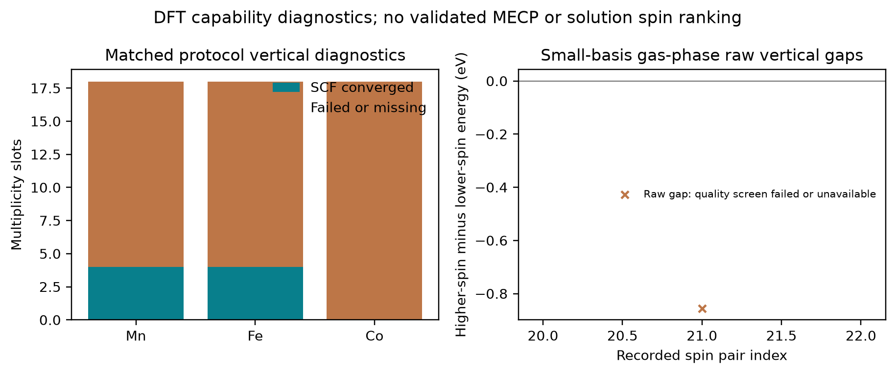
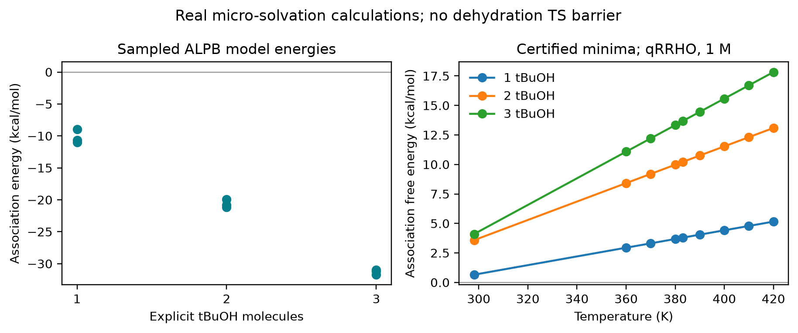
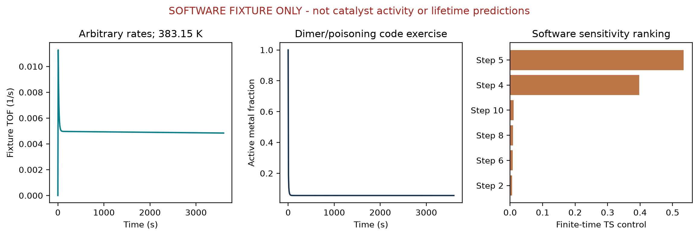
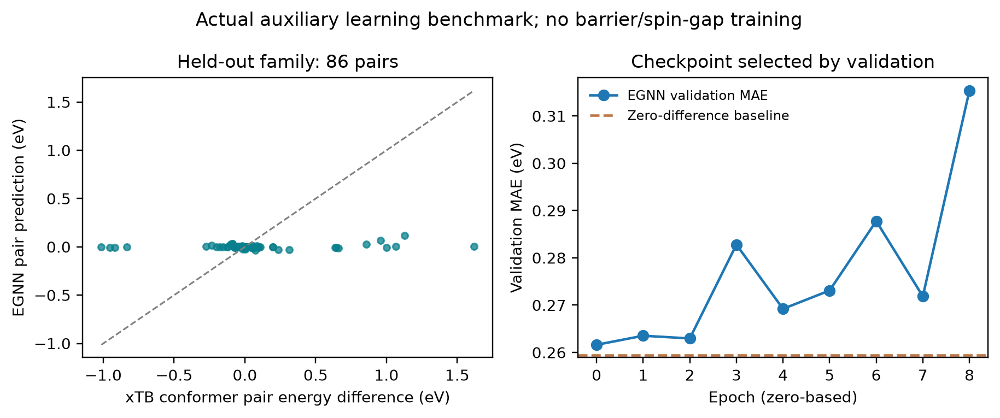

# 钳形配体催化的多自旋面、微溶剂化与等变学习

**第三阶段中文研究白皮书｜数学推导、可复现实现与真实证据边界**

项目：pincer-catmech-ai。编制日期：2026年9月13日。默认讨论温度为383.15 K，凝聚相参考协议为GFN2-xTB/ALPB甲苯；实际自旋诊断使用的气相DFT协议单独列明。总加入叔丁醇钾的设计基准为0.05当量，考察范围0.01—0.20当量。游离叔丁氧负离子浓度与中性叔丁醇活度尚无实验约束。

本书在四个相互连接的层次上回答一个具体问题：如何建立一条不会把算法通过、真实电子结构计算和催化性能混为一谈的计算研究链？第一部分推导交叉缝约束优化；第二部分用真实氢键簇计算分析显式溶剂；第三部分从18条通道构建守恒的18物种微观动力学；第四部分从原生PyTorch张量推导几何等变网络，并保留没有优于简单基线的真实训练结果。

阅读导航：第1—9章为证据体系与自旋交叉；第10—18章为微溶剂化；第19—27章为动力学；第28—34章为等变学习；第35—36章为复现、研究决策和参考来源。全部编号章均有独立论证，PDF目录由这些标题生成。正文能量、时间、浓度的含义以各章定义为准；机器数据表保留的有效数字多于本文，不表示相应的物理精度。

## 1. 研究问题、证据分层与本阶段结论

苄醇与苯胺通过借氢反应形成二级胺的设想，将醇脱氢、醛与胺缩合、亚胺加氢联结为一个催化循环。若金属—配体协同参与氢转移，局部质子化状态、配位结构、自旋态和溶液氢键都可能改变路径。把这些因素放进同一软件项目并不自动产生可信的速率预测：电子能对应的是特定哈密顿量和几何，自由能还依赖振动及标准态，速率需要过渡态，批次浓度还依赖完整网络与初始条件。研究链条中的每一步都必须说明输入从何而来。

本阶段最重要的结果包括三项真实完成的内容和两项明确的未完成物理目标。真实完成的是九个叔丁醇簇优化、其中三个选定簇的完整Hessian及27行温度热化学；具有手写解析Jacobian和参数切线的18物种求解器；使用540个真实构象配对标签训练的原生等变网络。尚无被接受的目标钳形催化剂MECP，也没有覆盖18条通道的完整过渡态自由能证书，因此不能给出物理TOF或催化剂排名。辅助网络测试误差未优于等能参考基线，不能声称已获得可用的高精度催化筛选器。

| 证据层级 | 本阶段实例 | 可以支持 | 不能支持 |
|---|---|---|---|
| 文献方法 | ALPB、EGNN、约束交叉优化 | 方法定义与理论出处 | 本体系机理已经成立 |
| 真实模型计算 | xTB簇优化、完整Hessian | 指定协议下的局部结构与能量 | 实验势垒或溶液比例 |
| 真实辅助学习 | 审计后构象电子能差 | 固定划分下模型误差 | 势垒与自旋能隙准确性 |
| 软件验证 | 任意速率夹具、解析函数 | 实现、守恒和对称性 | 实际催化活性与寿命 |
| 待检验假设 | 环状质子接力、失活通道 | 后续计算与实验设计 | 已证实反应事实 |

这里的“真实计算”表示原生程序确实运行并留下可追溯输出，不表示方法误差消失。反过来，负结果和失败记录也有信息价值：它们约束了当前能作出的结论，帮助把下一轮资源投入到最关键的证据缺口。本文将“能运行”“数值正确”“物理适用”“实验成立”视为四个不同层次。

## 2. Mn、Fe、Co与Ru：自旋问题如何进入催化循环

3d金属的配位场分裂、电子配对代价和金属—配体共价性可能处于相近尺度，因此改变配位数、氢化状态或配体质子化形式时，不同多重度电子态值得分别计算。4d Ru在许多钳形配体工作模型中以低自旋闭壳层路径作为起点，但“4d”不能作为所有状态必为闭壳层的证明。Mn、Fe、Co也不能仅凭元素名被指定为某个固定自旋态。真实比较必须针对相同组成、相同电荷和相同几何上的明确电子态，然后再讨论各态结构松弛。

电子自旋量子数S与多重度M满足：

$$
M=2S+1.
$$

若以单重态、三重态和五重态作候选，则对应S为0、1、2。但电子总数与多重度奇偶性必须匹配；不符合电子数的请求应在调用SCF前拒绝。配体的氧化还原非惰性还意味着形式氧化态不是自旋密度的直接观测量。配体自由基、金属局域自旋和破缺对称解可能共享一个形式命名，却具有不同电子结构。

对借氢循环而言，至少要区分活性态、吸附醇态、氢化催化剂、结合亚胺态与产物结合态。某一步在单一势能面上有很高的势垒，另一自旋面却较低，并不意味着反应必然沿低能面无阻切换。体系还需要到达交叉附近，且存在适当的自旋轨道耦合和非绝热跃迁概率。只有两条能量曲线画出交点，仍无法计算通量。

本书采用一个有用但严格受限的工作顺序：先判断后端是否能提供真正不同的自旋相关能量与梯度，再寻找约束交叉驻点，然后检查交叉缝局部曲率，最后才考虑自旋轨道耦合和动力学。这个顺序避免将原生GFN2中不同占据数产生的输出直接用作经过验证的竞争自旋面。有关自旋极化扩展与原生占据模型的区别见[官方xTB自旋极化文档](https://xtb-docs.readthedocs.io/en/latest/spgfn.html)及[spGFN方法论文](https://doi.org/10.1002/jcc.27185)。

## 3. 两条势能面的对象、单位与可比性

令核坐标向量R包含全部原子的3N个笛卡尔分量。MECP模块内部以bohr表示坐标、Hartree表示能量，梯度单位为Hartree/bohr，Hessian单位为Hartree/bohr平方。分子生成器与图网络使用Å时，边界处必须显式转换。将eV梯度直接当作原子单位梯度，会同时破坏步长、惩罚参数量纲和收敛阈值，不能靠优化器“自行适应”。

两个电子态在同一核几何上给出：

$$
E_1(\mathbf R),\qquad E_2(\mathbf R).
$$

$$
\mathbf g_1=\nabla_{\mathbf R}E_1,\qquad \mathbf g_2=\nabla_{\mathbf R}E_2.
$$

定义对称平均能量A、能隙c、平均梯度g和能隙梯度d：

$$
A=(E_1+E_2)/2,\qquad c=E_1-E_2.
$$

$$
\mathbf g=(\mathbf g_1+\mathbf g_2)/2,\qquad \mathbf d=\mathbf g_1-\mathbf g_2=\nabla c.
$$

符号c在这里是能隙函数，在后续动力学中小写浓度向量会明确写为粗体c，两者所在章节和单位不同。对常规单约束交叉缝，要求能隙梯度非零。局部隐函数定理说明c=0通常定义一个少一维的流形；若d也为零，则正则性失效，简单的投影与SQP公式不能继续盲用。退化应成为可读的失败状态。

每一对表面调用必须匹配核电荷、原子次序、总电荷、基组、泛函、溶剂模型、网格和参考定义，只允许指定电子态不同。能量来自一个几何而梯度来自另一个几何，不是数值噪声，而是破坏数学对象的输入错误。相同几何字节哈希、原生输入、输出、SCF状态和完整梯度共同组成一次表面记录。哈希只能证明记录对应哪份文件，无法单独证明SCF解属于期望态。

本阶段气相PBE/STO-3G诊断与GFN2-xTB/ALPB甲苯自由能属于不同协议，不能相减构造一个“复合势垒”，也不能把前者的垂直态差塞入后者的热化学标签。跨方法修正需要事先声明一致的热力学循环和相应证据。

## 4. MECP约束目标与KKT条件的逐步推导

在交叉缝上，两条能量相等，因此平均能量等于任意一条表面能量。最小能量交叉点问题可以对称地写成：

$$
\min_{\mathbf R} A(\mathbf R),\qquad c(\mathbf R)=0.
$$

引入拉格朗日乘子λ，将可行性与驻点条件组合成拉格朗日函数：

$$
L(\mathbf R,\lambda)=A(\mathbf R)+\lambda c(\mathbf R).
$$

对R与λ分别求导，得到一阶KKT条件：

$$
\mathbf g+\lambda\mathbf d=\mathbf 0.
$$

$$
c=0.
$$

第一式并不要求两条势能面的梯度各自为零。它要求平均梯度只有交叉缝法向分量；沿着不改变能隙的一阶切向位移，能量不能再线性下降。第二式要求几何确实位于交叉缝。二者缺少任意一个，都不足以证明是约束驻点。

若改用E1作为约束目标，由E1=A+c/2可得新拉格朗日函数等于A加上另一个乘子乘c。乘子平移半个单位，而满足约束的一阶驻点几何不变。使用平均能量的价值是使状态1和状态2交换时表达保持对称，便于发现标签顺序错误。

给定任意正则几何，可选择使驻点残差最小的乘子。展开残差平方并对λ求导：

$$
q(\lambda)=\mathbf g^\top\mathbf g+2\lambda\mathbf d^\top\mathbf g+\lambda^2\mathbf d^\top\mathbf d.
$$

$$
q'(\lambda)=2\mathbf d^\top\mathbf g+2\lambda\mathbf d^\top\mathbf d.
$$

令其等于零，得到：

$$
\lambda_*=-\frac{\mathbf d^\top\mathbf g}{\mathbf d^\top\mathbf d}.
$$

分母正是正则性条件所保护的量。若它过小，乘子会不稳定；此时应审查表面是否真正不同、是否存在状态翻转、或是否处于非正则交叉，而不是加入一个任意小数后宣布问题已经解决。约束交叉优化的早期方法背景可见[Farazdel与Dupuis的原始论文](https://doi.org/10.1002/jcc.540120219)。

## 5. 投影梯度与坐标无关的物理收敛判据

令交叉缝的单位法向为n，构造切向正交投影P：

$$
\mathbf n=\mathbf d/\|\mathbf d\|,\qquad P=I-\mathbf n\mathbf n^\top.
$$

直接计算可验证P对称、幂等，并把d映射为零：

$$
P^\top=P,\qquad P^2=P,\qquad P\mathbf d=\mathbf0.
$$

将上一章的最优乘子代回驻点残差，即得：

$$
\mathbf g+\lambda_*\mathbf d=P\mathbf g.
$$

所以投影梯度是KKT驻点残差的直接几何表达。同时，由两态梯度的差等于d，得到：

$$
P\mathbf g_1=P\mathbf g_2=P\mathbf g.
$$

代码默认要求绝对能隙不大于0.0001 Hartree，并要求投影梯度最大分量不大于0.0003 Hartree/bohr。绝对值不可省略：一个很大的负能隙也满足单边“小于正阈值”，但并不接近交叉。默认阈值是本项目数值验收参数，可配置且需随结果保存，不是适用于所有电子结构方法的普遍化学准确度标准。

任务中提出的“梯度差的绝对值点乘绝对坐标趋于零”不能替代KKT条件。如果绝对值表示向量范数，结果已是标量，点乘坐标的运算没有清楚定义；如果表示逐分量绝对值，则移动坐标原点一般会改变判据。即使写成有符号的d点乘R，也不要求在MECP为零。

考虑两原子键长r上的解析例子：

$$
E_1=(r-1)^2/2,\qquad E_2=(r-3)^2/2.
$$

交叉位于r=2，此处平均能量沿所有切向不变，能隙严格为零。若u为键方向，笛卡尔能隙梯度为两个相反的向量，分别为负2u与正2u，于是d点乘R等于2r，即4，而不是零。这个反例是软件解析问题，并非催化数据。由此可见，修正判据是保证物理定义正确的必要工作。

## 6. Harvey型有效梯度、标量惩罚与回溯线搜索

将切向降低能量与法向恢复交叉分开，可以写出Harvey型有效梯度：

$$
\mathbf G_H=P\mathbf g+\kappa c\mathbf d,\qquad \kappa>0.
$$

由于两部分正交，其范数平方没有交叉项：

$$
\|\mathbf G_H\|^2=\|P\mathbf g\|^2+\kappa^2c^2\|\mathbf d\|^2.
$$

在正则交叉上，有效梯度为零同时要求能隙与切向梯度为零，因此两种误差不能通过相互抵消伪造收敛。但这个向量不必是某个标量函数的真实梯度，不能未经推导就把它用于普通能量Hessian的割线更新。相关有效梯度思路见[Harvey等人的原始论文](https://doi.org/10.1007/s002140050309)。

任务指令中写出的有理惩罚标量部分可以完整定义为：

$$
F_{\mathrm{sat}}=A+\alpha\frac{c^2}{c^2+\epsilon}.
$$

其中α具有能量单位，ε具有能量平方单位。商法则逐步给出：

$$
\frac{d}{dc}\frac{c^2}{c^2+\epsilon}=\frac{2c(c^2+\epsilon)-2c^3}{(c^2+\epsilon)^2}.
$$

$$
\nabla F_{\mathrm{sat}}=\mathbf g+\frac{2\alpha\epsilon c}{(c^2+\epsilon)^2}\mathbf d.
$$

大能隙时恢复系数按能隙的负三次方衰减，可能远离交叉时失去驱动力。代码保留该完整函数及有限差分验证，但不把原指令中含省略号的表达宣称为已确定的文献公式。实际全局化使用：

$$
\Phi=A+\rho|c|+\alpha_qc^2/2.
$$

对非零能隙，沿p的方向导数为：

$$
D\Phi[\mathbf p]=\mathbf g^\top\mathbf p+\rho\operatorname{sgn}(c)\mathbf d^\top\mathbf p+\alpha_qc\mathbf d^\top\mathbf p.
$$

在零能隙处，中间项改为ρ乘能隙方向导数的绝对值。回溯仅接受满足Armijo充分下降的候选；约束改善停滞时提高惩罚，原子单位下参数数值上限为1000。惩罚增大是搜索策略，最终验收仍独立检查真实能隙和投影梯度。

## 7. SQP消元、阻尼BFGS与交叉缝二阶检查

在迭代点用正定矩阵B近似拉格朗日Hessian，对能隙作一阶展开，局部二次子问题为：

$$
\min_{\mathbf p}\ \mathbf g^\top\mathbf p+\mathbf p^\top B\mathbf p/2.
$$

$$
c+\mathbf d^\top\mathbf p=0.
$$

其KKT线性方程分别是Bp加λd等于负g，以及d点乘p等于负c。为避免大块矩阵排版与显式求逆，分别求解Bu=g、Bv=d，随后消元得到：

$$
\lambda_{k+1}=\frac{c-\mathbf d^\top\mathbf u}{\mathbf d^\top\mathbf v}.
$$

$$
\mathbf p=-\mathbf u-\lambda_{k+1}\mathbf v.
$$

B正定且d非零保证分母为正。最大位移限制会缩小全步，从而只能实现部分线性化能隙修正；线搜索必须按实际缩放步重新评估。代码不将限制后的步长仍描述为完全满足线性约束。

令s为实际位移，割线向量在两个端点必须使用同一个新乘子：

$$
\mathbf y=(\mathbf g_{k+1}+\lambda_{k+1}\mathbf d_{k+1})-(\mathbf g_k+\lambda_{k+1}\mathbf d_k).
$$

若两个端点使用不同乘子，y将混入乘子变化而非纯几何曲率。定义b等于s转置Bs、q等于s点乘y。当q不小于0.2b时令θ=1；否则令θ=0.8b/(b-q)。构造阻尼向量：

$$
\widetilde{\mathbf y}=\theta\mathbf y+(1-\theta)B\mathbf s.
$$

$$
B_{k+1}=B-\frac{B\mathbf s\mathbf s^\top B}{b}+\frac{\widetilde{\mathbf y}\widetilde{\mathbf y}^\top}{\mathbf s^\top\widetilde{\mathbf y}}.
$$

该更新使割线曲率至少为0.2b，从而维持正定搜索模型。但正定的近似搜索矩阵不证明真实交叉缝是极小。令Q张成除去交叉法向及刚体平移、转动后的切空间，真实约束Hessian为：

$$
H_{\mathrm{seam}}=Q^\top(\nabla^2A+\lambda_*\nabla^2c)Q.
$$

模块通过对匹配解析梯度作中心差分检查其本征值和非对称误差，仅在一阶通过后才给出局部极小判定。所谓“Chaban–Gordon–Dyall核MECP方法”的署名未获得可靠原始来源确认，因此实现按KKT/SQP命名；[查得的Chaban、Schmidt、Gordon论文](https://doi.org/10.1007/s002140050241)讨论轨道优化，不应被挪作本算法的出处。

构造Q时，代码先把非零的交叉法向、平移与转动列向量分别归一化，再作奇异值分解。否则，较大分子半径产生的转动向量可能远大于较小但非零的能隙梯度，使数值秩判断丢失交叉约束。归一化不改变待排除空间，却能避免尺度不均衡。中心差分在各位移点保持同一个λ，因此包含完整的约束曲率贡献。解析检验取A=−2x−y²/2+z²/2、c=x+y²/2：原点处λ=2，虽然A沿y的笛卡尔二阶导数为−1，真实约束空间中的两个本征值均为+1。

令H-red表示尚未对称化的约化有限差分矩阵。数值局部极小判定还必须满足：

$$
\max_{i,j}|H_{\mathrm{red},ij}-H_{\mathrm{red},ji}|\leq10^{-5}\ \mathrm{Hartree}/\mathrm{bohr}^{2}.
$$

这是可通过`antisymmetry_tolerance`设置的默认绝对阈值；结果记录`hessian_symmetry_pass`及其Hartree/bohr平方单位阈值。非平凡本征值还须大于默认曲率阈值1e−5 Hartree/bohr平方。`positive_curvature`仅描述对称化矩阵的本征值；`minimum_verified`还要求对称性检查及两项一阶条件通过。不能先对称化，再忽略原始矩阵暴露的非保守或噪声问题：一个对称部分本征值为[1,1]、最大反对称误差为40的对抗性测试已被正确拒绝。

这里仍然只是一个有限差分位移尺度下的局部数值检查，没有给出位移收敛证明或Hessian噪声上界。对称的梯度偏差仍可能通过对称性检查，因此步长敏感性、电子态连续性和小曲率的不确定度需要另行验证。上述解析例子属于软件证据，不提供任何催化剂能量、自旋轨道耦合或非绝热速率。

## 8. 电子结构后端与本机自旋诊断的实际证据

一个接口返回两组数，不足以证明它提供两条可信自旋面。本机首先在相同O2键长1.21 Å上检测原生GFN2与自旋极化扩展。原生GFN2的单重与三重占据调用分别输出−7.906752352880和−7.904118275554 Hartree，最大梯度差约为6乘10的负15次方Hartree/bohr。这是后端能力诊断；能量差不能据此直接作为可靠自旋势能面差。两次启用spinpol与tblite的调用都以SIGSEGV、退出码3终止，原始输出与输入均保留。

替代后端复用已有Psi4环境，使用RKS/UKS的解析梯度；HF请求则对应RHF/UHF。每态使用状态特定初猜、固定坐标方向与质心约定。非收敛SCF没有资格生成优化步或训练标签。非限制性解的自旋诊断由占据轨道重叠给出：

$$
\langle S^2\rangle=S_z(S_z+1)+N_\beta-\sum_{ij}|(C_\alpha^\top S_{\mathrm{AO}}C_\beta)_{ij}|^2.
$$

纯自旋期望值为：

$$
S(S+1)=(M^2-1)/4.
$$

偏离期望超过0.1被标为需要审查的诊断，不是普遍的电子态有效性定理。DFT辅助行列式、破缺对称解以及轨道稳定性仍需化学判断。实现依据与能力范围见[Psi4 SCF文档](https://psi4.github.io/psi4docs/master/scf.html)和[解析梯度文档](https://psi4.github.io/psi4docs/master/opt.html)。

人工初始几何的中性FeH2用于检验实际梯度搜索。首个单重态PBE/def2-SVP在120次SCF迭代内未收敛。另一个三重态/五重态搜索在约300.204秒内完成34次匹配表面对，最终能隙为−0.0001578660260293 Hartree，投影梯度最大分量为0.0140413212782 Hartree/bohr，状态为预算耗尽。它没有同时达到两项阈值，因此不是已认证MECP；更不是目标钳形催化剂结果。

实际钳形结构另有def2-SVP资源试算及气相PBE/STO-3G垂直诊断矩阵。原生运行汇总分别保留协议，不把粗网格与不同SCF算法混成同一数据集。最终完成计数应从`data/phase3/spin/summary.json`及其链接的矩阵摘要读取；本文对矩阵的化学结论限定为：没有被接受的目标催化剂MECP、没有可用于势垒学习的认证自旋交叉标签。小基组、气相、垂直诊断不能代替甲苯溶液的定量自旋热化学。

### 已完成的目标自旋矩阵与交叉搜索准入

最终Fe/Co/Mn扫描覆盖18个设计的54个多重度位置：其中48个进行了真实目标几何计算，6个缺少预期活性结构。共有8个SCF收敛态，6个通过所声明的S²与身份诊断；得到1组原始匹配垂直能差，0组通过诊断准入。缺失或失败值在完整CSV中保持空白；未通过质量检查的原始数值保留并附有标记。

最终矩阵统一采用气相PBE/STO-3G、35径向乘110球面网格、密度拟合、SAD初猜及1e−4阈值启动的后期SOSCF。能量与密度收敛目标分别为1e−8和1e−6。每态最多120次SCF迭代、120秒、500 MiB配置内存、600 MiB观测工作进程RSS上限和两个线程。该资源协议不等于方法精度验证。先前拒绝的Co联吡啶活性结构没有用重排物替代；早期协议试算和一次中断的五重态尝试与最终54格矩阵分开保留。

Q表示SCF收敛且通过本项目S²/身份诊断；U表示SCF收敛但质量被拒绝；T表示超时；M表示缺失预期几何；F表示其他已记录失败。Q仍只是垂直诊断，不是认证化学自旋标签。这里的M为多重度，不是浓度单位。

| 催化剂设计 | M=1 | M=3 | M=5 |
|---|---|---|---|
| Co_bipyridine_pnnoh_Ph | M | M | M |
| Co_bipyridine_pnnoh_iPr | M | M | M |
| Co_macho_pnp_Ph | T | T | T |
| Co_macho_pnp_iPr | T | T | T |
| Co_pyridine_pnn_Ph | T | T | T |
| Co_pyridine_pnn_iPr | T | T | T |
| Fe_bipyridine_pnnoh_Ph | Q | T | T |
| Fe_bipyridine_pnnoh_iPr | Q | U | T |
| Fe_macho_pnp_Ph | T | T | T |
| Fe_macho_pnp_iPr | T | T | U |
| Fe_pyridine_pnn_Ph | T | T | T |
| Fe_pyridine_pnn_iPr | T | T | T |
| Mn_bipyridine_pnnoh_Ph | Q | T | T |
| Mn_bipyridine_pnnoh_iPr | Q | T | T |
| Mn_macho_pnp_Ph | T | T | T |
| Mn_macho_pnp_iPr | T | T | T |
| Mn_pyridine_pnn_Ph | Q | T | T |
| Mn_pyridine_pnn_iPr | Q | T | T |

| 催化剂 | M | 能量/Hartree | S² | 质量标记 |
|---|---:|---:|---:|---|
| Fe_bipyridine_pnnoh_iPr | 1 | -2533.7122436149 | -0.00000000 | Q |
| Fe_bipyridine_pnnoh_iPr | 3 | -2533.7437027437 | 2.66144576 | U |
| Fe_bipyridine_pnnoh_Ph | 1 | -2756.8422312402 | -0.00000000 | Q |
| Fe_macho_pnp_iPr | 5 | -2713.7056752371 | 6.16690202 | U |
| Mn_bipyridine_pnnoh_Ph | 1 | -2756.7258829205 | 0.00000000 | Q |
| Mn_bipyridine_pnnoh_iPr | 1 | -2533.5901894093 | 0.00000000 | Q |
| Mn_pyridine_pnn_Ph | 1 | -2687.2566169593 | 0.00000000 | Q |
| Mn_pyridine_pnn_iPr | 1 | -2464.1132928431 | 0.00000000 | Q |

来源为`data/phase3/spin/pincer_vertical_diagnostic_003/spin_states.csv`及`vertical_gaps.csv`。随后目标MECP调度器重新检查完整矩阵、原生哈希、当前身份、引擎指纹和自旋质量。实际回执为`no_eligible_pair`，新增表面对计算0次、电子态尝试0次；一阶交叉为False，局部极小验证为False。没有合格种子不能证明不存在自旋交叉。可继续运行的搜索与曲率检查共享8次表面对/1920秒预算；完整钳形分子的曲率验证通常需要更多评估，不能把耗尽这一预算当作验证通过。



图中保留带拒绝标记的自旋污染原始能差。它们是气相小基组诊断，不是甲苯溶液自旋自由能、活化势垒或系间窜越速率。

## 9. 自旋结果的验收门槛与下一步可检验问题

MECP证据链至少需要五个彼此独立的层次。首先，两个电子态须有合法电子数、自旋与一致原子映射。其次，两态SCF都收敛且状态身份有诊断支持。第三，在同一几何上能隙与切向驻点残差同时通过阈值。第四，真实约束Hessian的非平凡切向曲率支持局部极小。第五，若要转化为跨自旋速率，还要计算相关自旋轨道耦合、交叉附近动力学与反应物统计权重。

| 输出对象 | 最小证据 | 当前用途 | 额外所需 |
|---|---|---|---|
| 垂直态差 | 同几何、同协议、SCF通过 | 后端与候选态诊断 | 稳定性、基组与溶剂检验 |
| 交叉驻点 | 绝对能隙与投影梯度通过 | 局部交叉候选 | 约束曲率 |
| 局部MECP | 一阶通过且切向正曲率 | 局部势能面解释 | 更广起点与态追踪 |
| 非绝热速率 | 耦合、核动力学、统计模型 | 反应通量建模 | 实验及方法验证 |

解析单元测试覆盖直线与弯曲交叉缝、正负能隙、退化梯度、状态相同、SCF失败传播、子进程超时、旋转平移协变、阻尼BFGS正定性以及极小与鞍点区分。这些测试回答“算法是否执行了所写数学”，不能把解析抛物面上的收敛当作金属配合物化学成功。

后续研究可以先选择一个已通过结构身份审查的Fe或Co催化剂，而不是立即扩张全部矩阵。对几个物理合理初始电子构型测量SCF成本、检查轨道稳定性，在一致溶剂与较合适基组上获得一组可靠梯度，再据此决定MECP预算。若一个态在大部分几何上难以收敛，优先解决电子态定义和态跟踪。增加优化迭代次数无法修复错误的电子结构对象。

比较Mn、Fe、Co与Ru时，应报告每个状态的可用数据数、失败原因及方法一致性，避免只画成功点制造某个金属“更容易交叉”的印象。当前失败更直接说明本地资源与所选初猜/协议的限制。它尚不支持任何关于真实催化反应是否发生自旋交叉的肯定或否定判断。

接口要求后端具备区分电子自旋态势能面的能力。代码保留的布尔字段名`spin_dependent`表示这一能力，不意味着每种非相对论计算都必须使用显含自旋的哈密顿算符。无显式自旋项的电子哈密顿量，也可因允许电子态的空间对称性与反对称性产生不同自旋态能量。因此须审查具体方法及其电子态处理，不能仅凭名义占据设置判断能力。

`SurfacePair.validate`会拒绝明确失败的已提供SCF、分子身份或诊断质量检查，以及自旋污染标志和声明为非解析的梯度。若提供S平方元数据，数值必须有限且有有效参照；给定多重度M时，另行提供的参照须与(M²−1)/4一致，并满足：

$$
\left|\langle S^2\rangle-\frac{M^2-1}{4}\right|\leq0.1.
$$

0.1是本项目的保守资格筛查，绝非普适自旋纯度判据，也不证明轨道稳定性、电子根连续性或定量精度。数学驻点残差通过不能绕过明确失败的质量元数据。缺少质量信息同样不能解释为验证通过；允许空元数据的解析玩具势能面，是为了检验软件数学。

已提供的态身份、多重度、能量和梯度必须与实际返回值一致，几何及原子单位必须与被计算对象一致，两态的方法、基组、电荷、溶剂化及相关来源信息须匹配。优化和曲率调用还会拒绝记录中的态身份或已提供电子结构协议在不同几何间发生改变。这是元数据一致性检查，不能代替基于轨道重叠的连续态追踪。自旋专项测试共85项通过，其中57项新增对抗性测试覆盖质量拒绝、协议一致性、尺度投影与约束曲率。优化器收敛仍返回一阶交叉驻点，`minimum_verified=false`；可选二阶结果的数值边界见第7节。

## 10. 为什么显式叔丁醇值得计算，以及连续介质的边界

连续介质模型用宏观介电响应及参数化非静电项描述溶剂环境，能高效提供大量构型的溶剂化估计。但是，一个没有显式溶剂核坐标的模型没有特定叔丁醇氧原子，也没有能逐个追踪的O—H键。因此它本身不能明确表示“第一个叔丁醇接收质子、第二个把质子继续传递”的有向几何路径。这个表达能力差异不等于ALPB在本反应中已被证明失效，更不证明加入任意数量溶剂就会得到更正确的势垒。

半缩醛胺底物为PhCH(OH)NHPh，目标缩合形式为亚胺与水。设想一个或数个叔丁醇介入，可在羟基、胺基和将离去的水之间组织氢键。潜在作用既有电荷分布稳定，也有质子传递路径改变、构象选择和熵代价。这些效应方向未必一致。总加入叔丁醇钾还会引入离子对、钾配位和游离碱比例等因素；只计算中性叔丁醇簇无法替代这些物种。

本阶段计算对象是中性半缩醛胺加1、2、3个中性叔丁醇，全部在GFN2-xTB/ALPB甲苯、gsolv协议下优化。底物式为C13H13NO，28个原子；叔丁醇式为C4H10O，15个原子；因此簇有43、58和73个原子。电子温度300 K是电子占据计算参数，与用来计算核平动、转动和振动热化学的383.15 K不是同一个温度，不能混写。

用户提出的6元或8元环状质子接力过渡态是有价值的待检验假设。现有底物参考构象的NH方向背离OH氧，使简单刚性放置难以同时满足一个叔丁醇闭桥的方向与距离。实现因此生成开放的OH/NH锚定氢键簇，并记录闭合探针失败，而没有为了得到“环状图”强制扭曲底物后把它当成机制。方法背景参见[ALPB原始论文](https://doi.org/10.1021/acs.jctc.1c00471)与[官方溶剂化参考态文档](https://xtb-docs.readthedocs.io/en/latest/gbsa.html)。

## 11. 氢键定向停靠、刚体变换与拓扑检查

生成器从已审查的底物与叔丁醇参考几何出发，保持原子索引、片段归属和共价图。对一个供体D—H，定义从D指向H的单位方向u。选取与u垂直的单位向量v，再以小偏转角θ构造单位接近方向：

$$
\mathbf d=\cos\theta\,\mathbf u+\sin\theta\,\mathbf v.
$$

$$
\mathbf R_{O_A}=\mathbf R_H+r_{HA}\mathbf d.
$$

因为u与v正交且单位化，d的长度为1，故H至受体氧的距离严格等于设定的1.85 Å。角D—H—O等于180度减θ，初始构型要求至少165度，落在任务要求的1.6—2.1 Å距离区间。这个构造是可检查的几何步骤，不是根据势能面推导出的最优氢键长度。

设叔丁醇自身氧坐标为RO，对全部片段原子施加同一个旋转Q和平移：

$$
\mathbf R'_a=Q(\mathbf R_a-\mathbf R_O)+\mathbf R_{O_A}.
$$

$$
Q^\top Q=I,\qquad \det Q=1.
$$

正交性保证片段内部所有距离保持不变。绕不同轴尝试方向时，只改变分子间取向，不破坏叔丁醇共价结构。未指定为氢键的跨片段接触需满足距离至少为两原子范德华半径和的0.65倍。选定氢键接触单独接受方向与距离检查，不会因一般立体筛选而被误拒，也不会因此逃过自身标准。

两个叔丁醇分别锚定底物OH和NH；第三个接收第一个叔丁醇的羟基氢，形成开放接力链。每个大小使用三个方向种子，总计九个起点。完整放置最多允许12轮，实际九例均在首轮成功。初始映射保留后续比较所需的原子和边信息。

优化后不强迫氢键保持初始1.85 Å。后处理以1.4—2.6 Å及至少120度作为已声明的保留筛选，同时独立搜索所有跨片段N/O—H···N/O接触。三醇种子02的一条预选接力接触改变，但发现的最终图仍连接所有片段。初始图、保留图、重新发现图具有不同含义，应分别保存。

## 12. 配平缔合能与构象变形代价

以S代表半缩醛胺、A代表叔丁醇，所计算的反应是配平的簇缔合：

$$
S+nA\rightleftharpoons SA_n.
$$

令星号表示对应模型下已选定的优化几何，缔合电子能为：

$$
\Delta E_{\mathrm{assoc}}=E(SA_n;\mathbf R_n^*)-E(S;\mathbf R_S^*)-nE(A;\mathbf R_A^*).
$$

这正是任务中称为“协同稳定能”的配平相减表达，但它的严格含义是缔合能。增加叔丁醇后多了更多成对接触，因此总能更负本身不能证明多体协同性增强。比较一个含43个原子的簇和一个含73个原子的簇的总电子能也没有意义，必须先减去相同数目的片段参考。

新做的同协议参考单点为底物−1127.825737362139 eV、叔丁醇−482.70190329033903 eV。它们与原参考梯度能的一致性分别为0及约2.72乘10的负11次方eV，说明本次复用链在数值上可追溯。该一致性不衡量GFN2相对高等级量子化学的误差。

将各片段从簇中抽出但不松弛，令Ei为冻结构片段能，定义变形代价：

$$
E_{\mathrm{def}}=\sum_iE_i(\mathbf R_i^{\mathrm{cluster}})-E(S;\mathbf R_S^*)-nE(A;\mathbf R_A^*).
$$

冻结构相互作用能为：

$$
E_{\mathrm{int}}^{\mathrm{frozen}}=E(SA_n)-\sum_iE_i.
$$

在缔合能中加上再减去冻结构单体能，便得精确恒等式：

$$
\Delta E_{\mathrm{assoc}}=E_{\mathrm{def}}+E_{\mathrm{int}}^{\mathrm{frozen}}.
$$

三种选定簇的变形代价分别为+0.51122、+0.81026、+0.78791 kcal/mol，相互作用能分别为−11.50531、−21.97652、−32.50443 kcal/mol。于是负缔合能来自足够强的片段吸引抵消内部变形。在连续介质下抽取片段会重新定义介质空腔，因此这里的冻结构相互作用仍包含溶剂模型响应，而非单纯真空气相的静电或氢键能。

## 13. 多体展开：为什么正的余项不支持正协同性

一个含n个叔丁醇的簇有m=n+1个片段。对同一簇几何上的每个单体与每个唯一片段对，定义二体增量：

$$
\varepsilon_{ij}^{(2)}=E_{ij}-E_i-E_j.
$$

先从完整簇扣除所有单体，再扣除全部二体增量，可得到超过成对作用的余项：

$$
E_{\mathrm{beyond}}=E_{1\ldots m}-\sum_iE_i-\sum_{i<j}(E_{ij}-E_i-E_j).
$$

每个单体在所有唯一片段对中出现m−1次。展开括号后，单体项净系数为负1加m−1，即m−2，于是：

$$
E_{\mathrm{beyond}}=E_{1\ldots m}-\sum_{i<j}E_{ij}+(m-2)\sum_iE_i.
$$

当m=2时，唯一片段对就是完整簇，余项恒为零；这是一条代数一致性检查。当m=3时，余项恰为三体增量：

$$
\varepsilon_{123}^{(3)}=E_{123}-E_{12}-E_{13}-E_{23}+E_1+E_2+E_3.
$$

当m=4时，该余项包含四个三体增量与一个四体增量的总和。因为未要求所有三片段子集的独立计算，不能把总余项专称为“纯四体作用”。本阶段对应1、2、3醇分别执行了4、7、11个冻结构单点，包含全部单体、全部唯一对及独立完整簇，其中二片段情况保留冗余完整对核对。

| 叔丁醇数 | 二体和 | 超成对余项 | 变形代价 | 单位 |
|---:|---:|---:|---:|---|
| 1 | −11.50531 | 0.00000 | +0.51122 | kcal/mol |
| 2 | −23.52359 | +1.54707 | +0.81026 | kcal/mol |
| 3 | −36.06279 | +3.55836 | +0.78791 | kcal/mol |

正余项意味着在本次定义下，完整冻结构簇的吸引弱于全部二体吸引简单相加。它没有显示增强吸引的正协同性。每个子集都重新计算ALPB空腔和反应场，余项包含这些非加和贡献，不能唯一归因于氢键极化。表格数值来自`many_body_nonadditivity.csv`；完整恒等式在单位换算前用原能量求值，避免大数相减与重复转换放大舍入误差。

## 14. 九个真实簇优化与电子能结果

本阶段使用原生xTB 6.7.1，GFN2、总电荷零、未成对电子数零、电子温度300 K、SCC准确度0.5及ALPB甲苯gsolv。九个优化均实际运行，保留初始与最终XYZ、原生标准输出、梯度、重启文件、WBO和映射。运行器每次仅启用一个物理xTB子进程，线程限制为2，并使用工作目录锁防止并发写入同一原生文件。

| 醇数 | 种子 | 缔合电子能/kcal mol−1 | 最大力/eV Å−1 | 表征状态 |
|---:|---:|---:|---:|---|
| 1 | 00 | −10.63859 | 0.00058134 | 优化通过，未选Hessian |
| 1 | 01 | −8.92299 | 0.00084548 | 优化通过，未选Hessian |
| 1 | 02 | −10.99409 | 0.00046040 | 选定，完整极小检查 |
| 2 | 00 | −19.93472 | 0.00086742 | 优化通过，未选Hessian |
| 2 | 01 | −21.16626 | 0.00054751 | 选定，完整极小检查 |
| 2 | 02 | −20.82725 | 0.00042493 | 优化通过，未选Hessian |
| 3 | 00 | −31.71652 | 0.00050057 | 选定，修复后完整检查 |
| 3 | 01 | −31.16098 | 0.00059361 | 优化通过，未选Hessian |
| 3 | 02 | −30.99282 | 0.00044930 | 优化通过，未选Hessian |

九例均保留原有共价连接，也均在后处理氢键图中连接所有片段。每种大小仅选择已采样电子能最低的一例进行昂贵的完整Hessian，因此“三个认证极小”与“九个优化收敛”必须区分。三方向种子远不足以穷尽叔丁醇相对位置、底物构象及氢键拓扑，最低采样能不是全局最低能的证明。



图中电子缔合与自由能表达不同统计对象。随着醇数增加，电子能更负，但标准自由能仍可变得更不利。这里没有催化剂、钾离子、叔丁氧负离子、过渡态或IRC，不能将图中任一差值标为脱水活化能。GFN2方法本身的原始来源为[Bannwarth、Ehlert与Grimme，JCTC 2019](https://doi.org/10.1021/acs.jctc.8b01176)；这提供方法出处，并不验证本组氢键簇相对高等级参考的数值误差。

## 15. 完整Hessian、刚体投影与软模修复

几何优化收敛说明局部梯度较小，却不足以区分极小与鞍点。完整Hessian由解析梯度的两侧中心差分构造。令ea为笛卡尔单位方向，步长为δ，则：

$$
H_{ab}\simeq\frac{g_a(\mathbf R+\delta\mathbf e_b)-g_a(\mathbf R-\delta\mathbf e_b)}{2\delta}.
$$

本次使用完整未冻结原子的原生Hessian，步长0.005 bohr，Hessian SCC准确度0.05，导出未投影矩阵。对矩阵对称化并质量加权：

$$
F=M^{-1/2}(H+H^\top)M^{-1/2}/2.
$$

在质量加权空间中构造平移和转动方向，用SVD分离这些非线性分子的六个刚体自由度。若U为其余内部空间的正交基，则求解：

$$
U^\top F U\mathbf v_k=\lambda_k\mathbf v_k.
$$

$$
\widetilde\nu_k=\operatorname{sgn}(\lambda_k)\sqrt{|\lambda_k|}/(2\pi c).
$$

式中频率单位需结合质量、能量和长度单位转换；符号保留负曲率信息。任何负频率都必须记录，不能为了热化学可运行而静默删除。原生完整数值Hessian的能力说明见[官方xTB Hessian文档](https://xtb-docs.readthedocs.io/en/latest/hessian.html)。

43和58原子簇在首次Hessian中通过检查，最低频率分别为15.08035和17.76954 cm−1。73原子簇第一次出现−2.56861 cm−1软虚频，被分类为数值不确定性，而未直接宣布极小。沿该模式施加最大0.10 Å位移，再作无约束极严格优化，第二次完整Hessian没有虚频，最低为+1.42092 cm−1。初次矩阵、失败分类、修复路径与最终矩阵均保留。

最终频率很软，说明构型容易沿低曲率方向运动，统计权重与数值设置可能敏感。通过当前极小门槛并不消除这种敏感性。三醇自由能使用修复后的认证几何；电子缔合与多体表保留最初所选无约束优化几何。两者Hessian级能量差为−0.00030413 eV，约−0.0070 kcal/mol，虽小仍明确记录，不能暗中把两份坐标当作同一结构。

## 16. qRRHO熵与一次标准态校正的完整推导

对正频率模式，令无量纲量x为光子式振动能与热能之比：

$$
x_k=hc\widetilde\nu_k/(k_BT),\qquad q_k^{\mathrm{HO}}=\frac{e^{-x_k/2}}{1-e^{-x_k}}.
$$

由统计热力学熵公式对温度求导，得到谐振子模式熵：

$$
S_k^{\mathrm{HO}}=R[\ln q_k+T\partial_T\ln q_k].
$$

$$
S_k^{\mathrm{HO}}=R\left[\frac{x_k}{e^{x_k}-1}-\ln(1-e^{-x_k})\right].
$$

当频率很低，谐振近似会给出过大的熵贡献。qRRHO把低频模式向自由转子描述平滑混合。定义有效惯量与权重：

$$
\mu_k=\frac{h}{8\pi^2c\widetilde\nu_k},\qquad \mu_k^{\mathrm{eff}}=\frac{\mu_k B_{\mathrm{av}}}{\mu_k+B_{\mathrm{av}}}.
$$

$$
w_k=\frac{1}{1+(\widetilde\nu_0/\widetilde\nu_k)^4},\qquad \widetilde\nu_0=100\ \mathrm{cm}^{-1}.
$$

$$
q_k^{\mathrm{FR}}=\sqrt{\frac{8\pi^3\mu_k^{\mathrm{eff}}k_BT}{h^2}},\qquad S_k^{\mathrm{FR}}=R[\ln q_k^{\mathrm{FR}}+1/2].
$$

$$
S_{\mathrm{vib}}^{q\mathrm{RRHO}}=\sum_k[w_kS_k^{\mathrm{HO}}+(1-w_k)S_k^{\mathrm{FR}}].
$$

实现保留谐振零点能与热焓，以插值熵替换谐振振动熵，并包括完整分子平动、转动和电子熵；对称数明确取1。低频处理依据[Grimme 2012原始论文](https://chemistry-europe.onlinelibrary.wiley.com/doi/10.1002/chem.201200497)，但本项目的半经验电子能和ALPB协议并不等同于该论文的整套高等级方法。

气体1 atm标准态的浓度为p°/(RT)。将其转换到1 M，化学势改变为RT乘新旧浓度比的对数，因此每个物种：

$$
G^{1\mathrm M}=E_{\mathrm{model}}+H_{\mathrm{thermal}}-TS^{q\mathrm{RRHO}}+RT\ln(c^\circ RT/p^\circ).
$$

这里热焓包含零点能，p°为101325 Pa，体积单位必须一致，才能让对数自变量无量纲。ALPB的gsolv过剩项已在模型能中，只加一次，不能再次叠加。对于S+nA生成一个簇，物种数变化为−n，所以反应标准态校正是负nRT乘同一对数。标准态改变影响缔合自由能，却不代表已测得溶液中的真实活度。

## 17. 27行温度自由能数据与缔合统计解释

下表完整包含三个选定簇在九个温度的标准1 M缔合自由能，共27个数据点，单位均为kcal/mol。它们由已缓存的真实Hessian重新评价温度项得到，并非又执行了27次量子优化。298.15 K用于展示温度趋势，360—420 K覆盖动力学软件网格，383.15 K为设计基准。

| 温度/K | 1个叔丁醇 | 2个叔丁醇 | 3个叔丁醇 |
|---:|---:|---:|---:|
| 298.15 | +0.65825 | +3.58611 | +4.10551 |
| 360.00 | +2.94352 | +8.41532 | +11.07970 |
| 370.00 | +3.31260 | +9.19524 | +12.20556 |
| 380.00 | +3.68154 | +9.97488 | +13.33091 |
| 383.15 | +3.79773 | +10.22041 | +13.68528 |
| 390.00 | +4.05034 | +10.75423 | +14.45573 |
| 400.00 | +4.41900 | +11.53327 | +15.58002 |
| 410.00 | +4.78752 | +12.31200 | +16.70378 |
| 420.00 | +5.15589 | +13.09041 | +17.82700 |

温度升高后标准缔合自由能更正，符合此组计算中缔合熵不利的重要作用。但不能把表中斜率直接解释为精确实验熵，因为溶剂参数、构象集合与低频近似均有限制。每种大小只取一个已采样最低电子能构型，没有完整系综自由能。若存在其他氢键拓扑及低能构象，其配分函数贡献可能改变热力学排序。

在明确理想活度近似时，可以定义标准平衡常数：

$$
K_n^\circ=\exp[-\Delta G_{\mathrm{assoc},n}^\circ/(RT)].
$$

$$
\frac{a_{SA_n}}{a_S}=K_n^\circ a_A^n.
$$

第二式表明实际比例还依赖叔丁醇活度的n次方。没有aA，就不能从标准自由能直接画实际簇比例。若有多个构象，需先以相同参考建立系综配分和简并度，再讨论不同簇大小竞争；不能把独立最小值当作已归一化概率。总叔丁醇钾加入量尤其不能直接代替中性叔丁醇活度。

数据原表为`association_thermochemistry.csv`，每行附带标准态、认证状态与“非脱水势垒、非体相物种比例”的解释字段。383.15 K的三项正自由能与对应负电子缔合能同时保留，它们揭示熵与标准态的重要性，不构成相互矛盾。

## 18. 从氢键极小到质子接力过渡态还缺什么

一个开放氢键簇具有短O···H接触，只说明几何上存在可能的质子传递通路。要证实脱水过渡态，至少需要沿反应坐标找到一阶鞍点、验证唯一负模式与预期键变化一致、通过两端连通性检查确认连接半缩醛胺侧与亚胺加水侧，并在相同组成和标准态下评价活化自由能。若模型要代表碱促进反应，还需说明钾离子、叔丁氧负离子和叔丁醇究竟在哪一侧以什么形式出现。

当前数据没有这些过渡态证据，因此不生成一张带虚构峰高的脱水能垒图。可以画出的图是簇优化与缔合自由能图，并标注其参考反应。对于“6元或8元环更有利”的陈述，也必须先定义成环原子序列与原子映射，保证比较的是同一配平反应。环成员数不应仅从示意图视觉判断。

后续计算可以从三类合理拓扑开始：叔丁醇同时连接离去羟基与氮氢的闭桥；两个醇形成中继链；碱或钾介入改变电荷分布的离子簇。每类都需构象搜索和连续介质下的稳定性检查。若高温下标准缔合自由能不利，这不排除少量高反应性簇参与通量，但要求把形成簇的统计代价纳入整体势垒参考，不能只比较已经缔合簇内部的低峰。

设预平衡形成簇后发生反应，在该近似有效时：

$$
v_n=k_n^{\mathrm{cluster}}[SA_n].
$$

$$
v_n\propto k_n^{\mathrm{cluster}}K_n^\circ a_A^n a_S.
$$

这说明“簇内势垒低”和“总体反应通量大”是两个问题，形成簇的代价与活度会共同决定结果。此处只是模型推导，当前没有足够数据给出kn或实际vn。

新增的有界质子接力搜索现已完成。计算使用两个独立的43原子半缩醛胺/叔丁醇种子，以真实GFN2-xTB/ALPB甲苯协议分别执行九图像路径搜索；随后从第一条路径的最终势能带进行一次保留原始记录的续算。续算保存全部图像坐标、原子映射和来源SHA256，重新计算所有力并重复两端Hessian检查，没有重置插值。全过程采用一个xTB工作进程、一个线程，物理计算在原定1200秒截止时间前结束。三次路径运行均未收敛，最终为**已认证过渡态0个、已获得活化自由能势垒0个**。

| 路径运行 | 实际FIRE/NEB步数 | 最终NEB最大力，eV/Å | 最大力收敛要求，eV/Å | 最终状态 |
| --- | ---: | ---: | ---: | --- |
| 原始种子02 | 100 | 0.375882 | 0.07 | 未收敛 |
| 原始种子01 | 100 | 1.347282 | 0.07 | 未收敛 |
| 种子02的保留记录续算 | 额外200 | 1.206630 | 0.07 | 未收敛 |

合计400个真实FIRE/NEB步来自两个种子和一次续算，不能计作三个独立初始构象。两条原始路径各自的反应物与产物均通过自由优化、完整映射共价图、C—N距离区间以及完整原生Hessian极小值门槛，每个端点均有123个正的内部振动频率。因此计数为4个原始端点认证，加上续算对第一条路径两端的2次重复认证，不代表独立发现了6个极小值。产物准备使用已验收的亚胺、水和叔丁醇组分参考几何，保证C=N结构及被转移的氮氢、醇羟基氢身份守恒。种子02准备几何中的H—H过近接触标记完整保留；自由物理优化消除了该接触并认证了正确产物盆地，准备坐标本身没有被当作驻点证据。

这条通道只显式包含中性叔丁醇，不含钾离子、叔丁氧负离子或金属催化剂，因此不能解析0.05当量总加入叔丁醇钾对应的游离碱浓度或碱动力学级数。端点热化学包括383.15 K基准，并与300 K电子展宽温度明确区分。由于NEB力门槛未通过，后续鞍点精修、鞍点Hessian、虚频模式验收及两侧端点下坡连通性检查均未进入。

这项真实搜索提供了可检查的端点身份与实际势能带。但未收敛带上某个采样点的最大电子能只是一条未收敛路径的离散值，不具备一阶鞍点、唯一负模式或自由能认证。它不能拿来填动力学第11通道的势垒，也不能成为EGNN的活化能标签。端点极小正确与路径过渡态正确仍是两道独立门槛，6元或8元环状过渡态仍未得到证实。

最终状态由`data/phase3/proton_wire/summary.json`和`verification.json`记录。`sampled_band_profiles.csv`包含27行真实图像剖面，`endpoint_thermochemistry.csv`包含78行端点—温度记录，其中保留了重复端点检查。两个均小于95 MiB的完整原生ZIP保存标准输出、启动记录、梯度、XYZ、完整Hessian及电子重启/缓存文件。合并清单逐项验证51,322个带归档名的成员版本，覆盖51,321个当前证据树文件；多出的一个版本保留了较早的辅助脚本源文件。全部归档及成员SHA256和续算九图像坐标检查通过。校验和一致证明文件身份，不能证明某条氢键就是催化关键结构，也不能替代过渡态认证。

## 19. 18物种状态向量与闭合模型的化学解释

动力学以浓度M为单位、时间秒为单位，并在一次积分中保持温度固定。模型把主循环、溶液缩合、二聚和两类不可逆失活同时纳入。十八个动态变量的次序固定如下，代码、CSV、Jacobian和切线矩阵都使用这一顺序；任何导入数据必须按名称匹配，不能依赖一个未说明的数组顺序。

| 序号 | 符号 | 动态物种 | 含金属数 |
|---:|---|---|---:|
| 1 | C | 活性催化剂 | 1 |
| 2 | CA | 醇结合催化剂 | 1 |
| 3 | CHB | 氢化催化剂—醛结合态 | 1 |
| 4 | CH | 氢化催化剂 | 1 |
| 5 | CHI | 氢化催化剂—亚胺结合态 | 1 |
| 6 | CP | 产物结合催化剂 | 1 |
| 7 | D | 氢化催化剂二聚体 | 2 |
| 8 | CO | 羰基中毒催化剂 | 1 |
| 9 | X | 配体裂解后的失活催化剂 | 1 |
| 10 | A | 苄醇 | 0 |
| 11 | B | 苯甲醛 | 0 |
| 12 | N | 苯胺 | 0 |
| 13 | H | 半缩醛胺 | 0 |
| 14 | I | 亚胺 | 0 |
| 15 | P | 目标二级胺 | 0 |
| 16 | W | 水 | 0 |
| 17 | Z | 苯 | 0 |
| 18 | U | 游离叔丁氧负离子 | 0 |

其中H是半缩醛胺浓度，不能读成原子氢；CH是氢化催化剂，D由两个CH形成。符号CO表示中毒催化剂整体，不是自由一氧化碳浓度。模型的氢化催化剂含相对活性态增加的氢化物与配体质子；二聚体因此包含两个金属氢化物以及两份额外配体质子。具体元素和电荷由输入证书核对，而非依靠简写猜测。

中性叔丁醇以给定的无量纲储库活度a参与质子穿梭。它在每条穿梭路径两侧以相同计量出现，净变化为零，因此不是被漏掉的消耗物种。U则是动态游离碱，只在裂解路径中净消耗。0.05当量总加入叔丁醇钾不自动等于U初值，也不确定a。游离比例、离子对和催化剂预活化仍在模型外。

这种闭合方式适合清楚检验数学与数据接口，却不是宣称真实溶液只有十八种化学物种。若实验发现额外中毒物种、钾配位态或活化过程，应扩充状态与守恒账本，而不是把新物种效应偷偷塞进某一个任意速率常数。

## 20. 全部18条反应通道及质量作用速率

对第j条通道定义正向系数fj和反向系数bj，下式rj均为净速率，正值沿指定正向。前六步分别描述醇配位、氢转移、醛释放、亚胺配位、加氢和产物释放。第7—13步提供无碱、碱促进与不同叔丁醇数的平行缩合路径。第14步是可逆二聚；第15—18步采用明确声明的不可逆失活近似。

下列公式中，C后留空格A表示游离催化剂与醇浓度的乘积；固定符号CA表示结合态。CH、CHI、CHB和CP同样各是一个独立物种。生产代码通过独立数组元素区分，不依靠符号字符串乘法。

$$
r_1=f_1 C\,A-b_1 CA.
$$

$$
r_2=f_2 CA-b_2 CHB.
$$

$$
r_3=f_3 CHB-b_3 CH\,B.
$$

$$
r_4=f_4 CH\,I-b_4 CHI.
$$

$$
r_5=f_5 CHI-b_5 CP.
$$

$$
r_6=f_6 CP-b_6 C\,P.
$$

$$
r_7=f_7 B\,N-b_7 H.
$$

$$
r_8=f_8 H-b_8 I\,W.
$$

$$
r_9=U(f_9 B\,N-b_9 H).
$$

$$
r_{10}=U(f_{10}H-b_{10}I\,W).
$$

$$
r_{11}=a(f_{11}H-b_{11}I\,W).
$$

$$
r_{12}=a^2(f_{12}H-b_{12}I\,W).
$$

$$
r_{13}=a^3(f_{13}H-b_{13}I\,W).
$$

$$
r_{14}=f_{14}CH^2-b_{14}D.
$$

$$
r_{15}=f_{15}C\,B,\qquad r_{16}=f_{16}CA\,B.
$$

$$
r_{17}=f_{17}C\,U,\qquad r_{18}=f_{18}CA\,U.
$$

第15、16步分别由游离或醇结合催化剂与醛反应，生成中毒催化剂和苯；结合醇的路径还释放A。第17、18步由游离碱引发裂解，生成X与未显式积分的中性裂解片段；第18步同样释放A。四条路径的反向系数严格为零，这是一项机理近似，不能从一个反应自由能就推出不可逆性。

涉及n个动态分子和m个储库叔丁醇的反应侧，完整分子级系数单位为M的1−n−m次方每秒。用cA=c°a替换叔丁醇浓度后，有效系数单位为M的1−n次方每秒；c°=1 M使数值不变而量纲改变。a、a平方、a立方是指定通道组成带来的模型幂次，不是已测得的反应级数。

## 21. 从计量矩阵展开全部18个微分方程

设S为18行18列整数计量矩阵，列对应通道，行为上一章固定物种次序。每一列由产物计量减去反应物计量构造。令粗体r为全部净速率，浓度动力学为：

$$
\dot{\mathbf c}=S\mathbf r(\mathbf c).
$$

为便于逐物种核对，全部十八个方程在此展开。点表示对秒求导，每个r单位为M/s。

$$
\dot C=-r_1+r_6-r_{15}-r_{17}.
$$

$$
\dot {CA}=r_1-r_2-r_{16}-r_{18}.
$$

$$
\dot {CHB}=r_2-r_3.
$$

$$
\dot {CH}=r_3-r_4-2r_{14}.
$$

$$
\dot {CHI}=r_4-r_5,\qquad \dot {CP}=r_5-r_6.
$$

$$
\dot D=r_{14},\qquad \dot {CO}=r_{15}+r_{16}.
$$

$$
\dot X=r_{17}+r_{18}.
$$

$$
\dot A=-r_1+r_{16}+r_{18}.
$$

$$
\dot B=r_3-r_7-r_9-r_{15}-r_{16}.
$$

$$
\dot N=-r_7-r_9.
$$

$$
\dot H=r_7+r_9-r_8-r_{10}-r_{11}-r_{12}-r_{13}.
$$

$$
\dot I=-r_4+r_8+r_{10}+r_{11}+r_{12}+r_{13}.
$$

$$
\dot P=r_6.
$$

$$
\dot W=r_8+r_{10}+r_{11}+r_{12}+r_{13}.
$$

$$
\dot Z=r_{15}+r_{16},\qquad \dot U=-r_{17}-r_{18}.
$$

二聚式中的系数2必须出现在CH的消耗方程中，因为每次反应事件移走两个金属单体。既已把f14定义为宏观二聚事件速率系数，就不能又在r14前擅加二分之一。产物释放通道是可逆的，所以P点等于净r6，某些非标准初始条件下可以为负；程序不能强制把它称为正向生成速率。

两条失活结合态路径释放的醇，在A方程中以正号返回。若遗漏这两项，金属守恒仍可能通过，但有机元素账本会失败。这说明只检查一个守恒量远远不够。代码一方面显式写出十八式，另一方面用S乘r独立构造结果并在测试中比较，使符号错误更容易暴露。

## 22. 金属、碱当量、元素与电荷账本

金属总库存必须把二聚体按两个金属计数，并保留中毒与裂解态：

$$
M_{\mathrm{tot}}=C+CA+CHB+CH+CHI+CP+2D+CO+X.
$$

把上一章相应微分式加权求和，每个通道贡献严格抵消，包括二聚的负2r14加正2r14，以及失活中活性池的减少与CO/X的增加。若wM为这组权重行向量，则：

$$
\mathbf w_M^\top S=0,\qquad \frac{dM_{\mathrm{tot}}}{dt}=0.
$$

游离碱只在裂解中净消耗一份，并产生一份X，因此第二个精确库存是：

$$
B_{\mathrm{eq}}=U+X,\qquad \frac{dB_{\mathrm{eq}}}{dt}=0.
$$

这不代表游离碱恒定，更不把U等同于总加入钾盐。催化性碱通道9、10在两侧保留U，净计量为零；裂解通道则改变其库存分配。

为了保持18个显式变量，中性裂解片段F可通过X代数恢复。若两条裂解通道各生成一个F，而且没有其他生成消耗路径，则：

$$
F(t)=F(0)+X(t)-X(0).
$$

对元素e，令ae,i为物种i的原子数，ae,F为裂解片段原子数。将F贡献并入X列，定义有效账本：

$$
L_{e,i}=a_{e,i}+a_{e,F}\delta_{i,X}.
$$

$$
L_eS=0.
$$

实际总元素库存还需加常量ae,F乘F(0)−X(0)。当初始已有失活催化剂时，这个偏置重要；计算随时间的守恒残差时常量会消失。电荷使用同样方法。钾若始终作为惰性对离子，其电荷是一个常量贡献，不需要动态方程；若钾参与配位或沉淀，这项假设就需要修改。

输入检查要求中性叔丁醇为C4H10O、叔丁氧负离子为C4H9O且电荷−1、裂解片段中性、金属单体含一个受支持金属、二聚体含两个。每条路径的反应物、产物与TS总原子和电荷独立配平。守恒证明模型内部一致性，不证明被建模的化学路径真实发生。

## 23. 全部非零速率导数与解析Jacobian

令Dkj表示第k条净速率对第j个物种浓度的导数。由于S与浓度无关，对f等于Sr直接使用链式法则：

$$
J_{ij}=\frac{\partial \dot c_i}{\partial c_j}=\sum_kS_{ik}\frac{\partial r_k}{\partial c_j}.
$$

$$
J=S D.
$$

以下按“速率编号；物种：导数”列出全部非零D项，未列项严格为零。这里用明确的偏导下标，避免一张稠密18乘18表挤压排版而难以核对。

$$
D_{1,C}=f_1A,\quad D_{1,A}=f_1C,\quad D_{1,CA}=-b_1.
$$

$$
D_{2,CA}=f_2,\qquad D_{2,CHB}=-b_2.
$$

$$
D_{3,CHB}=f_3,\quad D_{3,CH}=-b_3B,\quad D_{3,B}=-b_3CH.
$$

$$
D_{4,CH}=f_4I,\quad D_{4,I}=f_4CH,\quad D_{4,CHI}=-b_4.
$$

$$
D_{5,CHI}=f_5,\qquad D_{5,CP}=-b_5.
$$

$$
D_{6,CP}=f_6,\quad D_{6,C}=-b_6P,\quad D_{6,P}=-b_6C.
$$

$$
D_{7,B}=f_7N,\quad D_{7,N}=f_7B,\quad D_{7,H}=-b_7.
$$

$$
D_{8,H}=f_8,\quad D_{8,I}=-b_8W,\quad D_{8,W}=-b_8I.
$$

$$
D_{9,B}=Uf_9N,\quad D_{9,N}=Uf_9B,\quad D_{9,H}=-Ub_9.
$$

$$
D_{9,U}=f_9BN-b_9H.
$$

$$
D_{10,H}=Uf_{10},\quad D_{10,I}=-Ub_{10}W,\quad D_{10,W}=-Ub_{10}I.
$$

$$
D_{10,U}=f_{10}H-b_{10}IW.
$$

$$
D_{11,H}=af_{11},\quad D_{11,I}=-ab_{11}W,\quad D_{11,W}=-ab_{11}I.
$$

$$
D_{12,H}=a^2f_{12},\quad D_{12,I}=-a^2b_{12}W,\quad D_{12,W}=-a^2b_{12}I.
$$

$$
D_{13,H}=a^3f_{13},\quad D_{13,I}=-a^3b_{13}W,\quad D_{13,W}=-a^3b_{13}I.
$$

$$
D_{14,CH}=2f_{14}CH,\qquad D_{14,D}=-b_{14}.
$$

$$
D_{15,C}=f_{15}B,\qquad D_{15,B}=f_{15}C.
$$

$$
D_{16,CA}=f_{16}B,\qquad D_{16,B}=f_{16}CA.
$$

$$
D_{17,C}=f_{17}U,\qquad D_{17,U}=f_{17}C.
$$

$$
D_{18,CA}=f_{18}U,\qquad D_{18,U}=f_{18}CA.
$$

这些导数直接来自乘法法则。以r9为例，对U求导必须保留整括号，不能只返回正向项；以r14为例，二次幂导出系数2。实现不使用r除以浓度，不取对数浓度，也不在生产Jacobian中调用有限差分或自动微分。因此当某物种初始浓度为零时，导数仍有定义。

## 24. 刚性Radau积分与独立数值验证

例如C方程对C的导数为负f1A、负b6P、负f15B、负f17U的和；CH方程对CH的二聚贡献为负4f14CH。后一个4来自化学计量2再乘速率二次幂导数2，是很容易遗漏的因素。J等于SD将这两层含义清楚分开，并保证任何守恒行向量都满足w转置J等于零。

反应网络中快速结合、慢氢转移和缓慢失活可以产生不同时间尺度。显式积分可能为稳定性被迫采用很小步长，因此主轨迹使用隐式Radau，传入手写解析Jacobian，默认相对容差10的负9次方、绝对容差10的负12次方M。实现依据[官方solve_ivp文档](https://docs.scipy.org/doc/scipy/reference/generated/scipy.integrate.solve_ivp.html)，其中Radau支持稠密或可调用稀疏Jacobian。

报告默认输出500个等间隔时间点。这是密集插值的报告网格，不是求解器只走了500步，也不是固定步长积分。程序同时审查自适应接受点与500个报告点，要求所有浓度和通量有限，金属和碱当量漂移低于10的负10次方M，浓度不低于负10的负10次方M。没有通过事后裁剪负值来伪造非负轨迹。

解析Jacobian可通过中心差分独立核查：

$$
J_{ij}^{\mathrm{FD}}=\frac{f_i(\mathbf c+\delta\mathbf e_j)-f_i(\mathbf c-\delta\mathbf e_j)}{2\delta}.
$$

有限差分仅在验证中使用，检验的状态包括随机正浓度和零浓度。步长过小会放大浮点相消，过大则引入截断误差，因此报告误差必须与所用步长和浓度尺度一起解释。18通道任意软件夹具的最大绝对差约9.63乘10的负11次方，远低于任务要求的10的负5次方；这不是物理速率常数的误差。

一个与实现不同形式的解析核验是只保留不可逆二聚：

$$
\frac{dCH}{dt}=-2f_{14}CH^2.
$$

分离变量积分得到：

$$
CH(t)=\frac{CH(0)}{1+2f_{14}CH(0)t}.
$$

此解检查了反应事件与金属计量的系数，且可同时验证D的增长和总金属守恒。独立动力学审查最终有68个测试通过，涵盖证书、温度、导数、守恒、失活、切线与异常输入。测试通过意味着代码按模型求解，不能把任意软件夹具的时间尺度当作催化剂寿命。

## 25. 从自由能到Eyring系数：来源与热力学闭合

真实动力学系数必须来自接受的过渡态自由能。对第j通道的某一方向，标准活化自由能是同一温度、协议与标准态下TS减去反应侧全部物种自由能：

$$
\Delta G_j^{\ddagger}=G_{TS,j}-\sum_i\nu_{ij}G_i.
$$

数值1 M Eyring系数为：

$$
k_j=\frac{k_BT}{h}\exp[-\Delta G_j^{\ddagger}/(RT)].
$$

多分子反应需附带标准浓度幂次以保持第20章所述量纲。不能因c°数值为1就省略对单位的解释。正反方向共享同一个TS和两个端点，于是两系数之比由反应标准自由能确定：

$$
\frac{k_j^+}{k_j^-}=\exp[-\Delta G_j^\circ/(RT)].
$$

这个关系说明独立修改一个方向而不修改另一个，会在没有物理理由时改变平衡常数。多个平行缩合通道也必须使用一致端点自由能，否则可能出现虚假的热力学循环驱动力。负或非有限标准势垒不被静默裁为零，而是要求复核结合、扩散与参考态处理。

物理输入需要20个状态/参考记录和18个逐通道TS记录，具有温度匹配的有限1 M自由能、同协议、源文件SHA256、驻点与身份审查、元素和电荷配平。TS要求恰有一个负模式，并有反应模式和连通性审查标记。醇脱氢额外使用−1800至−300 cm−1的项目验收区间，该区间是针对本任务的规则，不是所有氢转移的普遍定义。

代码曾接受“附了合格来源快照，却另填任意数值速率”的危险组合。修正后会从证书重新生成Eyring数组，核对温度及每个系数，并对来源映射作防御性复制和只读保护。任意速率夹具必须显式选择软件证据标签，不能携带伪装为计算结果的快照。

但文件哈希和审查标记仍有边界：它们固定来源并记录人工判断，不会自动重新解析任意量子输出来证明每个能量、频率和连接性声明。外部输入仍需独立科学审查。本项目当前没有完整18TS证据集，因此物理系数构造必须拒绝；反应自由能不能补作缺失活化自由能，旧阶段未认证的路径也不能升级成已认证势垒。

## 26. 参数切线方程、有限时间速率与选择性控制

对第j通道定义无量纲TS扰动θj，降低TS自由能对应正θ：

$$
\theta_j=-\delta G_{TS,j}/(RT).
$$

保持所有中间体自由能、温度、储库活度与初始浓度不变，同时把该通道正反系数乘以exp(θj)。这样保持正反平衡比。定义浓度参数切线Zij为ci对θj的导数，对初值问题求导：

$$
Z_{ij}=\partial c_i/\partial\theta_j,\qquad Z(0)=0.
$$

$$
\dot Z=J(\mathbf c(t))Z+S\operatorname{diag}(\mathbf r).
$$

第一项是浓度改变间接影响所有通道，第二项是被扰动通道自身速率的直接改变。共有18乘18即324个切线变量。按列展开时，精确稀疏Jacobian为：

$$
\dot{\operatorname{vec}_F Z}=(I_{18}\otimes J)\operatorname{vec}_FZ+\operatorname{vec}_F(S\operatorname{diag}(\mathbf r)).
$$

切线在已接受的浓度密集轨迹上积分，不暗中用另一套参数重新计算轨迹。温度、活度、速率数组与证据标签的签名不一致时拒绝分析。总速率参数导数矩阵由链式法则给出：

$$
Q=DZ+\operatorname{diag}(\mathbf r).
$$

设目标净产物释放v=r6，苯生成w=r15+r16。瞬时TOF与其有限时间对数控制为：

$$
\mathrm{TOF}(t)=v/M_{\mathrm{tot}},\qquad X_{\mathrm{rate},j}=Q_{6j}/v.
$$

对两条已建模释放支路定义s=v/(v+w)，对数求导得到：

$$
X_{\mathrm{sel},j}=\frac{Q_{6j}}{v}-\frac{Q_{6j}+Q_{15j}+Q_{16j}}{v+w}.
$$

若考察累计净产物增量，则：

$$
X_{\mathrm{product},j}=\frac{Z_{Pj}}{P(t)-P(0)}.
$$

它也是固定时间平均TOF的对数控制。上述量是有限时间批次敏感度，不自动成为稳态Campbell DRC，也不强制总和为1。概念来源见[Campbell 2017原始论文](https://pubs.acs.org/doi/10.1021/acscatal.7b00115)。当正净通量或增量不超过10的负20次方、或副产物通量为负时，相应对数控制输出NaN；阈值与单位写入元数据。NaN表示未定义或低于报告下限，不得画成零。选择性也仅覆盖这两条释放通量，不是完整实验碳收率。

## 27. 40条件软件夹具、失活解释与寿命边界

为了检验求解器在不同参数尺度下的稳定性，本阶段实际计算八个温度与五个初始游离碱当量组合，共40个软件夹具，每组报告500点。温度为360、370、380、383.15、390、400、410、420 K，游离碱当量为0.01、0.025、0.05、0.10、0.20；叔丁醇活度0.1是夹具假设。任意速率只是测试算法，输出目录明确名为`software_verification`。

| 核验量 | 实测最大残差 | 要求或含义 | 数据类型 |
|---|---:|---|---|
| 解析J与中心差分差 | 9.63087e−11 | 低于1e−5 | 软件验证 |
| 金属库存漂移/M | 3.64292e−17 | 低于1e−10 M | 软件验证 |
| 碱当量漂移/M | 4.99600e−16 | 低于1e−10 M | 软件验证 |
| 金属切线残差/M | 5.72391e−17 | 守恒切线一致性 | 软件验证 |
| 真实催化剂预测数 | 0 | 缺完整TS输入 | 证据状态 |



图示的浓度和控制曲线仅是软件夹具。不能给其中某条曲线贴上“Fe最优”“Ru更稳定”之类金属标签，不能将峰值转换成实验TOF声称催化性能。温度参数变化验证计算路径及尺度稳定性，任意常数的温度映射不是测得的Arrhenius行为。

下面完整给出基准软件夹具在383.15 K、游离碱0.05当量、3600秒时的18通道控制系数。列依次为瞬时净速率对数控制、两支路瞬时选择性对数控制、累计净产物对数控制。数值来自`baseline_control_coefficients.csv`，按通道次序排列，全部无量纲。这是一份可复核软件输出，不是任何金属的真实DRC排名。

| 通道 | 模型路径 | 速率控制 | 选择性控制 | 累计产物控制 |
|---:|---|---:|---:|---:|
| 1 | 醇配位 | +0.00048041 | +1.56049e−8 | +0.00036547 |
| 2 | 醇氢转移 | +0.00569093 | +1.18107e−7 | +0.00442729 |
| 3 | 醛释放 | +0.00075825 | +1.04421e−9 | +0.00074956 |
| 4 | 亚胺配位 | +0.39729700 | −6.81859e−8 | +0.40287336 |
| 5 | 亚胺加氢 | +0.53441828 | −9.18188e−8 | +0.54187072 |
| 6 | 产物释放 | +0.00755757 | −1.31914e−9 | +0.00768641 |
| 7 | 半缩醛胺形成 | +0.00435505 | +6.31320e−8 | +0.00507855 |
| 8 | 直接脱水 | +0.00893576 | +9.84437e−9 | +0.01088658 |
| 9 | 碱促进加成 | +0.00065310 | +9.46751e−9 | +0.00076170 |
| 10 | 碱促进脱水 | +0.01116696 | +1.23024e−8 | +0.01360675 |
| 11 | 单醇接力 | +0.00335091 | +3.69164e−9 | +0.00408247 |
| 12 | 双醇接力 | +0.00044679 | +4.92219e−10 | +0.00054433 |
| 13 | 三醇接力 | +0.00002234 | +2.46109e−11 | +0.00002722 |
| 14 | 氢化二聚 | +0.00036451 | +6.86669e−10 | −0.01087346 |
| 15 | 羰基中毒 | −0.00000278 | −3.94631e−8 | −0.00000208 |
| 16 | 结合醇态羰基中毒 | −0.00001016 | −9.65566e−8 | −0.00000837 |
| 17 | 配体臂裂解 | −0.00040209 | +6.76768e−11 | −0.00021218 |
| 18 | 结合醇态配体裂解 | −0.00145085 | +2.44184e−10 | −0.00079415 |

这张表展示为什么必须区分观测量。二聚通道在此时的瞬时速率控制为微小正值，但累计产物控制为负，反映过去轨迹与当前释放速率的不同敏感性；不应把它粗略标记成“一概有利”或“一概有害”。选择性控制很小，部分接近数值精度可影响解释的尺度，不能把这些末位差异当作材料设计依据。t=0等对数未定义位置在原表保留为空值/NaN，不会用末端表中的数填回。

从模型结构可作定性推理：二聚消耗两个CH，可能降低即时可用氢化单体；可逆解离又可能提供储库效应。羰基中毒把金属移入CO，裂解把金属移入X并消耗U，这些不可逆池影响有限时间累积产物。推理描述的是方程结构，不是已证明真实金属体系具有相同寿命趋势。没有参数就无法判断二聚在实验浓度下是否重要，也无法量化碱提高缩合与加速裂解之间的最优点。

“分岔”是严格的动力系统概念，需要固定模型参数、寻找平衡或周期解并研究稳定性随参数改变的结构变化。批次反应曲线转折、产物先快后慢或敏感度换符号，不足以宣布存在分岔。本阶段提供能审查这些问题的Jacobian与切线基础，没有完成物理分岔图、催化寿命测量或真实速率控制排名。

## 28. 原生E(3)网络：标量、极向量与学习目标

几何模型的第一步不是选择层数，而是给每个量声明变换类型。原子位置xi是三维极向量，原子元素与角色特征hi是标量通道，边属性与图级上下文也必须是不随坐标旋转改变的标量。通道编号不是空间坐标编号，神经网络可任意混合标量通道，却不能任意混合未收缩的x、y、z分量而仍声称旋转不变。

一个一般欧氏变换由正交矩阵Q和平移t组成：

$$
x_i^{\prime a}=Q^a{}_b x_i^b+t^a,\qquad Q^\top Q=I.
$$

$$
\det Q\in\{-1,+1\}.
$$

行列式为+1的是正常旋转，−1包含反射或空间反演。E(3)包括平移以及两类正交变换；SE(3)仅包括正常旋转和平移。标量输出与坐标输出要求不同：

$$
f(QX+t)=f(X).
$$

$$
F(QX+t)=QF(X)+t.
$$

前者是不变性，后者是等变性。将两者统称为“旋转不变”会掩盖坐标输出到底该如何改变。模型实际以Å存储坐标，以eV表达可用辅助能差，能量与坐标误差各用相应单位核验。

本项目完全使用原生PyTorch张量、共享MLP与index-add聚合，不使用PyG或DGL高层图层。建筑起点是[Satorras、Hoogeboom与Welling的EGNN原始论文](https://proceedings.mlr.press/v139/satorras21a.html)，本实现另外加入有界位移、平均邻域聚合、图级上下文、独立预测头、缺标签处理和匹配构象对训练。

节点输入共12维：九种元素指示加金属、供体、质子位点角色标记。图级输入共5维：电荷、按4缩放的名义未成对占据以及三个化学状态指示。这里的GFN2名义占据只是来源协议信息，不是已观测自旋劈裂。三个标量头分别预留活化势垒、MECP能隙和辅助构象电子能差；只有最后一个有真实标签并接受了训练。几何正确的空预测头仍然是未训练的函数，API必须拒绝把它作为物理输出。

## 29. 从张量收缩逐步证明标量消息不变

定义原子相对坐标，其平移项严格抵消：

$$
r_{ij}^a=x_i^a-x_j^a.
$$

$$
r_{ij}^{\prime a}=Q^a{}_b r_{ij}^b.
$$

用欧氏度量δab收缩两个向量指标，得到距离平方：

$$
d_{ij}^2=\delta_{ab}r_{ij}^ar_{ij}^b.
$$

变换后的距离平方展开为：

$$
d_{ij}^{\prime2}=\delta_{ab}Q^a{}_cQ^b{}_d r_{ij}^c r_{ij}^d.
$$

将Q与度量的收缩识别为Q转置Q，得到：

$$
d_{ij}^{\prime2}=(Q^\top Q)_{cd}r_{ij}^cr_{ij}^d.
$$

使用正交性消去Q：

$$
d_{ij}^{\prime2}=\delta_{cd}r_{ij}^cr_{ij}^d=d_{ij}^2.
$$

推导没有使用行列式符号，因此反射同样成立。这一步解释了“物理归纳偏置”的具体来源：模型并非看过足够多旋转样本后近似学到距离不变，而是在代数结构中从一开始就保持该性质。

为改善数值尺度，代码将距离平方压缩为无量纲径向量，长度尺度ℓ为2 Å：

$$
\rho_{ij}=\ln(1+d_{ij}^2/\ell^2).
$$

任何仅作用于不变量的确定标量函数仍然不变。共享消息MLP输入节点标量、径向量与边标量，输出通道消息：

$$
m_{ij}^\alpha=\phi_m^\alpha(h_i,h_j,\rho_{ij},e_{ij}).
$$

输入各项变换前后相同，因此每个消息通道满足m撇等于m。Linear、SiLU、Linear、SiLU只在通道空间运算，没有空间方向偏置。若外部调用者向eij塞入未声明的x轴方向分量，这个证明就失效；所以公开接口的属性类型约束是对称性保证的一部分。

本实现用有向边，消息mij与mji可不同，因为接收与发送节点顺序不同。欧氏不变性不要求两者相等。不同方向的消息都由相同规则生成，再按接收节点聚合即可。完全图无需固定键拓扑；若传入稀疏边，变换或重排时必须一致传递连通关系。

## 30. 标量乘极向量的坐标更新与位移上界

只用标量MLP无法直接产生有方向的位移。EGNN以相对坐标这个已知极向量乘一个不变标量，从而得到方向正确的向量消息。令节点i的有效入邻居数为Di，至少取1以避免空邻域除零。边系数为：

$$
a_{ij}=\eta\frac{\tanh[\phi_x(m_{ij})]}{\sqrt{1+d_{ij}^2/a_0^2}}.
$$

其中a0为1 Å、η为0.05。坐标更新写为：

$$
u_i^a=D_i^{-1}\sum_{j\in\mathcal N(i)}r_{ij}^a a_{ij}.
$$

$$
x_i^{+,a}=x_i^a+u_i^a.
$$

因为aij和邻居计数不变，代入相对坐标变换后逐步得到：

$$
u_i^{\prime a}=D_i^{-1}\sum_jQ^a{}_b r_{ij}^b a_{ij}.
$$

$$
u_i^{\prime a}=Q^a{}_b\left[D_i^{-1}\sum_jr_{ij}^b a_{ij}\right]=Q^a{}_b u_i^b.
$$

$$
x_i^{\prime+,a}=Q^a{}_b x_i^{+,b}+t^a.
$$

所以每层坐标更新同时满足旋转、反射和平移等变性。没有学习一个固定方向的向量偏置，因为那会在旋转后仍指向原实验室方向，破坏等变。

有界系数还有数值价值。双曲正切绝对值不超过1，单边位移满足：

$$
\|r_{ij}a_{ij}\|\le\eta\frac{d_{ij}}{\sqrt{1+d_{ij}^2/a_0^2}}\le\eta a_0.
$$

再用三角不等式和邻居平均，得到每层每个节点的位移长度不超过ηa0，即0.05 Å。这个上界使高原子数图不会因邻居数增多而任意放大位移，但不是化学几何优化的收敛保证。

当两个节点重合，r为零，向量贡献严格为零；分母仍有限，距离平方梯度为2r也有限。实现不除以未正则化的距离，不随机移动重合节点掩盖异常。无邻边时位移为零，节点位置保持。输出坐标是模型的潜在几何坐标，没有参考优化几何监督，因此不得把它保存成“网络优化后的稳定催化剂”供量子化学以外的结论使用。

## 31. 逐层归纳、原子排列与能量梯度的变换

隐藏特征更新先平均消息，再作残差标量MLP：

$$
\bar m_i=D_i^{-1}\sum_jm_{ij}.
$$

$$
h_i^+=h_i+\phi_h(h_i,\bar m_i).
$$

每个输入都是不变量，故新隐藏特征仍是标量不变量。初始元素/角色嵌入满足这一前提，第29章证明消息不变，第30章证明坐标等变，因而用数学归纳法可得任意有限层数都保持同一变换类型。这个证明依赖每层都遵守输入类型，不能只测试第一层然后假定后续任意操作安全。

图级读出同时使用节点和与均值以及标量上下文：

$$
s_g=\sum_{i:b_i=g}h_i,\qquad \mu_g=s_g/\max(1,N_g).
$$

$$
f_{g,k}=\phi_k(s_g,\mu_g,c_g).
$$

所有头都是标量函数，所以所有原始输出满足欧氏不变性，即使参数尚未训练也是如此。不变性是函数结构性质，准确性需要标签与独立测试，两者不能混为一个“物理正确性”指标。

再令π重新编号原子，同时重排特征、坐标、边端点和边属性。共享MLP不使用绝对原子序号，所以：

$$
m_{\pi(i)\pi(j)}^\pi=m_{ij}.
$$

有限求和仅被重新排序，其数学值与项数不变，故节点隐藏特征与坐标按π等变，图标量不变。index-add的浮点累加次序可能造成末位舍入差，应以数值测试量化，而不要求不同硬件下比特级一致。跨图边会使一个分子输出依赖另一个分子，接口因此明确拒绝；打包批次与逐分子求值应在容差内一致。

最后对不变标量f求坐标导数。由X撇=QX+t得X=Q转置(X撇−t)，链式法则给出：

$$
\frac{\partial f}{\partial x_i^{\prime a}}=\frac{\partial x_i^b}{\partial x_i^{\prime a}}\frac{\partial f}{\partial x_i^b}.
$$

$$
\frac{\partial f}{\partial x_i^{\prime a}}=Q^a{}_b\frac{\partial f}{\partial x_i^b}.
$$

若定义负梯度为形式上的力，它同样按极向量变换。实际测试对网络输出执行自动微分验证这一点，但本模型没有真实力标签，因此“力协变测试通过”不表示力场准确。掩码填充节点不参与边、聚合或计数；空图通过图有效性掩码标记，内部占位零不得变成观测能量标签，物理预测接口对无效图返回NaN。

## 32. 真实标签审计、配对参考与防泄漏划分

数据入口最初有812条真实ALPB甲苯构象优化记录。每条必须通过原生收敛、供体配位保持、完整化学身份、几何SHA256、输出来源、返回码零、正常结束和原生能量一致性检查；同时核对GFN2、电子温度300 K、准确度0.5、电荷与名义占据。审计保留610个结构，排除202条并保存原因。排除数不是为了改善误差而对结果筛选，而是训练前定义的证据门槛。

这些结构按催化剂、化学状态、分子式、原子序列、电荷、名义占据和协议哈希构成70个可比组。每组以原始构象序号最小、再按结构ID的规则选择固定参考，不查看电子能，避免以最低能选择参考引入额外目标依赖。排除自配对后得到540个真实差值：

$$
y_{ar}=E_{\mathrm{GFN2/ALPB}}(X_a)-E_{\mathrm{GFN2/ALPB}}(X_r).
$$

每个标签引用两份几何哈希、两份原生输出与原始记录行哈希。它是同组成、同协议构象的相对电子能，不是吉布斯势垒、NEB峰高、自旋差、结合自由能或催化速率。原生优化收敛的结构也并非逐一通过完整Hessian，因此不能把610个都称为认证极小。

| 划分 | 配对数 | 完整家族 | 用途 |
|---|---:|---|---|
| 训练 | 374 | 吡啶PNN与联吡啶PNNOH，各Ph/iPr | 梯度更新与归一化 |
| 验证 | 80 | MACHO PNP、iPr | 检查点选择 |
| 测试 | 86 | MACHO PNP、Ph | 最终独立误差 |

划分键为骨架加取代基家族，同一家族跨金属、跨状态、跨构象全部留在一个集合。否则相同催化剂的相似构象可能出现在训练与测试两边，使测试只测到构象近邻插值。该划分仍只有六个家族，验证与测试各只有一个；两者共享PNP骨架但取代基不同，因此不能称为广泛的留一骨架外推验证。

原生后端曾对LF文本计算哈希，再由Windows写成CRLF文件。导入器验证这个明确约定，仅恢复CRLF到LF用于原哈希，同时另存原磁盘字节哈希，不任意删空白或修改数值。最初按原字节误判的审计记录也保留。来源一致性的这种修复有必要公开，否则“全部哈希通过”容易掩盖到底校验的是哪一组字节。

## 33. 配对势能规范、缺失标签与训练损失

辅助头学习一个共享标量势函数fθ，但训练和预测只使用匹配结构差：

$$
\widehat y_{ar}=f_\theta(X_a)-f_\theta(X_r).
$$

交换候选与参考会严格反号，相同结构严格为零：

$$
\widehat y_{ar}=-\widehat y_{ra},\qquad \widehat y_{aa}=0.
$$

若对同组成所有结构加上任意常数，差值不变，因此绝对fθ不可辨识。API拒绝把这个配对专用头当作绝对能量预测，要求提供匹配参考。配对构造器核对组成和协议，其他调用者也必须遵守，不能拿两种金属或不同电荷结构直接作差后称为学得的反应能。

仅用训练集已观察标签拟合均值μ与尺度σ，本次分别为−0.12956554和0.42901018 eV。正确做法是对预测和标签执行相同标准化：

$$
z_{ar}^{\mathrm{pred}}=(\widehat y_{ar}-\mu)/\sigma.
$$

$$
z_{ar}^{\mathrm{target}}=(y_{ar}-\mu)/\sigma.
$$

两者相减后均值抵消：

$$
z_{ar}^{\mathrm{pred}}-z_{ar}^{\mathrm{target}}=(\widehat y_{ar}-y_{ar})/\sigma.
$$

实际物理输出保持原始势函数差，不能事后再加一次训练均值。否则相同结构会输出μ、反向配对也不再反号。这个看似细小的归一化错误会破坏配对能量的基本物理代数，因此单元测试明确覆盖自配对零与交换反对称。

令Mpk表示第p配对、第k目标是否有真实观察标签，损失只对观察位置求和：

$$
\mathcal L=\frac{\sum_{(p,k):M_{pk}=1}(z_{pk}^{\mathrm{pred}}-z_{pk}^{\mathrm{target}})^2}{\#\{(p,k):M_{pk}=1\}}.
$$

实现先按掩码选出有效项再做减法，避免零乘NaN仍为NaN的问题。全缺失批次返回可微空和与零梯度。势垒、能隙列没有观察标签，归一化器的中性占位均值和尺度绝不充当零目标；相关头冻结并保持未就绪。共享特征在辅助任务中更新也不代表这些头接受了监督。

训练使用两层24通道网络，12675个参数，AdamW学习率0.002、权重衰减10的负5次方、梯度范数裁剪10、每批两个配对、种子20260913。验证标签只选检查点，测试标签不参与归一化、训练或调参。测试集看过后没有为改善本次报告而追加选择性调参。

## 34. 实测训练误差、对称性与明确保留的负结果

原生PyTorch 2.10.0在CPU双线程下完成九个训练epoch，耗时85.032秒，进程峰值RSS为392376320字节，约374.20 MiB。验证集连续八个epoch未改善触发停止，所选epoch0是已经完整遍历374个训练配对后的检查点，不是未训练初始化。训练日志、权重、划分、归一化与来源摘要均保存。

| 集合 | 配对数 | 模型MAE/eV | 模型RMSE/eV | 等能参考MAE/eV |
|---|---:|---:|---:|---:|
| 训练 | 374 | 0.28666436 | 0.44369871 | 0.28643789 |
| 验证 | 80 | 0.26161685 | 0.52399179 | 0.25939262 |
| 测试 | 86 | 0.19519977 | 0.38456639 | 0.19399894 |

“等能参考”基线预测候选与固定参考能量相同，即预测差值零。它是一个用于比较的预测器，不是把缺失标签填成零。测试集模型MAE比该基线差0.00120083 eV，因此本次运行没有显示预测能力提升。虽然它优于训练均值常数基线的0.260416 eV，但不能挑较弱基线掩盖未胜过更自然基线的事实。



实际训练检查点重新以float64加载，对欧拉角0.371、−0.893、1.247弧度及平移3.17、−2.41、0.63 Å进行测试，同时检验非正常正交变换、排列和打包独立性。

| 变换或检查 | 标量最大差/eV | 坐标最大差/Å | 解释 |
|---|---:|---:|---|
| 正常旋转与平移 | 1.77636e−15 | 1.77636e−15 | SO(3)/SE(3)通过 |
| 非正常正交变换 | 8.88178e−16 | 1.77636e−15 | O(3)通过 |
| 原子排列 | 1.33227e−15 | 0 | 排列规则通过 |
| 批次打包 | 1.33227e−15 | 不适用 | 图隔离通过 |

误差远低于标量10的负6次方eV与坐标10的负10次方Å的阈值，证明当前检查点执行了预期几何规则。另有16个测试覆盖梯度协变、零边、重合坐标、空图、填充掩码、非法边、缺标签、归一化、配对、来源哈希和就绪拒绝。

这些结果支持原生等变实现与真实辅助训练基准已经完成。只有六个家族、标签范围有限且测试没有胜过简单基线，不能支持催化筛选准确度。

## 35. 可复现目录、执行顺序与检查点追踪

完全图边数按原子数平方增长，计算量约为层数乘边数乘通道数平方，当前小型CPU实验也不证明大规模速度优势。纯距离驱动的不变表示没有显式自旋轨道张量，不会产生非绝热概率；没有额外手性环境时，对互为镜像的输入给同样标量，也是该对称性选择的能力边界。

复现首先要确定“复现什么”。读取已有原生证据重建表格，与从全新量子输入重跑计算，是两个不同层次。前者需要校验原生归档、协议和哈希，后者还受程序版本、线程、SCF初猜、数值库和资源限额影响。本阶段保留已有环境，避免把重新安装带来的版本改变与算法改变混在一起。表格再生成和原生结果复用都有来源检查，不能因为目录存在就默认缓存可靠。

| 对象 | 仓库位置 | 主要内容 | 复核方式 |
|---|---|---|---|
| 自旋优化器 | src/pincer_catmech/quantum/spin_mecp.py | KKT、BFGS、线搜索 | 解析与失败传播测试 |
| 自旋后端 | src/pincer_catmech/quantum/spin_provider.py | 匹配能量梯度 | 原生输出与态诊断 |
| 溶剂簇 | data/phase3/solvation | 9优化、3极小、27温度行 | 原生归档与清单 |
| 动力学 | data/phase3/kinetics/software_verification | 40条件、每组500点 | NPZ、CSV、守恒摘要 |
| EGNN | data/phase3/egnn | 配对、划分、权重、指标 | 几何和来源哈希 |

在仓库根目录、已具备依赖的Python环境中，可先进行纯软件与聚合检查：

```powershell
python -m pytest tests/test_advanced_campaign.py -q
python scripts/run_advanced_campaign.py --stage software
python scripts/run_advanced_campaign.py --stage collect
```

独立动力学完整审查的复现命令为：

```powershell
python -m pytest tests/test_master_kinetics.py tests/test_master_kinetics_review.py -q
```

溶剂簇和辅助训练入口为：

```powershell
python scripts/run_solvation_clusters.py --seeds 3 --threads 2
python scripts/train_phase3_egnn.py --threads 2 --batch-size 2 --seed 20260913
```

第二条命令的其他默认值由脚本管理；本次实际参数与检查点以摘要和日志为准，不能仅凭示范命令假设完全相同。新的物理簇计算应使用新的scratch与output目录，现有运行器会校验和复用原生结果，不通过一个未经核验的“覆盖重跑”更新证据。自旋执行需明确指定已有Psi4解释器，并分别声明方法、基组、网格、态、多重度、单态超时和输出位置。总执行器的`--execute-physical`才请求真正物理阶段，单独聚合不代表重算了量子任务。

训练权重SHA256为625c2d699edb28c193a58885487b731c6616d16daed17a71a22573e6ed7207dd；对应划分SHA256为75839e7593913a010ed1a8de79c67127e30cab8d0e132fd7b1d61fd053248dbc。这两个标识使误差表与特定模型、特定划分对应。若后续重训得到新权重，必须同时重导指标与对称性结果，不能继续引用旧表。完整来源摘要还记录脚本、模型模块、测试文件与数据清单哈希。

部署脚本应先运行检查与基准，确认所有阶段状态已被完整记录，再执行常规提交和推送。计算失败可以作为完整记录的阶段结论，却不能被脚本转换成“物理成功”。Git提交证明仓库版本，不能替代量子认证；PDF存在证明文件输出，也不能替代逐页版面核验。本文的Markdown、机器数据与图应在同一版本下导出，动态自旋和质子线结果必须在最终发布前统一汇总。

### 最终集成验证与可移植证据

完整回归记录共556项测试，失败与错误均为零，结果保存于`data/phase3/verification/pytest.xml`。测试源文件清单绑定所有Python模块、脚本、测试及包配置。数值夹具、模拟进程和对抗性文件验证仍属于软件证据；实际物理计算数量由独立原生回执给出。

EGNN汇总现在同时绑定检查点、数据集、家族划分、归一化与输出头就绪标志。三个训练时源文件已按旧哈希逐字保存于`data/phase3/egnn/source_at_training/`；现行核验代码另列指纹。命令`python scripts/train_phase3_egnn.py --verify-only`只核验并汇总原模型，不重建数据或再次训练。物理动力学入口在存档认证输入前检查指定设计、组成、电荷、溶剂、网格和碱库存，不能把另一催化剂的合法模型改名塞进本设计。这些检查不补造缺失的化学证书。

自旋发布清单包含794个科学文件。另有93个大型Psi4密度拟合B矩阵/DIIS中间缓存，共18,136,488,536字节，原件仍保留于计算机，没有放入Git及交付ZIP；精确路径、大小和SHA256逐项记录在`data/phase3/spin/evidence_publication.json`。输入、原生输出、梯度与电子态响应仍完整发布。编号97和64的含义由[官方PSIO文件表](https://psi4.github.io/psi4docs/master/autodoc_psifiles.html)与本机Psi4 1.11头文件核对；交付包不是全部临时目录的备份。

后续质子接力的执行与分卷核验顺序见`docs/PROTON_WIRE_REPRODUCIBILITY.md`，历史运行源码指纹保持原意。主脚本的`--stage all`核验各阶段完成回执并重新运行40个软件网格；部署脚本完整测试后无强制推送。交付导出器再独立核对远程提交、ZIP逐文件Git对象及两份白皮书与四张图的最终PDF。

## 36. 科学决策门槛、局限与原始参考来源

本阶段建立了一条可审计的工作链，也明确暴露了定量催化结论还缺少的环节。下一轮资源优先级应由证据缺口决定。对于自旋部分，优先获得可靠的目标配合物状态梯度、稳定性和方法一致性，再扩大交叉搜索。对于微溶剂化，优先寻找并认证少量真正的配平质子接力TS，同时评估碱与钾配位。对于动力学，优先补齐会支配通量和失活的TS证据，不能以任意速率完成漂亮但无物理根据的金属排名。对于机器学习，优先增加独立家族及可信目标标签，并预先固定验证设计，再讨论更大模型。

| 决策问题 | 现有证据 | 当前结论 | 解锁下一结论所需 |
|---|---|---|---|
| 哪个金属自旋交叉最好 | 后端诊断与有限实际尝试 | 尚不能排名 | 目标MECP及耦合一致比较 |
| 叔丁醇是否降低脱水势垒 | 九簇与三完整极小 | 只能讨论缔合 | TS、连通性、活度与配平 |
| 最佳加碱量是多少 | 守恒软件网格 | 尚无物理最优量 | 游离碱与失活势垒 |
| EGNN能否替代势垒计算 | 真实辅助能差负基准 | 尚未显示该能力 | 足量势垒/能隙标签 |

热化学还有系统方法误差、构象遗漏、低频模式近似、连续介质参考和温度依赖等限制。动力学把储库活度视为固定，尚无总碱至游离碱的物种平衡，也未包含全部可能失活化学。模型中的瞬时支路选择性与实验总碳选择性不是同一指标。等变网络保证空间变换规则，却不能凭几何归纳偏置补出未见过的电子态信息。任何实验解释都应对照这些边界，而非只关注测试全部通过的行数。

下列来源均为原始方法论文、作者或官方文档。它们用于说明方法定义和实现背景，不能被读作本文目标钳形体系已经被这些论文验证。本文给出的KKT消元、多体恒等式、Jacobian条目和逐层等变证明是针对当前实现的直接推导，不冒充某篇文献的逐字公式。

<!-- pagebreak -->

### 原始方法与官方文档

1. Harvey、Aschi、Schwarz与Koch，1998，非相互作用势能面交叉的有效梯度方法。[原始论文DOI](https://doi.org/10.1007/s002140050309)。用于交叉缝投影思路；没有把任务中不完整的有理惩罚式错误归于该文。
2. Farazdel与Dupuis，1991，交叉缝约束方法。[原始论文DOI](https://doi.org/10.1002/jcc.540120219)。提供早期约束优化背景；本实现的具体消元、阻尼和审计规则在正文独立定义。
3. Chaban、Schmidt与Gordon，1997，SCF/MCSCF轨道优化。[原始论文DOI](https://doi.org/10.1007/s002140050241)。列出此项是澄清署名边界，不能据此给核坐标MECP算法附上未经证实的方法名。
4. Bannwarth、Ehlert与Grimme，2019，GFN2-xTB。[JCTC原始论文](https://doi.org/10.1021/acs.jctc.8b01176)。是本组簇电子结构方法的出处，不是本组缔合能的独立参考基准。
5. Ehlert、Stahn、Spicher与Grimme，2021，ALPB。[JCTC原始论文](https://doi.org/10.1021/acs.jctc.1c00471)。用于隐式溶剂方法背景，并配合[官方溶剂参考态文档](https://xtb-docs.readthedocs.io/en/latest/gbsa.html)解释gsolv。
6. Grimme，2012，超分子结合热力学的低频处理。[Chemistry—A European Journal原始论文](https://chemistry-europe.onlinelibrary.wiley.com/doi/10.1002/chem.201200497)。用于约化惯量qRRHO熵处理。
7. xTB开发者，完整数值Hessian与自旋极化能力。[Hessian官方文档](https://xtb-docs.readthedocs.io/en/latest/hessian.html)及[自旋极化官方文档](https://xtb-docs.readthedocs.io/en/latest/spgfn.html)。程序能力与本机实测分开报告。
8. Psi4开发者，SCF与梯度协议。[SCF官方文档](https://psi4.github.io/psi4docs/master/scf.html)及[优化与梯度官方文档](https://psi4.github.io/psi4docs/master/opt.html)。用于备用物理后端行为说明。
9. Campbell，2017，速率控制程度。[ACS Catalysis原始论文](https://pubs.acs.org/doi/10.1021/acscatal.7b00115)。用于解释TS能量扰动；本文有限时间批次敏感度不被冒称为已验证稳态DRC。
10. Satorras、Hoogeboom与Welling，2021，E(n) Equivariant Graph Neural Networks。[ICML原始论文](https://proceedings.mlr.press/v139/satorras21a.html)。用于标量消息与相对向量等变更新的架构来源。
11. SciPy开发者，solve_ivp接口与Radau求解。[官方文档](https://docs.scipy.org/doc/scipy/reference/generated/scipy.integrate.solve_ivp.html)。用于积分、密集输出和稀疏Jacobian接口，不能被视为具体反应网络真实性证明。

面向后续研究者，本书最可复用的内容是清楚定义的数学对象、完整的原生来源、拒绝不合格输入的接口，以及如实保留的负结果。它们让下一轮计算能够从确定的事实继续推进，也使将来出现真实势垒、MECP和实验速率时，可以在同一套单位、守恒、数据划分与证据门槛下逐项对照。
