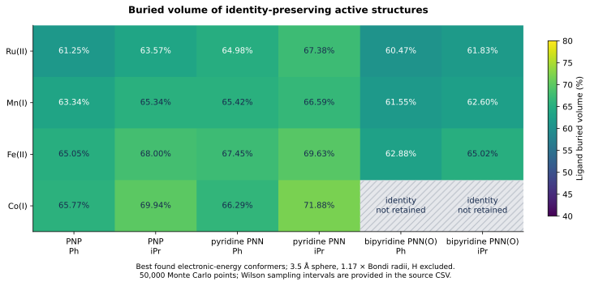
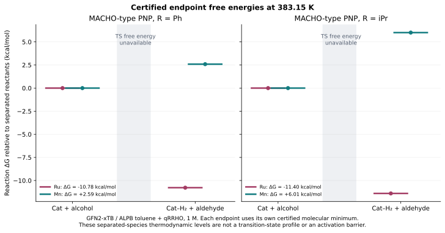
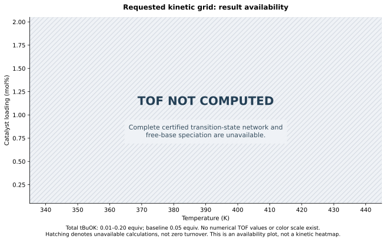

# 从设计钳形结构到可辨识借氢动力学：计算研究与证据边界

## 1. 摘要与冻结计算状态

**已冻结的限时计算记录。** 本地真实量子计算从 2026-09-12T17:01:17.890189+00:00 开始，主构象搜索于 2026-09-12T20:01:18.364829+00:00 结束，覆盖 3.0001 小时，包含初始气相预优化及随后按用户条件开展的 ALPB 甲苯计算。本报告陈述实际得到的数据及失败结果；本次运行未在时限内完成全部过渡态、微观动力学与训练模型目标。

研究对象为苯胺与苄醇的借氢 N-烷基化。四种金属分支 Ru(II)、Mn(I)、Fe(II)、Co(I)，三种质子响应骨架与两种膦取代基组成二十四项设计。溶液模型控制器实际完成 812 次原生优化任务，经完整化学身份与供体配位检查，在七十二个催化剂—状态组合中获得 70 个合格的最佳已发现几何，其中包括 22 个活性设计。两种 Co 联吡啶活性模型均发生配体氧与羰基连接重排，因此不计入目标活性态集合。这里的结构属于按文献骨架启发的设计类似物，不能表述为二十四种已在实验中确证的催化剂；有限构象搜索也不证明全局最低点或电子基态自旋。

独立的完整 Hessian 审核最终选出 70 个催化剂状态证书和 9 种分子参照。每个证书使用自己的几何与完整振动谱，覆盖十三个温度，共导出 910 条催化剂热化学温度行、117 条参照温度行，以及 858 条满足原子与电荷守恒的反应温度行。另有单独认证的 K–OtBu 接触离子对和去 N-质子化半缩醛胺簇模型。反应自由能只说明指定分子参照之间的热力学差异，不能替代活化自由能。

条件为 ALPB 甲苯、383.15 K 基准温度、叔丁醇钾基准零点零五当量及零点零一至零点二零当量的请求扫描域。两 Ru、两 Mn、两 Co 代表以及显式缩合簇均接受真实路径探索；冻结时有 0 条脱氢过渡态记录通过全部规定门槛。由于缺乏完整六步、来源一致的反应网络，实际 TOF 网格、稳态 Campbell 速率控制度、训练代理模型和 Pareto 催化剂排名均未得到。本交付保留数值上成功与失败的记录、端点热力学、可执行证据门槛，以及尚未达到的科学目标，不能把软件测试通过解读为催化机理或实验活性已被验证。

## 2. 化学问题与原始文献背景

目标反应的总计量关系为

$$\mathrm{PhCH_2OH+PhNH_2\longrightarrow PhCH_2NHPh+H_2O}.$$

这条简洁的反应式包含多个物理含义不同的过程。苄醇首先失去两个氢当量形成苯甲醛，苯甲醛与苯胺经碳氮键形成和脱水产生亚胺，亚胺再接受氢而生成二级胺。金属可能直接参与脱氢和加氢，配体可能传递质子或通过非共价作用组织底物，缩合过程则会受到水、酸碱平衡及配位环境影响。一个较低的脱氢势垒并不自动代表完整催化循环具有较高周转频率；只有把相互耦合的步骤放在统一物种与浓度体系中，才能判断该势垒对总体速率的实际影响。

结构明确的锰 PNP 配合物已经被用于胺与醇的 N-烷基化，这为选择该反应类型提供了原始实验依据。但文献中的成功催化剂具有确定结构与实验条件，不能据此推断本项目中每个跨金属类似物都能合成或具有相同反应性。[Elangovan 等，Nature Communications，2016，DOI 10.1038/ncomms12641](https://www.nature.com/articles/ncomms12641)。

内球与外球氢转移应当作为待检验的竞争假说。内球路径可能依赖底物先配位，再发生氢化物迁移；外球路径可以在不形成持续底物—金属配位键的情况下完成氢转移。PNP 供体组合和配体上可移除氢的存在，都不能独立证明外球双功能机制占优。侯成与合作者早期对 Co-PNP 体系的研究支持非双功能内球途径，说明金属几何和电子组态能够改变常见直觉；该论文的单位归属为中山大学，而且研究中的钴体系不能直接等同于本设计矩阵的 Co(I) 分支。[Hou 等，Dalton Transactions，2015](https://pubs.rsc.org/en/content/articlelanding/2015/dt/c5dt02163d/unauth)。

广西师范大学侯成课题组的相关研究进一步区分了质子响应位点的直接断键成键作用与非共价辅助作用，并将 DFT 和机器学习用于借氢反应问题。这些工作说明统一标签和结构描述符的重要性，但原文机理、误差统计和催化表现不能迁移为本仓库的验证结果。[Mei 等，2022](https://pubs.rsc.org/en/content/articlelanding/2022/dt/d2dt02597c)；[Mo 与 Hou，2025](https://pubs.rsc.org/en/content/articlelanding/2025/qo/d5qo01139f)。本项目独立开展，不声称该课题组参与、授权背书或采用了本流程。

## 3. 二十四成员设计空间的精确定义

设计空间采用四乘三乘二的笛卡尔积。金属分支依次为 Ru(II)、Mn(I)、Fe(II) 和 Co(I)。其中钴明确选择一价模型，三价钴并未隐含地合并进同一个标识。骨架分别是脂肪族 MACHO 型 PNP、吡啶衍生 PNN 和羟基联吡啶衍生 PNN；膦取代基分别采用异丙基和苯基。每个催化剂标识同时编码金属、骨架与取代基，使几何、能量、错误信息和后续路径都能够回到唯一的设计图。

下表描述的是设计成员，而不是成功率或文献身份。优化失败不会从矩阵中删除一个设计；它会改变该设计所拥有的证据状态。如此可避免只展示容易计算的体系而造成选择性呈现。

| 金属分支 | 骨架标识 | 膦取代基标识 | 设计数量 |
| --- | --- | --- | --- |
| Ru(II) | macho_pnp；pyridine_pnn；bipyridine_pnnoh | iPr；Ph | 6 |
| Mn(I) | macho_pnp；pyridine_pnn；bipyridine_pnnoh | iPr；Ph | 6 |
| Fe(II) | macho_pnp；pyridine_pnn；bipyridine_pnnoh | iPr；Ph | 6 |
| Co(I) | macho_pnp；pyridine_pnn；bipyridine_pnnoh | iPr；Ph | 6 |

联吡啶骨架参考了含羟基吡啶功能团及联吡啶—甲基膦框架的已报道钌 PNN(O) 化学。不过，本项目中准确的金属、取代基、电荷和辅助配体组合仍然属于设计类似物，不能把“参考已发表骨架”扩写为“二十四种已发表催化剂”。[de Boer 等，Organometallics，2017，DOI 10.1021/acs.organomet.7b00111](https://pubs.acs.org/doi/10.1021/acs.organomet.7b00111)。

辅助配体的选择同样属于模型定义。Ru 和 Fe 活性设计含一个羰基与一个氢化物，Mn 设计含两个羰基，Co 设计含一个羰基。与所选去质子化配体共同计数时，生成器将它们组织为名义十六电子活性集合。形式电子数用于整理假说，不是对实际轨道占据的测量。更换金属可能改变几何偏好、配体解离倾向和可达氧化态，因此该矩阵不能被描述成除一种电子参数外其余物理性质完全相同的实验对照。

## 4. 质子响应位点、氢原子库存与电荷守恒

三种骨架并不共享完全相同的 N–H 活化方式。`macho_pnp` 以中心胺/酰胺型氮作为响应位点。`pyridine_pnn` 选择膦甲基碳位点，其去质子化图采用芳香碳负离子共振表示，与芳构化/去芳构化思想相关。`bipyridine_pnnoh` 则选择羟基吡啶氧位点。后一骨架还具有可能响应的苄位碳，但一个结构中存在两个响应位置，不代表两个竞争通道都已计算。所有路径构建必须读取具体原子映射，不能把不同元素的质子受体都写成氮。

每个设计构造三个状态。活性态含指定去质子化位点；加氢态比活性态多两个氢原子，一个加到配体响应位点，另一个作为新增金属氢化物；质子化参照态只多一个质子，总电荷相应增加一。计量关系写为

$$\mathrm{Cat_{hydrogenated}=Cat_{active}+H_2},\qquad
\mathrm{Cat_{protonated}^{+}=Cat_{active}+H^{+}}.$$

这里表达的是组成关系，不是已经算出的平衡。不同原子数或电荷的绝对电子能不能直接相减后排列“稳定性”。吸氢过程需要氢参考化学势；质子化需要完整供酸体/碱平衡或其他明确参照；涉及电子变化时还必须给出电子化学势和相应电荷模型。缺失这些参照时，数值上巨大的能量差可能主要反映多了一个原子或电子，而不包含希望讨论的化学结论。

在用户指定的活化条件下，应研究质子化配体与叔丁氧基之间的质子转移，并把叔丁醇作为共轭酸产物。钾离子可能形成接触离子对，也可能参与有组织的过渡结构。若计算体系不含钾而含叔丁氧基，它就是带负电的团簇近似，所有端点和路径图像都必须保留这一电荷。不能在输入时使用阴离子团簇，讨论时却默认它已经完整代表甲苯中的叔丁醇钾盐。

活化反应与催化循环中的质子穿梭还应分开。前者改变催化剂初始质子化分布，后者可能在单个基元步骤中暂时移动质子而在步骤结束时恢复穿梭体。把二者都简化为“乘以碱浓度”会混淆预平衡与速率方程。必须先确定参与每个基元事件的物种及计量数，再从对应自由能定义其活度依赖。

同一甲苯 ALPB 模型下已经获得一个独立的叔丁醇钾接触离子对参照。优化后的 K–O 距离为 2.151712546 Å，叔丁氧基共价图保持，完整内部 Hessian 认证其为极小点。收敛救援首先以一千开尔文电子占据产生重启信息，随后执行全新的三百开尔文电子计算，再完成该占据设置下的真实无约束优化和 Hessian；没有用高电子温度能量代替报告参照。原有 SCC 失败仍保留。该结果建立的是一个接触离子对模型，不代表已经确定盐的溶解度或总体物种分布；缺少单独定义的自由 K+ 化学势，也不能据此求得盐解离比例。来源为 `data/ionic_reference_retry/summary.json` 及 `data/ionic_reference_retry/distance2.2_warm1000/result.json`。

## 5. 电子结构近似与修订后的溶剂条件

GFN2-xTB 提供真实的半经验量子能量与解析梯度，包含为高效分子计算参数化的静电和色散贡献。它适合在有限本地资源内探索结构并形成待检验假说，但其方法定义不等于本反应所有金属势垒都具有统一准确度。原始论文说明的是模型构造和研究范围，不能把其他测试集的平均误差直接当作这里每个设计的误差条。[Bannwarth、Ehlert 与 Grimme，JCTC，2019，DOI 10.1021/acs.jctc.8b01176](https://doi.org/10.1021/acs.jctc.8b01176)。

标准 GFN1-xTB 与 GFN2-xTB 的限制性开壳层处理使用自旋无关能量表达。因此，输入一个未配对电子数不意味着已经通过合适的自旋依赖模型解决竞争自旋态的能量排序。生成器记录的是名义低自旋占据假设，而不是基态自旋判定。对于 Fe 和 Co，这一限制尤其需要保留在结论中；重复优化同一占据也不能替代自旋态研究。[xTB 官方自旋极化说明](https://xtb-docs.readthedocs.io/en/latest/spgfn.html)。

早期快照采用气相 GFN2-xTB，电子占据温度为三百开尔文。电子展宽温度与核自由度的热化学温度是不同参数，不能因为输入中出现三百开尔文就断言全部自由能按该温度计算。修订条件采用甲苯 ALPB，用户给出的介电背景约为二点三八；核热化学基准温度为 383.15 K，而动力学温度轴保留 340 至 440 K 共十一个点。后来的溶液模型计算需要独立记录，不能对早期文件仅改名称就视为已经加入溶剂。

修订流程使用 ALPB 的 `gsolv` 约定，避免把程序自带的溶液参考态转换与外部 RRHO 转换重复相加。xTB 的 `reference` 和 `bar1mol` 约定包含各自参考态处理，不能与此选择无条件互换。完整 RRHO 先以一大气压为参照，再于实际温度转换到一摩尔每升一次。[xTB 官方溶剂化参考态说明](https://xtb-docs.readthedocs.io/en/latest/gbsa.html#reference-states)。

ALPB 是连续介质贡献，不会自行确定自由叔丁氧基浓度、钾离子配对结构或显式溶剂分子数。方法、溶剂、电荷和参考态必须共同定义能量比较。气相中间体与 ALPB 过渡态拼出的势垒混合了不同问题；即使两个计算都收敛，也不能作为统一势能面上的反应自由能。

基准温度 383.15 K 并不属于从 340 到 440 K、间隔十开尔文的十一个点，因此需要单独的热化学条目。从同一个接受几何在多个温度重新计算配分函数，是明确的固定几何近似，不表示每个温度都重新优化了几何、溶剂响应和溶液物种分布。如果网格中保持溶剂参数不变，也应随结果注明，不能把这种固定参数计算理解为已经建立真实的温度依赖溶剂模型。电子占据设置、核热化学温度和介质参数的分别记录，可以避免一个温度字段被赋予三种不相同的物理含义。

实际热化学表含十三个温度：298.15 K、基准 383.15 K，以及 340、350、360、370、380、390、400、410、420、430、440 K。几何、Hessian 和 ALPB 超额贡献保持在所接受的同一个模型上，各温度重新评价统计配分函数及浓度校正。报告的焓与熵是在固定 ALPB 势基础上组装的模型 RRHO/qRRHO 量，未独立计算溶剂化焓，也未计算溶剂自由能对温度的导数。因此，这些量不构成真实溶液完整的焓熵分解。

对应核算为 $G_{\rm model}^{\circ}(T)=H_{\rm model}^{\rm RRHO}(T)-TS_{\rm full}^{q}(T)+\Delta G_{\rm conc}(T)$。ALPB 贡献已经在进入模型焓的势能中计入一次，完整熵包含分子平动、转动、振动和明确假设的电子贡献。`H_298` 与 `G_298_qRRHO_sol` 是为兼容接口保留的旧字段名，真实评价温度由同一行的 `temperature` 决定。383.15 K 条目不会因为名称包含“298”而变成室温数据。同理，旧字段 `G_qRRHO_gas` 表示尚未加入浓度转换的值，其中仍可能包含 ALPB 稳定化。科学比较必须读取方法、溶剂和温度元数据，不能由字段名猜测物理参照。

## 6. 计算调度、资源边界与连续遥测

控制器记录的启动时刻为协调世界时 2026 年 9 月 12 日 17:01:17.890189，三小时窗口截至 20:01:17.890189。早期配置包含两个工作进程，每个工作进程两个线程。时间窗口表示投入计算的资源预算，不保证可以找到指定数量的极小点或过渡态。复杂配体的全 Hessian、困难电子收敛以及双向下坡检查可能远比普通几何优化昂贵；资源耗尽应对应有记录的不完整状态，而不是放宽标准后制造成功。

每个作业关联催化剂、状态、初始种子、计算后端、电荷、占据设置及输出目录。完成、收敛和科学接受属于三个不同字段。程序可以结束但未达到力阈值；达到力阈值的结构可能已经丢失原有配位；保留配位的驻点仍可能具有不希望出现的负曲率。分开记录这些阶段能够说明计算真正停在哪里，也使后续研究者知道应重试数值设置、初始构型还是机理假说。

遥测应包括累计时间、完成及活动作业、收敛数量、相同组成内部的最佳能量变化和工作进程的 CPU 活动。能量漂移只有在方法、溶剂、电荷和组成一致时才可比较。更大分子具有更负总能量并不是搜索改进；加入溶剂产生能量变化也不是同一气相优化的下降幅度。用户要求的十分钟遥测是运行监控，不能替代保存每个原始计算的具体记录。

自主重试也需要边界。一个可审计的重试会保留错误类型，说明改变了哪项电子或几何条件，并记录新的结果；它不会覆盖原始失败，也不会把缺失值填成方便画图的数值。若剩余时间不足以完成 Hessian 或双向连接验证，过渡态状态仍应是不完整。持续计算的价值在于增加真实证据，而不是让时钟经过指定时长后自动赋予结果可信度。

## 7. 分子装配与构象搜索的含义

装配从显式有机连接关系、供体原子和响应位点出发。RDKit 距离几何生成候选配体坐标，并通过约束帮助供体处于预设的起始排列；随后添加金属及辅助片段，再进入实际电子结构优化。有机力场预处理只是构建几何的步骤，其能量不作为 GFN2-xTB 能量替代。原始分子图、原子次序及氢库存均需保留，因为后续反应路径要求精确原子映射。[RDKit 距离几何接口](https://www.rdkit.org/docs/source/rdkit.Chem.rdDistGeom.html)。

成功嵌入并不保证起始结构合理。片段拼接后过近的原子对可以使电子问题病态，或代表错误的键合关系。生成器因而检查严重重叠，并允许更换种子或扭转构型。这样的拒绝是装配失败，不能推导为某种催化剂无法存在。同样，优化后的供体距离检查是几何保持测试，不是完整的键级或电子结构分析；发生显著重排时仍需检查原子排列和化学身份。

对同一方法和同一化学状态，可以从多个种子或扭转扰动开始优化，并比较访问到的接受结构。其中最低者应称为“已找到的最低能构象”。全局最低点需要更强的构象覆盖证据。反复找到同一结构能够增加局部搜索的可信度，但不能排除远处配体构象、解离状态或未探索的辅助配体排列。

CREST 提供使用快速量子方法自动探索低能构象空间的文献框架。然而，能量后端使用 xTB 并不意味着已经运行 CREST；只有存在实际 CREST 调用和原始输出，才能把搜索称为完成的 CREST 计算。[Pracht、Bohle 与 Grimme，PCCP，2020，DOI 10.1039/C9CP06869D](https://pubs.rsc.org/en/content/articlehtml/2020/cp/c9cp06869d)。本报告按运行证据描述实际采用的种子和构象探索，不借用工具名称扩大发生过的工作。

若一个物种的构象集合已经得到适当验证，可按 $p_k\propto g_k\exp[-G_k/(RT)]$ 计算权重并构造系综自由能。这里需要一致自由能和正确简并度。只用电子极小值加上任意重复结构计数会偏置构象分布，尤其当构象主要在熵而不是电子能上不同时。早期最佳结构表因此属于搜索记录，不是完整的热平衡系综。

## 8. 数据谱系与分层证据标准

早期数据来源包括 `data/campaign/control.json`、`data/campaign/records.jsonl`、`data/campaign/assembly_failures.jsonl` 和 `data/datasets/best_conformers.json`。控制文件记录调度设置与声明的时间窗口，追加记录描述每次尝试，最佳构象集合是随搜索改进而更新的派生选择。因此，从最佳集合引用数值时必须说明观察时刻；本报告下一节给出固定快照，不把它伪装成实时状态。

原始输出和优化几何具有各自的 SHA256。前者用于识别数值作业记录，后者用于识别描述符和后续计算实际使用的结构。哈希证明的是文件身份，不是化学正确性。其价值体现在重新运行几何、修改解析器或升级方法时，可以区分数值变化来自原始数据变化还是后处理变化，而不必依靠文件名猜测。

本研究区分五个证据层级。装配图确定一种拟议组成；收敛优化确定满足相应力与结构检查的数值结果；完整且合格的 Hessian 确定所用模型下的局部曲率；过渡态还需要指定不稳定运动及其端点连接；有效反应网络则需要全部相关状态和步骤自由能、统一参照及合理浓度模型。层级之间可以逐步累积，却不能互相替代。

热化学桥接保存 `verified_minimum`、`numerical_uncertainty`、`not_a_minimum`、`failed` 和 `deadline_exhausted` 等状态。只有结构与振动条件满足后才输出被接受的自由能。一个只是力收敛的结构不能直接填入 Gibbs 能列，未认证 NEB 峰值也不能直接填入活化自由能列。缺失数据因此具有科学含义：它指出缺少哪个前提，而不是等待随意补数的空格。

相同原则也适用于论文组织。真实输出格式兼容测试说明解析器能读取某类文件；解析公式测试说明数值实现符合定义；当前真实 xTB 优化说明实际进行了某个半经验计算。三者都重要，但它们分别回答不同问题。保留失败和未经接受的记录，能防止后续训练只看到经过选择的成功标签，从而掩盖模型适用范围。

化学身份检查覆盖完整配体和辅助配体，而非仅检查三个供体到金属的距离。检查内容包括原始非金属共价图、异常新生的配体—辅助配体键、原有金属—氢化物与金属—羰基配位，以及所声明的质子和氢库存。当前几何筛查对非金属键使用 ASE 共价半径和的一点二八倍，并采用明确记录的辅助配位距离区间。这些是筛查约定，不是普适键级界限。预定催化剂热化学必须同时通过数学极小点认证、接受几何精确哈希、NPZ 来源精确哈希及完整身份检查；下游选择字段为 `data/campaign/thermochemistry/identity_audit.json` 中的 `eligible_for_intended_catalyst_thermochemistry`。后来更新的最佳构象不能因为催化剂名称相同，就自动继承旧几何的 Hessian。

原始 Ru-MACHO 活性态证书说明数学驻点与化学身份为何必须分开。保留下来的 iPr 与 Ph 来源几何发生了配体 C–H 连接变化：受影响 C–H 距离约为 2.350 与 2.370 Å，相应氢到 Ru 的距离约为 1.563 与 1.572 Å。完整 Hessian 可以认证这些模型重排结构的局部曲率，但它们不再是原先指定的活性态。因此，这些计算作为模型中的氢迁移或副反应证据保留，不进入预定状态的热化学比较。应使用绑定具体几何和哈希的审计记录，并在比较距离前把配体局部索引转换为完整分子索引，确保化学解释和 Hessian 证书对应同一结构。另有构象审计澄清文件 `data/campaign/neb/ru_conformer_identity_index_clarification.json`，记录了这一索引映射，并核验十四条相应当前几何的哈希均与原始计算记录一致。

另一个经过单独诊断的 `Co_bipyridine_pnnoh_Ph` 候选形成了配体氧到辅助羰基碳的接触。零起始索引二十五与四十六之间的距离为 1.496300406 Å，xTB Wiberg 键级为 0.833712668；原始键级文件的一起始索引则为二十六与四十七。复制进入仓库的几何和键级文件均与 `data/cobalt_carbonyl_rescue/side_reaction_diagnostic.json` 中的 SHA256 一致。这两类诊断共同支持所算结构出现非预期共价连接，但不能证明实验副产物、氧化态归属或有效催化路径。即使其数值优化正常结束，也应从预定活性态排序中排除。

动力学适配层还要求明确的溶剂及溶剂参考态元数据、经过复核的完整化学身份、元素组成和分子电荷。它逐步检查原子与电荷守恒，并核对每个鞍点是否包含所声明的完整反应物及穿梭体组成。接受的鞍点元数据还必须确认反应专属运动与端点连接。这些检查使用经过审阅的计算证据；适配层不会执行新量子计算，也不会单凭文件哈希相同推断化学有效性。计算模型必须保留完整来源快照，因此仅声明一个证据等级字符串不能替代缺失步骤。

## 9. 冻结结构结果与接受边界

下表完全使用 `data/datasets/catalyst_descriptors.csv` 冻结的 ALPB 甲苯活性态最佳已发现几何。二十四项设计中有 22 项保留目标身份。PNP 角度为 P–M–P，两类 PNN 角度为 P–M–N；埋藏体积采用五万个 Monte Carlo 点，逐项 Wilson 区间及完整精度坐标见 CSV 与 `data/structures/`。破折号表示没有可用结果，绝不等于零。由于尚未形成来源验证完整的活化自由能数据集，本表全部势垒单元格仍为空缺。

| 金属 | 骨架 | R | 夹角／度 | Vbur／% | ΔG‡／kcal mol−1 |
| --- | --- | --- | ---: | ---: | --- |
| Ru | PNP | Ph | 162.618 | 61.250 | — |
| Ru | PNP | iPr | 163.554 | 63.568 | — |
| Ru | pyridine PNN | Ph | 160.073 | 64.980 | — |
| Ru | pyridine PNN | iPr | 159.636 | 67.382 | — |
| Ru | bipyridine PNN(O) | Ph | 164.168 | 60.472 | — |
| Ru | bipyridine PNN(O) | iPr | 164.046 | 61.834 | — |
| Mn | PNP | Ph | 163.861 | 63.338 | — |
| Mn | PNP | iPr | 155.406 | 65.342 | — |
| Mn | pyridine PNN | Ph | 162.547 | 65.420 | — |
| Mn | pyridine PNN | iPr | 162.476 | 66.586 | — |
| Mn | bipyridine PNN(O) | Ph | 160.534 | 61.546 | — |
| Mn | bipyridine PNN(O) | iPr | 160.445 | 62.596 | — |
| Fe | PNP | Ph | 167.484 | 65.054 | — |
| Fe | PNP | iPr | 166.351 | 67.998 | — |
| Fe | pyridine PNN | Ph | 167.626 | 67.452 | — |
| Fe | pyridine PNN | iPr | 163.651 | 69.628 | — |
| Fe | bipyridine PNN(O) | Ph | 165.897 | 62.876 | — |
| Fe | bipyridine PNN(O) | iPr | 162.565 | 65.022 | — |
| Co | PNP | Ph | 165.093 | 65.774 | — |
| Co | PNP | iPr | 168.909 | 69.936 | — |
| Co | pyridine PNN | Ph | 169.543 | 66.290 | — |
| Co | pyridine PNN | iPr | 169.238 | 71.884 | — |
| Co | bipyridine PNN(O) | Ph | — | — | — |
| Co | bipyridine PNN(O) | iPr | — | — | — |

两种缺失的 Co 联吡啶活性设计有明确的计算原因：更换起始几何后，非预期配体 O—羰基 C 连接仍反复出现。苯基案例所保存诊断结构的 O—C 距离为 1.4963 Å，原生 xTB Wiberg 键级为 0.8337。它支持该近似势能面上发生重排的解释，却不能确定溶液中的副反应产率或实验分解速率。重排结构即便具有全正 Hessian，也只是另一种化学身份的数学极小点，不能计入原定活性态。

电子能选择与热化学认证具有不同任务。描述符表使用抽样中电子能最低的合格几何；热化学表则在已获得完整证书的构象中，按 383.15 K 的 G 选择，并在十三个温度统一沿用该证书几何。二者通过文件路径、原子顺序和几何哈希明确绑定，不假定必然来自同一个构象。Co PNN 的特殊夹角以及若干异丙基与苯基体积次序反转，只属于结构观测，仍需进一步计算解释。

追加式记录分别保留装配错误、电子不收敛、供体脱落、共价重排、Hessian 拒绝与路径预算耗尽。恢复运行后控制器当前轮次计数可能不同于累计日志，最终统计按完整记录汇总。原生证据归档包含真实优化、梯度及失败输出；`data/CAMPAIGN_STATUS.json` 和热化学导出清单给出冻结数目，同时保留早期气相准备的历史。

## 10. 位阻观测量的定义与可解释范围

设金属位置为 $\mathbf r_M$，两个供体位置为 $\mathbf r_1$ 和 $\mathbf r_2$，则 $\mathbf a=\mathbf r_1-\mathbf r_M$、$\mathbf b=\mathbf r_2-\mathbf r_M$，夹角为

$$\theta=\arccos\left[\operatorname{clip}\left(\frac{\mathbf a\cdot\mathbf b}{|\mathbf a||\mathbf b|},-1,1\right)\right].$$

截断只用于处理反余弦边界的浮点误差。若供体与金属重合，向量长度为零，几何本身无定义，不能通过截断“修复”。刚体旋转和平移不会改变夹角，但选取不同供体对会改变描述符的化学意义。PNN 配体只有一个磷供体，不能为满足表头而虚构第二个磷；其角度标签必须在表格、回归输入和任何图中保留为 P–M–N。

埋藏体积定义为选定配体原子球的并集在金属中心探测球内所占比例：

$$\%V_{\rm bur}=100\frac{\operatorname{Vol}[B_R(M)\cap\cup_jB_{sr_j}(j)]}{4\pi R^3/3}.$$

默认探测半径为三点五埃，Bondi 半径乘以一点一七，并默认排除氢。该约定与 SambVca 文档中的描述符参数一致，但本实现采用随机积分而不是服务器的空间网格。[SambVca 参数说明](https://www.aocdweb.com/OMtools/sambvca2.1/help/help.html)。金属仅作为中心，不作为配体遮蔽体积；反离子、底物和其他辅助片段是否计入，也必须由明确的原子选择定义。

球内均匀采样需要均匀方向和与 $u^{1/3}$ 成正比的径向坐标，不能直接均匀抽取半径。命中比例为 $\hat p$ 时，标准误差为 $100\sqrt{\hat p(1-\hat p)/N}$ 个百分点。记录 Wilson 区间可改善零占据或全占据附近朴素对称区间的问题。该区间只量化固定几何与半径模型下的数值积分不确定度，不包括构象、电子方法、半径参数及原子选择的不确定度。

因此，较窄数值区间不能被解释为准确预测溶液中的底物可达性。不同构象可能具有相近的总埋藏体积，却暴露不同空间方向；结合过渡态也可能依赖单一百分数无法表示的局部口袋。结构指标应与完整坐标和模型状态一起解释，而不应替代势垒或直接与产率画成未经验证的因果关系。

角度类型还带来统计解释问题。末端 P–M–P 和 P–M–N 都是角度，但它们的取值范围受到不同供体身份和骨架约束控制。若回归把两者混成一个没有标签的数值列，模型可能只是识别骨架类别，而没有学到可迁移的几何效应。因此，需要保留供体标签、进行骨架内部比较，并检查留出配体组上的表现，才能判断该特征实际携带什么信息。对异丙基和苯基的比较也应检验构象是否可比，不能把优化路径选择带来的差别直接命名为取代基电子效应。

## 11. 统计热力学与 qRRHO 自由能推导

对以倒厘米给出的内部模式波数 $\tilde\nu_i$，先转换为普通频率 $\nu_i=100c\tilde\nu_i$，再定义无量纲变量 $x_i=h\nu_i/(k_BT)$。谐振子的能级为 $\epsilon_n=h\nu_i(n+1/2)$，配分函数与摩尔内能分别为

$$q_i=\sum_{n=0}^{\infty}e^{-\beta\epsilon_n}=\frac{e^{-x_i/2}}{1-e^{-x_i}},\qquad
U_i=N_Ah\nu_i\left[\frac12+\frac{1}{e^{x_i}-1}\right].$$

将配分函数代入 $S_i=R[\ln q_i+T\partial_T\ln q_i]$，显式零点能项从熵中相消，得到

$$S_i^{\rm HO}=R\left[\frac{x_i}{e^{x_i}-1}-\ln(1-e^{-x_i})\right].$$

当频率趋于零时，$S_i^{\rm HO}\sim R(1-\ln x_i)$ 发散。柔性配体扭转可能因此在谐振熵中占据过大权重，即使这些运动更适合被理解为受阻内部转动。Grimme 内插使用自由转子极限降低这种敏感性，是明确的统计近似，而不是耦合扭转量子动力学的精确解。[Grimme，Chemistry—A European Journal，2012，DOI 10.1002/chem.201200497](https://doi.org/10.1002/chem.201200497)。

定义未约化惯量、约化惯量及平均惯量参数：

$$\mu_i=\frac{h}{8\pi^2\nu_i},\quad
\mu_i'=\frac{\mu_iB_{\rm av}}{\mu_i+B_{\rm av}},\quad
B_{\rm av}=10^{-44}\ \mathrm{kg\,m^2}.$$

对单位内部对称数的一维经典转子，相空间动量积分产生

$$q_i^{\rm FR}=\left(\frac{8\pi^3\mu_i'k_BT}{h^2}\right)^{1/2},\qquad
S_i^{\rm FR}=R\left(\frac12+\ln q_i^{\rm FR}\right).$$

约化惯量保证频率趋于零时惯量趋向有限值。仅使用 $h/(8\pi^2\nu_i)$ 是未约化模型，不能获得同一有限极限。默认权重与修正振动熵为

$$w_i=[1+(\tilde\nu_0/\tilde\nu_i)^4]^{-1},\quad\tilde\nu_0=100\ \mathrm{cm^{-1}},\qquad
S_{\rm vib}^{q}=\sum_i[w_iS_i^{\rm HO}+(1-w_i)S_i^{\rm FR}].$$

修正只替换振动熵。完整分子总熵与自由能满足

$$S_{\rm total}^{q}=S_{\rm total}^{\rm RRHO}-S_{\rm vib}^{\rm HO}+S_{\rm vib}^{q},\qquad
G^q=H_{\rm RRHO}-TS_{\rm total}^{q}.$$

总焓已经包含电子能、零点能与热贡献，不能再次添加电子能或 ZPVE。能量以千卡每摩尔、熵以卡每摩尔每开尔文表示时，需要把 $TS$ 除以一千。被接受的极小点使用全部正内部模式；被接受的一阶鞍点排除唯一不稳定反应坐标。虚频不能取绝对值变成正频，已有 qRRHO 的程序输出也不能再重复阻尼。每个温度必须对应其自身完整热力学状态，不能只改变熵计算温度而保留无关温度的总焓。

## 12. 标准态、活化参照与自由能一致性

即使对于理想气体，压力标准态和浓度标准态也不同。由 $\mu(p)=\mu(p^\circ)+RT\ln(p/p^\circ)$ 与 $C_g=p/(RT)$ 可得

$$\Delta G_{\rm conc}=RT\ln\left(\frac{C^\circ RT}{p^\circ}\right).$$

对数的自变量必须无量纲。在国际单位制中，一摩尔每升等于一千摩尔每立方米，一大气压等于 101325 帕。298.15 K 时转换量为 1.8943284455 千卡每摩尔；在 383.15 K 及网格其他温度处都需重新求值，不能沿用舍入的室温常数。修订的 ALPB `gsolv` 约定与此标准态转换共同定义核算方案，浓度位移只加入一次。

反应的标准态位移需乘分子数变化 $\Delta n=\sum_j\zeta_j$，产物计量数取正，反应物取负。两分子结合成一个复合物时，反应位移为负的单物种校正量。以两个分离物种为参照的活化自由能具有相同计量问题，而以预缔合复合物为参照的势垒对应另一基元步骤。不能把后者放入双分子 Eyring 表达式而不改变参照。

活化还需要化学参照。去质子化催化剂与质子化前体之间的比较必须包含叔丁氧基、叔丁醇或另一完整质子转移反应。活性态与加氢态之间的比较必须包含完整氢库存。只有原子、电荷和参照条件平衡，数值差值才成为可解释的反应量。不同辅助配体数量、不同电荷或不同溶剂模型的绝对能不能直接用于横向稳定性排名。

连续介质稳定化与实际溶液物种分布仍是两个问题。ALPB 不会自动生成钾离子配对平衡，标准态转换也不会加入溶剂化能。基于气相极小点和溶液过渡态拼接的势垒，会把模型差异混入反应能量。网络接受门槛因此要求参与同一次比较的能量遵循一致计算协议，同时把离子配对、聚集与显式溶剂的不足作为独立科学限制保留下来。

在完整催化网络尚未建立前，独立小分子参照已经提供一个可核查的反应热力学结果。统一记 $A$ 为苄醇，$D$ 为苯甲醛，$N$ 为苯胺，$Q$ 为中性半缩醛胺，$I$ 为亚胺，$W$ 为水，$P$ 为 N-苄基苯胺；这些符号在后文网络中保持同义。标准反应自由能按 $\Delta_rG^{\circ}=\sum_i\nu_iG_i^{\circ}$ 计算，产物系数为正，反应物系数为负。直接评价的三条参照反应为 $D+N\rightarrow Q$、$Q\rightarrow I+W$ 和 $A+N\rightarrow P+W$。

| 独立优化参照之间的反应 | $\Delta n$ | 383.15 K 的 $\Delta_rG^{\circ}$ / 千卡每摩尔 |
| --- | ---: | ---: |
| 半缩醛胺形成，$D+N\rightarrow Q$ | −1 | −7.51178867 |
| 半缩醛胺脱水，$Q\rightarrow I+W$ | +1 | +5.52597660 |
| 净借氢取代，$A+N\rightarrow P+W$ | 0 | −4.23531646 |

十三个温度的完整数值保存在 `data/datasets/reference_reaction_thermodynamics.csv`。配套 `reference_reaction_thermodynamics.manifest.json` 记录七种来源物质、计量系数、原子及电荷守恒、原始结果与几何哈希、NPZ 哈希、接受频谱、元数据修正历史和可重复导出脚本。每个参照均重新比对分子图、接受几何、完整全正内部频谱，以及每一温度条目与所保存 Hessian 的一致性。来源哈希修正使哈希对应来源路径真正指向的 NPZ，原始未投影 Hessian 的独立校验和仍然保留。这属于真实 GFN2-xTB 数据的已核查后处理，不是新量子计算，也不是合成研究数据。

在所选标准态下，模型给出有利的半缩醛胺形成、正的脱水自由能，以及放能的净取代反应。383.15 K 时，前两条反应相加得到 $D+N\rightarrow I+W$ 的自由能为 −1.98581207 千卡每摩尔。这些数值是稳定分子参照之间的自由能差，不是活化势垒，其正负不能确定决速步骤、生成速率常数或证明催化活性。实际反应自由能还包含活度修正：

$$\Delta_r G=\Delta_r G^\circ+RT\ln\prod_i a_i^{\nu_i}.$$

因此水累积、底物消耗、缔合与离子物种分布都会影响反应混合物。只有化学闭合机制成立后，催化剂和穿梭体才可在净计量中抵消；计量抵消本身也不确定碱的动力学级数。

### 认证的催化剂反应热力学

本表统一为 383.15 K、分离的一摩尔每升分子物种以及固定 ALPB 势能模型下的 kcal/mol。醇脱氢反应指 Cat＋苄醇→Cat–H₂＋苯甲醛；活化参照指质子化 Cat(+)＋叔丁醇盐(−)→Cat＋叔丁醇。所有加和均满足原子与电荷守恒，并使用各自几何绑定的完整证书。

两个 Ru PNP 设计的醇脱氢反应在本模型中均为放能，两个 Mn PNP 设计的醇脱氢反应均为吸能；这四个设计的亚胺加氢端点反应则呈相反的正负号分布。这只支持所选分子状态之间的热力学差别，不能推出 Ru 势垒更低或周转更快；缔合盆地、真实鞍点、亚胺还原、缩合及催化剂分布尚未全部确定。若干吡啶 PNN 反应比 PNP 更有利，但响应原子和骨架拓扑也同时改变，因此不能将其全部归因于金属或取代基电子效应。

较大的负去质子化自由能对应低介电模型中刻意分开的带电参照发生中和。它们不是测量的 pKa、真实溶解叔丁醇钾的活化平衡，也不能证明零点零五当量总盐对应某个自由阴离子浓度；该反应定义没有包含接触离子配对与反离子化学势。十三温度完整序列可用于既定热模型内的敏感性研究，尚未计算的溶剂温度导数仍属于另一项模型局限。

亚胺加氢定义为 Cat–H₂＋亚胺→Cat＋产物胺。它与醇脱氢及两项已认证缩合参照反应相加时，催化剂状态和中间体必须准确相消。独立导出的循环残差在每个温度检查该热力学闭合关系。较有利的储氢可以伴随较不利的放氢；任一孤立端点差均不能确定速率或选择最优催化剂。

| 设计 | 醇脱氢反应 ΔG | 亚胺加氢反应 ΔG | 分离离子去质子化 ΔG |
| --- | ---: | ---: | ---: |
| Ru / PNP / Ph | -10.775 | +8.526 | -62.348 |
| Ru / PNP / iPr | -11.398 | +9.148 | -70.884 |
| Ru / pyridine PNN / Ph | -18.043 | +15.793 | -44.000 |
| Ru / pyridine PNN / iPr | -20.092 | +17.842 | -46.760 |
| Ru / bipyridine PNN(O) / Ph | -21.305 | +19.055 | -55.810 |
| Ru / bipyridine PNN(O) / iPr | -21.393 | +19.144 | -55.049 |
| Mn / PNP / Ph | +2.589 | -4.839 | -87.579 |
| Mn / PNP / iPr | +6.007 | -8.257 | -85.690 |
| Mn / pyridine PNN / Ph | -29.891 | +27.641 | -42.664 |
| Mn / pyridine PNN / iPr | -34.350 | +32.100 | -41.239 |
| Mn / bipyridine PNN(O) / Ph | -15.129 | +12.879 | -71.003 |
| Mn / bipyridine PNN(O) / iPr | -13.874 | +11.625 | -69.603 |
| Fe / PNP / Ph | -2.628 | +0.378 | -66.410 |
| Fe / PNP / iPr | -3.655 | +1.405 | -60.589 |
| Fe / pyridine PNN / Ph | -15.663 | +13.414 | -31.458 |
| Fe / pyridine PNN / iPr | -18.785 | +16.536 | -35.108 |
| Fe / bipyridine PNN(O) / Ph | -7.145 | +4.896 | -62.274 |
| Fe / bipyridine PNN(O) / iPr | -6.790 | +4.541 | -59.328 |
| Co / PNP / Ph | +1.705 | -3.955 | -48.902 |
| Co / PNP / iPr | +10.376 | -12.625 | -46.660 |
| Co / pyridine PNN / Ph | -1.227 | -1.023 | -43.555 |
| Co / pyridine PNN / iPr | +4.185 | -6.434 | -41.237 |

## 13. 反应端点、原子映射与攀爬图像 NEB

路径搜索要求两个端点具有相同原子次序、总组成和电荷。脱氢过程中，原本与氧相连的氢应映射到所选配体响应位点，适当的碳上氢应映射到金属，苄位碳和氧则保留为羰基产物中的相同原子。若在端点之间添加或删除氢，搜索的就不再是同一个反应。相同原子数也不充分，因为互换两个化学身份不同的氢会制造另一条路径。

实现使用七个内部图像加上两个端点，总计九个图像。“七个中间图像”和“总共七个结构”不能混用。初始插值可通过改进方式减少重叠，但仍然只是坐标猜测；每个图像的能量和力必须来自所选量子后端。未计算能量的插值几何连线不能被称为势能剖面，二维示意图也不能替代真实路径输出。

对第 $i$ 个图像及其路径切向量 $\hat\tau_i$，NEB 力由垂直路径的物理力与平行路径的弹簧力组成：

$$\mathbf F_i^{\rm NEB}=-\nabla E(\mathbf R_i)+[\nabla E(\mathbf R_i)\cdot\hat\tau_i]\hat\tau_i
+k\left(|\mathbf R_{i+1}-\mathbf R_i|-|\mathbf R_i-\mathbf R_{i-1}|\right)\hat\tau_i.$$

垂直投影避免弹簧直接把弯曲路径拉离势能谷，平行弹簧帮助图像沿路径分布。经过适当预松弛后，选定攀爬图像移除弹簧并反转切向物理力：

$$\mathbf F_i^{\rm CI}=-\nabla E(\mathbf R_i)+2[\nabla E(\mathbf R_i)\cdot\hat\tau_i]\hat\tau_i.$$

该方法针对所表示路径上的鞍点，但不能证明已找到所有可能路径中的最低者，也不能独立确定该鞍点的振动阶数。[Henkelman、Uberuaga 与 Jónsson，JCP，2000，DOI 10.1063/1.1329672](https://doi.org/10.1063/1.1329672)。

端点优化、化学身份、带路径收敛和候选结构未经投影的真实力范数分别记录。未收敛带中的一个几何可以作为二聚体精修初猜，但必须保留这种来源。此举只是数值初始化策略，不豁免过渡态认证：精修候选仍须独立满足真实力阈值、完整 Hessian 模式数目、反应专属位移判据和正确的双向下坡连接，之后才能建立接受势垒。由此得到合格鞍点，也不能追溯性地把原来的带路径改称已收敛。未收敛带的最高能图像始终属于路径搜索观察，不能直接作为势垒。超过步数、电子求解失败和期限耗尽仍须明确保留。

一个真实 Mn-MACHO-PNP-Ph 候选提供了针对具体几何的接受边界诊断。该记录于协调世界时 2026 年 9 月 12 日 19:13:22 完成，取自此前二聚体轨迹中 source_frame=110 的记录，并保留通过筛查的催化剂身份。八十个原子的完整笛卡尔 Hessian 为 240 × 240 矩阵，投影六个外部方向后留下二百三十四个内部模式。其中四个带符号曲率频率为负，分别是 −378.9759、−27.7247、−18.9928 和 −7.7317 cm⁻¹；独立真实最大力为 0.2800261 eV Å⁻¹。因此，这是一项非平稳几何的曲率诊断，不是已接受的一阶鞍点，负曲率方向数目也不能表述为某个已平稳鞍点的阶数。准确的候选几何与 NPZ 哈希、完整频谱、真实力和来源轨迹记录在 `data/campaign/neb/Mn_macho_pnp_Ph_diagnostic_1789240138_30924/diagnostic.json`。

主负曲率模式的质子转移、氢负离子转移及联合重叠分别为 0.1060991、0.8215832 和 0.6559704。虽然其方向标记为协同，频率也位于脱氢要求的区间内，质子重叠仍低于单独的 0.15 阈值；较大的氢负离子分量不能替代这一条件。加上尚未收敛的真实力和额外负模式，该候选不能获得过渡态证书或用于构建 Gibbs 活化势垒。至最终冻结时，以该模式初始化的二聚体续算已结束，仍未获得过渡态认证。续算末帧的完整 Hessian 诊断与原候选一起列于下表，各自保留独立的真实力、振动模式和身份记录。有限时限内的搜索失败不能证明 Mn 路径不存在。

完整 Hessian 可以来自两个明确的数值来源。`src/pincer_catmech/kinetics/neb_ts_search.py` 中由 ASE 驱动的 `full_hessian` 对真实量子力逐一作外部中心差分，构建所有笛卡尔列，需要 6N 次力评价。`scripts/run_neb_campaign.py` 的原生提供器则调用 `src/pincer_catmech/quantum/thermochemistry.py` 中的完整、无偏置 xTB Hessian 实现，要求正常终止、零冻结原子、比例因子 1.0，以及有限的未投影 3N × 3N 矩阵。两者都是记录了各自位移约定的完整数值 Hessian，而非选取少数模式的近似。该候选的原生 Hessian 电子能与独立梯度电子能之差为 −3.2871 × 10⁻⁸ eV，满足 0.001 eV 的一致性门槛。同一诊断目录的 `native_hessian_provider.json` 保存了该比较，以及原生输入、命令、输出和原始矩阵的哈希；报告整理时独立核对了候选几何、NPZ 和五项原生文件的哈希。这些检查确认来源及势能模型的一致性，不意味着已经逐元素比较两种独立 Hessian 数值方案，也不替代驻点接受条件。

### 真实非驻点曲率诊断

以下为固定候选几何的完整 Hessian 非驻点诊断。依次列出未经修改的最大力（eV/Å）、负模式数、最负模式频率（cm⁻¹）及其质子／氢负离子重叠。它们不是驻点证书或活化自由能；随后以模式为依据的搜索另有结果文件，见最终 NEB 清单。

| 候选 | 最大力 | 负模式数 | 最负频率 | 质子重叠 | 氢负离子重叠 |
| --- | ---: | ---: | ---: | ---: | ---: |
| Mn PNP Ph / 19:13:22 UTC | 0.2800 | 4 | -378.976 | 0.106 | 0.822 |
| Mn PNP Ph / 19:56:03 UTC | 0.2220 | 2 | -338.863 | 0.117 | 0.822 |
| Ru PNP iPr / 19:44:30 UTC | 0.3869 | 5 | -778.913 | 0.823 | 0.040 |
| Ru PNP Ph / 19:34:30 UTC | 0.5983 | 4 | -373.320 | 0.046 | 0.084 |

## 14. 鞍点精修、全 Hessian 与自校正搜索

二聚体方法通过相邻两个几何的力差估计曲率方向，旋转步骤寻找低曲率方向，平移步骤反转该方向的力分量并松弛正交方向。它减少了每次精修迭代都构建完整 Hessian 的需要，但最终局部曲率认证仍需要额外计算。[Henkelman 与 Jónsson，JCP，1999，DOI 10.1063/1.480097](https://henkelmanlab.org/pubs/henkelman99_7010.pdf)。

笛卡尔 Hessian 元素可由中心力差估计：

$$H_{ab}=\frac{\partial^2E}{\partial x_a\partial x_b}≈-\frac{F_a(\mathbf x+\delta\mathbf e_b)-F_a(\mathbf x-\delta\mathbf e_b)}{2\delta}.$$

随后使用 $\widetilde H=M^{-1/2}HM^{-1/2}$ 质量加权，并投影掉整体平动和转动方向，再对内部空间对角化。经单位换算，特征值 $\lambda_k$ 对应带符号波数 $\operatorname{sgn}(\lambda_k)\sqrt{|\lambda_k|}/(2\pi c)$。对称化前的反对称部分可作为力差数值一致性的诊断；不能先强行对称化，再假装原始电子梯度完全可靠。

本任务要求脱氢候选恰有一个内部虚频，且位于负一千八百到负三百倒厘米之间。进一步还要求该模式同时与质子转移和氢化物转移坐标重叠，并具有预期协同方向。一个单独的虚扭转能够满足虚频数目，却不满足反应身份；相反，一个区间外但可能有物理意义的鞍点，在本次声明的接受规则下仍不被接受，只能作为另行分析对象。

自校正过程沿额外不稳定内部模式进行位移，在明确的尝试次数和时间约束内重新精修，并保存位移方向、幅度、力、频率和最终状态。不能把所有负频都删掉以达到目标计数，也不能只保留最像反应模式的一条而忽略其余负曲率。对于可能的数值噪声，需要通过更严格几何、步长或电子精度研究判断，而不是直接赋予有利标签。

沿反应模式正负方向分别下坡并优化，可检查候选是否连接指定端点盆地。只通过虚频数目而无法返回正确反应物与产物，仍然不足以证明目标过渡态。只有认证鞍点及正确反应物参照均获得一致热化学，才能建立实际自由能势垒；NEB 峰高本身不承担这一角色。

缩合过程使用独立的反应模式定义。热化学桥支持显式 `ts_imaginary_window_cm1=None`，它只关闭脱氢专属的频率区间，仍要求恰好一个负内部频率且没有零内部模式。依照实际定义的缩合步骤，不稳定位移应表现相应的一次或多次质子转移，以及 C–O 断裂和 C–N 收缩，并通过正确的下坡连接检查。不能为不含氢化物迁移的反应强加 hydride 指标。完整带符号频谱和所选择的频率区间约定均保存在证据中。

## 15. 基元网络与八个微分方程的守恒构造

网络包含十一种物种：醇 $A$、自由催化剂 $C$、醇配位复合物 $X$、醛 $D$、加氢催化剂 $H$、苯胺 $N$、半缩醛胺 $Q$、亚胺 $I$、水 $W$、亚胺与加氢催化剂的复合物 $Y$ 和产物 $P$。六个可逆基元步骤为

$$A+C\rightleftharpoons X,\quad X\rightleftharpoons D+H,\quad
D+N\rightleftharpoons Q,\quad Q\rightleftharpoons I+W,\quad
I+H\rightleftharpoons Y,\quad Y\rightleftharpoons P+C.$$

每个步骤均保留反向项，以便从同一状态自由能建立细致平衡，而不是把未知反向速率隐含设为零。按 $(A,C,X,D,H,N,Q,I,W,Y,P)$ 排列物种，列对应六个步骤，计量矩阵为

$$S=\begin{pmatrix}
-1&0&0&0&0&0\\-1&0&0&0&0&1\\1&-1&0&0&0&0\\
0&1&-1&0&0&0\\0&1&0&0&-1&0\\0&0&-1&0&0&0\\
0&0&1&-1&0&0\\0&0&0&1&-1&0\\0&0&0&1&0&0\\
0&0&0&0&1&-1\\0&0&0&0&0&1
\end{pmatrix},\qquad\dot{\mathbf c}=S\mathbf r.$$

选择三个显式守恒库存：

$$C_T=C+X+H+Y,$$
$$B_T=A+X+D+Q+I+Y+P,\qquad N_T=N+Q+I+Y+P.$$

第二个库存追踪来自苄醇的有机片段，第三个追踪来自苯胺的片段。反应底物总碳对应 $7B_T+6N_T$，底物氮对应 $N_T$；配体碳与氮则随催化剂库存保持不变。这样能够给出准确元素含义，而不把任意浓度和都称作碳平衡。

利用这些库存消去自由催化剂、醇和苯胺，剩余八个动态变量 $(X,D,H,Q,I,W,Y,P)$。它们满足

$$\dot X=r_1-r_2,\quad\dot D=r_2-r_3,\quad\dot H=r_2-r_5,\quad\dot Q=r_3-r_4,$$
$$\dot I=r_4-r_5,\quad\dot W=r_4,\quad\dot Y=r_5-r_6,\quad\dot P=r_6.$$

封闭网络还可能存在其他守恒关系，因此八个坐标不必是数学上最小维度。该表示满足任务要求，并能在每个时间点重构十一物种与检查库存。它并不弥补缺失化学：即使只积分八个变量，六个基元步骤的自由能参照和势垒仍须完整。删掉一个未知步骤、借用另一个体系的速率或凭经验设置极快反应，都会改变模型而非完成原任务。

有界缩合研究显示，当前六步网络具有需要明确处理的局限。四次真实 ALPB 簇模型搜索已经结束。中性四十三原子半缩醛胺／叔丁醇模型的两个端点保留指定身份，但九幅图 NEB 在一百八十步内未收敛；预松弛后记录的最佳投影力为 0.130327 eV Å⁻¹，仍高于 0.07 eV Å⁻¹ 阈值。因此没有从该带接受鞍点或势垒。五十七原子阴离子模型在无约束优化中把 N–H 质子转移给原先映射的叔丁氧基氧，原定中性半缩醛胺反应物盆地因而被拒绝。这是一个真实优化结果，不能解释为溶液反应无势垒的证明。

随后把获得的 N 去质子化簇作为独立化学模型 $Q_N^-+2BH$ 研究，其中 $B^-\equiv\mathrm{tBuO^-}$，$BH\equiv\mathrm{tBuOH}$。同一化学模型的两个具体几何具有完整 Hessian 记录，均含一百六十五个正内部模式，最低频率分别为 23.6346 和 24.6279 cm⁻¹。这是同一化学身份的重复数值表征，不是两个独立催化剂，也不是平衡分布估计。独立极小点接受记录与失败的父路径在 `data/condensation_search/summary.json` 及 `endpoint_0_verified_minimum.json` 文件中分开。两种产物准备方案，包括用已认证亚胺、水、叔丁醇与叔丁氧基参照构造的方案，都在无约束优化中重新形成 C–O 连接，并把质子返给原叔丁醇氧。两个产物身份均被拒绝，没有产生缩合活化自由能或 TOF。

这些结果提示应显式研究 $Q+B^-\rightleftharpoons Q_N^-+BH$ 的酸碱前平衡，以及单独的消除计量 $Q_N^-+BH\rightleftharpoons I+W+B^-$。实际簇实现还在第二个计量式两侧各包含一个额外、保持映射的 $BH$。这些式子定义一个守恒原子和电荷的机理假说，不意味着已经把每条计量式认证为单一基元步骤。引入 $Q_N^-$、显式碱及共轭酸或其缔合物，需要修改计量矩阵、浓度解释和守恒审计。不能把新物种偷偷塞入原来的八方程模型，同时继续沿用原有六个势垒。即使现在已有独立接触离子对参照，这些阴离子路径模型仍未包含钾。

## 16. Eyring 分子性、细致平衡与碱辅助通道

对于反应物分子性为 $m$、标准浓度为 $C^\circ$ 的基元步骤，过渡态理论给出

$$k_f=\frac{k_BT}{h}\exp\left[-\frac{\Delta G_f^{\ddagger\circ}}{RT}\right](C^\circ)^{1-m}.$$

单分子常数单位为每秒，双分子常数单位为每摩尔每升的倒数再除以秒。等价写法是将正向通量表示为

$$r_f=C^\circ(k_BT/h)e^{-\Delta G_f^{\ddagger\circ}/RT}\prod_i(c_i/C^\circ)^{\alpha_i}.$$

当标准浓度数值恰好是一时，因子在数值上不显眼，却仍决定单位与物理含义。错误地把所有 Eyring 常数都称为每秒，会在缔合与解离步骤之间造成系统性偏差。

同一个绝对过渡态自由能应同时定义正反势垒：$\Delta G_f^\ddagger=G_{TS}-\sum_i\alpha_iG_i$、$\Delta G_r^\ddagger=G_{TS}-\sum_i\beta_iG_i$，二者差值为标准反应自由能。因此正反速率常数比含有相应平衡因子及分子性单位。分别任意设置正反势垒会破坏这一关系。若得到负的表观活化自由能，需要科学复核或独立捕获模型，不能自动作为已验证的无势垒缔合处理。

修订条件要求在半缩醛胺脱水中考察叔丁氧基/叔丁醇质子穿梭。如果二者作为两个独立物种在一个基元事件前后都恢复，其标准自由能应进入正反参照，二者活度也同时乘入正反通量。只有计算了这种分子组成的实际过渡结构，才能产生对应浓度依赖。给路径加上“碱辅助”名称本身，不能证明任意一级碱浓度乘子正确。

总碱网格取零点零一、零点零五、零点一零和零点二零当量。加入的叔丁醇钾总量不自动等于自由叔丁氧基，特别是在甲苯这样的低极性环境。网格接口因此要求显式自由碱分数或物种分布假设；两个穿梭物种的模型还要求单独给出叔丁醇浓度。钾离子对及聚集状态在没有计算或实验支持时仍属未解决问题。

在这一证据层级，不能回答“提高碱用量一定使脱水更快”或“某个浓度下缩合必然控制速率”。碱可能通过活化平衡、穿梭体活度、离子配对或副反应发挥不同作用。现有接口的作用是强迫这些假设显式化，并拒绝在缺少路径自由能时生成看似精确的热图。

当前穿梭体近似在一条批式轨迹中固定所指定的自由碱与共轭酸活度。输出条件记录分别保存总碱、自由碱分数、实际自由碱浓度和共轭酸浓度。这定义了一个固定穿梭体储库条件下的动力学模型，并未求解钾离子配对、酸碱再分配、活化或聚集平衡。若自由碱分数随时间变化，就需要扩展物种分布模型及相应守恒关系。输入非零碱浓度而缺少已计算的碱辅助路径时，接口会拒绝执行，不会悄然忽略该输入。

## 17. 刚性积分、TOF 定义与数值验证

快速缔合与较慢化学转化可能造成相差很大的时间尺度，使显式积分效率下降。实现使用 `scipy.integrate.solve_ivp` 的隐式 Radau 或 BDF 方法，并显式记录相对和绝对容差。积分器失败与输入数据缺乏科学有效性是两种不同问题；换一个数值方法不能让缺失势垒变得有效。[SciPy `solve_ivp` 官方说明](https://docs.scipy.org/doc/scipy/reference/generated/scipy.integrate.solve_ivp.html)。

求解器演化八个约化变量，每次计算通量时重构被消去的浓度。隐式迭代可能暂时探测微小负浓度，因此通量求值使用非负浓度，而完成的轨迹还要检查具有实际量级的负值和非有限值。该数值处理受明确诊断约束，不是允许对失败轨迹大幅截断后继续声称浓度守恒。库存偏差、输出点数和最终求解状态都应保存。

设批式时长为 $t_f$、总催化剂浓度为 $C_T$，平均净周转频率与最终瞬时周转频率分别为

$$\mathrm{TOF}_{avg}=\frac{P(t_f)-P(0)}{C_Tt_f},\qquad
\mathrm{TOF}_{inst}(t_f)=\frac{\dot P(t_f)}{C_T}.$$

两者单位均为每秒，但回答不同问题。较高初速可以伴随较低平均速率，因为底物消耗、水累积或催化剂分布变化会影响后续过程。产物浓度除以催化剂浓度只是周转数，若没有除以明确时间，就不能称为周转频率。比较不同设计时必须同时给出初始底物、负载量、温度、碱解释和时长。

软件验证使用明确声明的解析一级释放问题，其精确解与 $1-e^{-kt}$ 成正比。此外检查八变量重构、催化剂与有机片段守恒、Eyring 单位、正反比值、零通量灵敏度、无效证据拒绝及两种刚性求解器。这些测试证明实现的数学行为，不提供任何缺失的化学势垒。

因此，即使全部单元测试通过，也不能把解析曲线写成某个钳形催化剂的真实借氢浓度轨迹。真实研究轨迹必须由完整接受的计算数据触发，并在导出结果时继承其来源和假设。若自由能输入不完整，正确行为是返回证据不足状态，而不是利用测试网络补足研究图像。

## 18. Campbell 控速度与批式过程的时间依赖

能量形式的控速度描述整体速率对某个过渡态自由能的对数响应，其余过渡态和中间体自由能保持不变：

$$X_j=-RT\left(\frac{\partial\ln r}{\partial G_{TS,j}}\right)_{G_{k\ne j},G_{intermediates}}.$$

该定义考察完整机制的灵敏度，不能简单等同于相对某个任意零点最高的一段能垒。多个步骤可以共同控制周转，中间体过度稳定也可能抑制反应。原始控速度研究为这些概念提供理论依据。[Campbell，ACS Catalysis，2017，DOI 10.1021/acscatal.7b00115](https://www.osti.gov/pages/servlets/purl/1534882)。

实现通过中心差分将一个过渡态能量分别改变正负 $\delta G$，其正反速率常数都按相同方向的指数因子改变，使该步骤平衡常数保持不变。只改变正向速率会同时改变热力学，不再是所定义的偏导数。比较时中间体自由能、初始条件和其他步骤都保持固定，差分步长也必须足够小且避免求解噪声主导。

封闭批式体系的组成随时间变化，最终平衡净速率趋于零。因此，在有限时间内针对平均 TOF 的灵敏度被明确命名为 `finite_time_apparent_DRC_of_average_TOF`，即有限时间表观控速度，而不是已验证的稳态 Campbell 控速度。净 TOF 非正时对数无定义，返回不可用状态比生成巨大数值更符合数学意义。实现也不强迫该有限时间量满足稳态情况下某些路径可具有的和为一关系。

这一区别直接影响任务中“缩合还是脱氢控制速率”的问题。早期较慢缩合可能积累醛，随后亚胺、水或加氢催化剂积累又会改变灵敏度。某个步骤的控制程度必须相对于完整有效网络、具体时刻和指定观测量来讨论。当前阶段没有完整接受网络，因而这些问题仍属于待辨识的研究目标。

若后续要研究严格稳态控速度，还需要定义持续进出料、化学势固定或其他开放体系条件，并验证所求状态确实为稳态。不能把闭式反应终点附近的低净速率误称为稳定催化周转。边界条件的改变会改变问题本身，应与数值方法或绘图选项一样明确记录。

有限差分本身还引入一个数值问题：在积分容差足以分辨速率变化的前提下，减小能量扰动后，灵敏度应保持稳定。扰动过大反映的是一段区间上的非线性响应，过小则可能放大积分噪声。解析释放测试能与已知导数比较，但真实多步骤网络仍需要自身的灵敏度收敛检查，之后才能解释两个较接近的控速系数差异。这种检查与增加反应时间不是同一件事，也不能由某一次求解器返回成功直接代替。它决定所见排序究竟是化学响应还是数值精度造成的波动。

## 19. 机器学习标签、分组验证与序数 Pareto 分析

代理模型目标是同一温度和电子/溶剂协议下被接受的脱氢活化自由能。输入可以包括供体夹角、埋藏体积、有来源的形式 d 电子数及明确定义的拓扑指标。目标值不能从基态电子能、结构优化成功标志或文献中的另一个催化剂势垒推断。每条标签都需要一阶鞍点、反应连接、完整反应物参照、来源身份和一致标准态。同一训练集还必须采用统一的活化参照约定和反应物分子性。相对于一个预缔合复合物的势垒，不能与相对于分离催化剂和醇的势垒混合训练，即使两者总元素组成相同；缺少的缔合自由能会改变预测目标。该参照约定和完整计量反应物记录均保存在训练来源清单中。

训练门槛为至少十条来自不同催化剂的接受标签，以及至少五个独立配体组。即使最初要求的六个代表性过渡态搜索全部成功，也仍不足以满足该门槛。这是数据规模限制，不应通过重复构象、拆分同一个原始结果或伪造势垒绕过。条件不足时，`train_surrogate` 在训练前返回 `insufficient_computed_data`，不会保存一个外观完整但标签来源不成立的模型。

分组依据为骨架与膦取代基，并把同组不同金属保持在同一侧。五折分组交叉验证因而检验未见配体组合的预测，而不是让高度相似的跨金属结构同时进入训练和测试。重复过渡态源标签被拒绝，训练与任何预处理限定在当前折的训练部分。这样的分组处理一个重要泄漏途径，但不保证对全新配体化学具有外推能力。[Scikit-learn 分组交叉验证说明](https://scikit-learn.org/1.1/modules/cross_validation.html#cross-validation-iterators-for-grouped-data)。

按组自助采样的梯度提升集成提供预测均值和成员间离散度。离散度被标为集成分歧，不是经过校准的置信区间，也不直接代表实验势垒误差。折外 MAE 和 RMSE 评价的是所提供的计算标签；描述符超出训练范围时另给外推标志，而未触发该标志也不能证明化学相似性。小数据模型尤其需要避免只展示较好单折结果或把训练误差当泛化证据。

Pareto 分析要求催化剂在相同温度、负载、碱条件和时长下具有有效 TOF。比较接口还核对所保存的初始浓度向量、实际自由碱与共轭酸浓度，以及计算和溶剂协议；所声明温度和负载必须与真实计算温度及初始催化剂／苄基片段守恒库存一致。目标是提高平均 TOF，并降低明确的金属偏好序数：Mn 和 Fe 为最优偏好类别，Co 次之，Ru 再次。该序数遵循用户给定排序，不是采购价格、成本估算或生命周期评价。没有有效动力学结果时，就没有可辩护的 Pareto 最优催化剂；结构指标再完整也不能替代这一缺失目标轴。

## 20. 结果解释、不确定度分解与下一步科学决策

已完成的限时真实计算表明，流程能够装配并电子优化多个设计钳形类似物，提取可追溯的几何描述符，同时也暴露了起始结构生成中的具体失败和不同供体排列。这些是有价值的计算观察，即使它们尚不能构成完整催化排序。其科学价值依赖对实际完成内容和最终研究目标的区分，而不是对未完成阶段作有利描述。

当前最稳妥的比较是在相同组成、电荷、方法、溶剂约定和结构身份内部进行。可以比较已找到构象、检查供体距离、识别明显几何重排并安排复核；不同组成的绝对能不能直接排序。跨金属活性比较还需要有效过渡态、一致热化学和适当的自旋及物种分布处理。增加同一 GFN2 模型的优化次数，并不能自动补上模型没有描述的自旋物理。

甲苯与叔丁醇钾条件的加入改变了化学问题。本次已经独立完成 ALPB 能量与力的重算，并统一参考态。所得孤立离子模型与钾接触离子对模型保留各自的化学含义，其数值表征并不确定溶液中的物种分布。最初气相计算仍是合法准备证据，却不能被追溯性改名为溶液结果。对于路径失败也应坚持同一原则：未收敛或错误模式的候选保留在审计链中，不会因报告需要一幅自由能图而变成接受势垒。

不确定度至少来自电子收敛、构象覆盖、局部曲率、近似哈密顿量、溶剂与离子分布、网络完整性、数值积分及机器学习泛化。一个类别误差很小，并不能限制另一个类别。埋藏体积的 Wilson 区间不能说明遗漏钾离子的影响，针对计算标签的低交叉验证误差也不能排除漏掉竞争机理。把这些误差分开讨论，比赋予所有结果一个笼统“精度”更有助于决定下一步工作。

完整结论需要接受的溶液模型状态自由能、所有纳入基元步骤的认证路径、可解释的碱浓度模型和足够独立训练标签。本次冻结记录将尚无依据的势垒、TOF、控速系数和代理排序明确保留为不可用。它提供实质性的计算记录与推进标准，同时暂不作当前证据不能支持的机理和性能主张。后续数据更新应改变具体证据状态和相应结论，而不能改变“真实计算、数值验证与实验确认必须分开”的基本原则。
