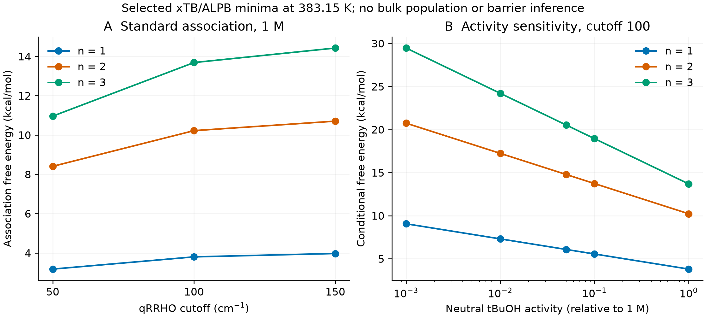

# 从机理原型到可证伪研究：Pincer-CatMech-AI 第四阶段技术报告

2026 年 9 月 16 日。以 CNS 主刊所重视的原创性、重要性与证据要求规划研究；本报告不声称已达到投稿标准。

## 1. 研究判断与问题重构

目前项目具有可审计的软件基础、若干真实的低成本量子化学计算和明确记录的失败。它尚无经独立验证的催化机理、可用于真实速率预测的完整自由能网络或胜过简单基线的 AI 模型。用户目前没有超算访问许可，也没有提供私有实验原始数据。因此，本阶段交付的是研究方案修正、本机诊断、公共结构入口和离线超算桥接工具，不能表述为实验与理论已经闭环。

Nature 正刊重视原创性、重要性以及对领域外读者的意义。严谨是必要条件，却不是充分条件；增加计算量、复杂模块或报告长度不会自动建立这些价值。期刊也没有公开的“满足若干项就保证录用”公式。项目采用这些要求约束研究决策，而不以期刊名称替代科学结论。[Nature 期刊定位](https://www.nature.com/nature/journal-information)；[编辑标准与流程](https://www.nature.com/nature/for-authors/editorial-criteria-and-processes)。

原方案的宽泛新意需要收回。Mn 借氢体系中 K/Na 及碱所影响的胺/亚胺选择性已有直接研究；Mn 钳形体系的高通量 xTB/DFT 扫描也已有先例。非惰性配体和醇辅助质子转移同样不是凭模块组合即可主张的新发现。公开文献的不同优化条件不能当作单变量因果实验，必须区分反应条件表与专门的动力学对照。[ACS Catalysis 2018](https://doi.org/10.1021/acscatal.8b02530)；[ZAAC 2021](https://doi.org/10.1002/zaac.202100078)。

建议收窄为尚待验证的研究问题：在一个结构可追溯的 Mn-PNP 借氢体系中，显式离子配对、质子接力与催化剂失活能否共同解释选择性随时间和条件变化，并对未参与拟合的条件给出优于简化模型的预测？这是一项研究假说，当前既没有证实其成立，也没有证实它构成足够广泛的新规律。完整文献排重和可证伪设计见 NATURE_RESEARCH_CASE.md。

配体参与质子转移或金属-配体协同并不自动证明配体发生电子氧化还原意义的非惰性行为；涉及后者的主张需要独立电子结构与实验依据。

### CNS 创新的具体立项要求

按用户进一步要求，项目将 CNS 级原创性和广泛意义作为立项门槛。具体学科匹配优先参照 Nature/Science；Cell 主要面向重要生物学问题，不能仅加“生物相关”标签强行适配。不存在满足固定清单便保证录用的共同 CNS 标准。Science 现行作者网页本次访问受阻，创新章程明确标注所引用 AAAS 官方指南为2019年版本，不冒称核验了2026年全部政策。

**唯一主创新候选：在同一借氢体系中，明确且可测的溶液物种能否将离子/可交换质子分配、胺/亚胺选择性和可逆休眠连接为共同因果机制，并支持冻结模型的干预与第二配体骨架预测。** K/Na 选择性、补碱恢复、隐藏状态和反应进程拟合均已有先例，单独成立不能算本项目的新发现。[同型 Mn 前体的休眠与碱恢复先例](https://doi.org/10.1039/D5GC05072C)；[竞争动力学模型与可辨识性先例](https://doi.org/10.1021/jacs.4c10488)。

候选的最低证据链是：在同一体系鉴定共享物种；用定量库存、时间尺度和独立干预淘汰分立解释；冻结网络和结构到参数的规则；在未读目标反应数据的条件和第二骨架上检验完整轨迹及预测区间。第二骨架不能用同一前驱体的第二晶体分子替代。若每个新条件都要重新拟合任意参数，或分立简化模型同样预测全部结果，就撤回共同机制或迁移主张。

完整主张-先例-新增发现-否定证据-公平基线-停止规则见 CNS_INNOVATION_CHARTER.md。12篇原始研究的针对性排重仍不等于穷尽查新。即使所有模型约束和实验检查都通过，仍须有足以改变理解的发现才能讨论 CNS 的概念贡献；当前这一发现尚未形成。

## 2. 证据分层与现有结果

| 项目 | 已有证据 | 不能据此主张 |
| --- | --- | --- |
| 软件验证 | 第三阶段冻结版本 556 项测试通过 | 化学正确或论文达标 |
| 自旋诊断 | 48 次实际尝试，8 次 SCF 收敛，6 个状态通过原自旋与身份门槛 | 已确认真实自旋排序或自旋交叉 |
| MECP | 原有可接受状态对 0，接受 MECP 0 | 交叉通道控制速率 |
| 微溶剂化 | 9 个 xTB/ALPB 结构，3 个选中簇通过全 Hessian 极小值检查 | 脱水 TS、溶液种群或普适质子线 |
| 中性脱水路径 | 两个种子及一次续算共 400 个 NEB 步，未达原力阈值 | 可用活化自由能 |
| 动力学 | 18 物种/18 通道的数值验证；40 个测试网格 | 实测 TOF、寿命或催化剂排名 |
| EGNN | 测试 MAE 0.19520 eV，零差基线 0.19400 eV | AI 超过简单基线或能预测反应能垒 |

以上为第三阶段冻结结果，不将本次诊断混入原数据集改变历史通过率。模型测试中的速率参数属于软件算例，不是文献拟合值。所有因资源限制终止和科学判据失败的作业均保留失败状态。

体系身份也是门槛。现有 Fe_bipyridine_pnnoh_iPr 原型的响应位点为羟基吡啶 O-H/O−，不能将该原型的自旋计算称为用户指定的 NH 活化验证。后续必须逐个骨架检查真实可脱质子位点、质子数、总电荷、对离子及反应前后原子映射。tBuOK 的加入量不等于游离 tBuO− 的活度。

## 3. 本阶段计算结果与方法边界

本节的数字由归档结果生成并在交付前核验。量子试算采用现有几何、相同电荷和未放宽的 SCF 阈值；一个 STO-3G 五重态获得较长时间预算，另两个 PBE/def2-SVP 作业检查单重态和五重态。配置为 2 线程、500 MiB 程序内存、1536 MiB 进程 RSS 上限，总墙钟预算 1200 s。它们是气相单点能与解析梯度诊断，不是甲苯中的几何优化、频率或高精度自旋能隙。

| 气相单点诊断 | SCF 状态 | S² | 自旋质量门槛 |
| --- | --- | --- | --- |
| sto3g quintet recovery | converged | 6.193760 | 不通过 |
| def2svp singlet | converged | -0.000000 | 通过（仅诊断） |
| def2svp quintet | timeout | unknown | 未知 |

本轮实际尝试 3 项，SCF 收敛 2 项、自旋质量数值门槛通过 1 项。全部记录 accepted_chemical_label=false，production_spin_gap_validated=false；本次新增可接受 MECP、TS 和真实速率均为 0。不能混用不同基组总能，也不能把通过的单个态当成溶液自旋排序。原始输入、输出、解析梯度（如已生成）、软件指纹及源文件快照均归档。

另完成 405 行热化学敏感性计算：3 个已有合格簇、9 个温度、3 个 qRRHO 交叉波数及 5 个中性 tBuOH 活度。源结果、接受几何及频谱均核验 SHA256；原交叉波数 100 cm⁻¹ 的 27 个缔合自由能全部重建，最大差为 0。它们是已有量子结果的再分析，新增量子作业数为 0。

| 显式 tBuOH 数 | 383.15 K 时交叉波数 50-150 cm⁻¹ 的标准缔合自由能范围 | 范围宽度 |
| --- | --- | --- |
| 1 | +3.176 至 +3.969 kcal/mol | 0.793 kcal/mol |
| 2 | +8.404 至 +10.703 kcal/mol | 2.299 kcal/mol |
| 3 | +10.958 至 +14.424 kcal/mol | 3.465 kcal/mol |

这些选中簇在所扫描条件下标准缔合自由能仍为正，但这不排除其他构象、离子辅助路径或不同标准态下的行为。只保留一个选中极小值不能代替构象系综；跨温度使用同一 ALPB 电子溶剂贡献也不是温度依赖溶剂模型。

对单个缔合平衡 $C + n A \rightleftharpoons CA_n$，采用无量纲活度 a（参照 1 M）：

$$\Delta G_{\rm eff}=\Delta G^\circ-nRT\ln a_A.$$

$$\ln(a_{CA_n}/a_C)=-\Delta G^\circ/(RT)+n\ln a_A.$$

其中 A 是中性 tBuOH，绝不是总 tBuOK 当量。降低 A 的活度会提高所示缔合的条件自由能。输出仅为该平衡的条件活度比，没有求解体相物料平衡，也不是产率、催化速率、过渡态自由能或溶液物种比例。

## 4. 公开实验结构与基准复现入口

2016 年 Nature Communications Mn-PNP 借氢论文提供公开实验参照，其 SI 所指向的前驱体原文为 JACS DOI 10.1021/jacs.6b03709。已取得 ACS Figshare 托管的 complex 1 原始 CIF；其分子式为 C18H37BrMnNO2P2。来源是原文作者的实验成果，并非本项目完成晶体实验。原始文件、下载链接、哈希、解析规则及候选结构的检查结论分别记录。[公开借氢论文](https://pmc.ncbi.nlm.nih.gov/articles/PMC5059641/)；[JACS 原文](https://doi.org/10.1021/jacs.6b03709)；[原始 CIF](https://ndownloader.figshare.com/files/5467289)。

解析核验得到：124 原子不对称单元经 4 个晶体对称操作展开为 496 原子晶胞，识别 8 个有限、完整的 62 原子分子，组成全部符合所报分子式与 Z=8。未发现部分占有率或无序；周期边界处的分子已解包，距离推导连接与发表键表一致。保留两个晶体学独立分子 Mn1/Mn2，二者属于同一个前驱体，不是两个不同催化体系或独立实验重复。Mn 邻域均为 P₂NC₂Br，有两个 CO 和一个 NH；原始 NH 距离约 0.836/0.846 Å，未人为改成优化键长。

原始 CIF 与派生坐标遵循来源所列 CC BY-NC 4.0，不能由仓库的 MIT 软件许可重新授权。charge=0 与 M=1/3/5 仅为后续计算候选；结构记录仍明确要求化学审查，未认证溶液活性物种或真实自旋。已生成并离线核验六项 ORCA 单点候选输入，全部为 prepared_not_submitted；没有 ORCA 运行结果。

晶体氢原子可能为受约束精修位置；晶体几何也不等于热溶液中的活性物种。即便导出完整分子，仍须由化学研究者核对 NH 位点、Br 配位、CO 数量、质子化、电荷及候选自旋。使用实验对应几何，是建立基准的起点，不是完成机理验证。

先复现公开参照体系的一组条件与物种，再扩展到设计结构。用户指定甲苯、383.15 K、tBuOK 基准 0.05 equiv. 及 0.01-0.20 equiv. 扫描仍作为待研究方案保留；文献真实条件应单独存储，不应为匹配用户方案而改写。只有反应浓度和参照底物定义清楚，equiv. 才能转换为初始浓度。

## 5. 区分机理的证据设计

| 竞争解释 | 可区分的观察 | 仍需排除的混淆 |
| --- | --- | --- |
| 仅总碱量控制 | 初始速率、反应级数与碱量的关系 | 活度、溶解度、离子缔合与诱导期 |
| 显式阳离子配对控制 | 匹配条件下 K/Na 与离子配对扰动的时间轨迹 | 更换阳离子伴随水含量和溶剂组成变化 |
| 醇/水参与质子接力 | 控制活度下的添加效应、同位素与交叉标记 | 平衡位移、交换及催化剂溶解度改变 |
| 失活决定终点选择性 | 完整浓度时间曲线、补加或恢复响应、物种谱图 | 底物耗尽、产物抑制及采样损失 |
| 自旋通道必要 | 合格多面势能、交叉区、SOC 与竞争动力学 | 数值污染、不同化学物种及多参考误差 |

此表是与导师讨论的实验设计，不是允许无人监督执行的合成操作规程。必须先有正式课题组、实验培训、经批准的操作与废物方案，再由有经验人员选择装置、试剂规模和分析方法。

建议将同一批校准、完整时间序列和质量平衡作为共同观测基础。使用内标及真实校准曲线，报告原始色谱/谱图、积分规则、检出限、独立反应重复、误差、遗漏数据与失败条件。技术重复不能冒充独立实验。实验规模、重复数和功效分析由噪声试验确定，当前不虚构精度或样本量。

预测集需在采集前登记条件、端点、允许误差、比较基线和停止规则；独立预测不能在观察结果后反复改参再称作验证。基线至少包含单面最简机理、无显式离子模型、无失活模型和非 AI 模型。只有新增机制在不增加任意自由度的情况下改善外部预测，才可能支持其必要性。若参数不可辨识，先增加有区分力的观测，而不是增加隐藏状态。

## 6. 专业计算的验收规则

必须将“程序正常退出”“数值收敛”“结构正确”“方法可信”和“解释实验”分为独立检查。不同程序得出相近数字，也可能共享相同近似；跨软件核对只能发现一部分实现和输入差错。

第一层为物种和构象：固定原子映射、电荷、电子数、自旋、显式离子/溶剂数，检查局域配位、游离物种和构象完备性。不同组成的总能不能直接相减解释为自旋能隙。对 NH 去质子化及 tBuOH 生成，需同时平衡所有反应组分。

第二层为驻点：极小值需合理收敛和无真实虚频；候选 TS 需一个对应目标化学变化的虚频、充分几何优化及双向 IRC 或同等可追踪端点证据。NEB 峰值不是 TS。低频处理、标准态和溶剂贡献必须一致，不能将单点电子能当自由能。

第三层为方法：在代表性态和关键能垒上比较至少两种合理泛函、基组提升、积分网格与 SCF 稳定性，并检查色散、显式离子、溶剂模型、温度与构象的敏感性。对开壳层检查 S²、占据轨道及态身份；若存在明显多参考特征，需要相应专业方法或收缩结论。r2SCAN-3c/CPCM 离线单点只是资源与格式试跑，不构成全部这些验证。

第四层为动力学：以一致的反应网络和质量/电荷守恒连接势垒，明确初始浓度、溶剂/水/碱活度和可逆性。通过详细平衡、辨识性、误差传播和外部时间序列检验；没有真实能垒时不得给出物理 TOF。MECP 还需自旋轨道耦合和跃迁概率的动力学处理，不能把交叉点能量直接当常规过渡态速率。

## 7. 你在物理世界的桥接任务

现在最值得做的是找到能够指导计算和实验核验的导师，申请学校账户并建立一个小规模公开文献复现项目。申请时提供本报告、真实结构出处、最小试跑包与明确验收问题；不以“需要很多算力才能发 Nature”作为依据。没有访问许可的阶段可以完成 Linux、SSH、调度器、量化软件输入、轨道和频率分析学习，也可以核查文献和结构。

你需要取得并记录以下非敏感信息：平台名称与登录说明，Slurm/PBS 类型，课题组账户/项目号，分区限制，单节点核数与内存，墙钟与并发上限，scratch 路径和清理周期，CPU 架构，ORCA/Gaussian 版本及合法授权，模块加载方式和 MPI 要求。密码、私钥、访问令牌不应进入项目或聊天；登录、双因素验证和学校身份授权由你本人完成。

本次工具提供 Slurm 路线。若获批平台使用 PBS，应先适配并核验对应脚本，不要直接运行 Slurm 文件。先执行离线校验，检查输入与哈希，再由管理员确认软件启动命令。算例必须提交到计算节点，不能在登录节点运行量化任务。先完成一个单点作业，检查原始输出、退出码、SCF 与身份，然后由你明确启用剩余数组。

单点试跑只用于测量能否运行、资源消耗和结果归档。后续预算以实际墙钟乘以所分配 CPU 数估算核时，核时不等于收费；收费、队列政策和剩余额度以平台规定为准。不要按这一小作业直接线性外推全部 TS/频率/多参考成本，需要分别选代表任务测量。

计算结束应带回完整输入、stdout/stderr、程序原生输出、作业脚本、几何/轨道/频率等必要文件、软件与依赖版本、作业号、退出码、资源统计和清单哈希。收集工具只认证它能核验的字段。缺少收敛证据、态身份或完整结果时，保持失败/未知，不补造数值。

详细可复制命令与管理信息表见 HPC_BRIDGE_ZH.md，离线包附带独立 Python 校验与收集入口。本阶段没有连接超算、没有提交收费作业，也没有声称在本机运行 ORCA 或 Gaussian。

## 8. 里程碑、停止条件与论文定位

| 阶段 | 必须交付 | 未满足时的动作 |
| --- | --- | --- |
| 公共基准 | 实验对应结构、真实条件、原始资料和可复现输入 | 暂停大规模设计结构扫描 |
| 算法与方法验证 | 可重复驻点与方法敏感性、通过代表任务资源验收 | 修复输入或缩小结论 |
| 可区分机理 | 至少一组能排除竞争解释的计算与实验 | 继续做诊断，不宣布发现 |
| 事前预测 | 锁定未参与拟合的条件及公平基线，独立验证 | 报告失败与适用边界 |
| 普遍意义 | 跨条件或体系有效的解释/设计原则，解决实际重要问题 | 优先选择适合的专业期刊 |

这些是本项目的研究关口，不是 Nature 的录用保证。即使全部完成，仍需判断结论是否改变领域理解、是否被既有工作覆盖、是否足以吸引更广泛读者。可发表的诚实阴性结果或严谨基准工作也有价值，不应为维持期刊目标而隐藏失败。

本次最终完整回归检查 713 项通过，0 失败、0 错误、0 跳过。测试验证软件行为与所覆盖的证据约束，不认证化学机理或期刊水平。

## 9. 可复现性与责任

代码、真实计算和导出文档分别有来源和哈希。第三阶段结果保持冻结；第四阶段放在新路径中。运行说明包括程序版本、线程数、内存、时间上限和失败记录，后处理的 405 行表明确不计作 405 次量子计算。

投稿前需要由有资格的研究者核查结构、方法、数据许可、作者贡献和全部结论。AI 工具不是作者，责任由人承担。论文应说明实际使用的辅助工具，保留可复制的代码/数据及持久归档计划；Git 仓库本身不能代替永久数据仓储和许可检查。[Nature 初次投稿说明](https://www.nature.com/nature/for-authors/initial-submission)；[计算工具报告指南](https://www.nature.com/documents/Computational_tools_reporting_guidelines.pdf)。

本项目当前结论是：研究路线已收窄并具备继续核验的具体入口；关键化学发现尚待形成。全力推进意味着优先处理最能改变判断的证据，而不是承诺绝对真理或期刊录用。

## 10. 数学物理模型：先规定能证明什么

用户新增要求将 CNS 级严谨性落实到模型、方程、方法和实验。这里采用统计热力学、基元反应动力学和可辨识性分析作为基础；这些成熟理论不是本项目的新发明。模型旨在使候选因果机制可被否定，不以方程数量或复杂度证明机制。严格数学性质只在写明的假设下成立；化学物种是否真实存在及参数是否可信仍依赖计算和实验。

令 c 为各真实化学物种的浓度，单位 mol/L；每条可逆基元通道有反应物计量 alpha 与产物计量 beta，元素及电荷账本为 B。均相、等温、定容模型的基本结构为：

$$N=\beta-\alpha,\qquad BN=0,\qquad \dot{c}=NJ+u.$$

J 为净反应通量，单位 mol/(L s)，u 为外加/移除通量。闭合体系满足 Bc=常数；加入碱、采样或气体交换后应显式记入 u，不能再假定所有闭合守恒量不变。模型必须包括相应游离离子、离子对、中性醇、水、休眠物种和必要的盐/副产物账本。“离子/质子库存”指化学形态间的分配和可利用性，不是总钾或氢原子凭空消失。若出现沉淀或明显传质限制，当前均相核心不能直接适用。

标准化学势与无量纲活度定义如下，其中 c° 是明确的标准浓度：

$$a_i=\gamma_i c_i/c^\circ,\qquad \mu_i=\mu_i^\circ+RT\ln a_i.$$

本次新代码实现理想混合物 gamma=1 的受限基础核，没有声称解决甲苯中离子缔合和非理想活度。扩展时，活度系数应来自与过量自由能一致的模型，并接受实验检验。任意指定 gamma 后不能沿用理想混合自由能的耗散证明。低介电溶剂中的总碱当量不能替代游离碱活度。

每条通道用同一过渡态标准自由能 G_TS° 和共同前因子定义正逆速率，避免独立拟合正逆常数破坏详细平衡。下式取传输系数 kappa=1 作为基础 TST 假设：

$$J_\rho^+=c^\circ\frac{k_{\rm B}T}{h}\exp\left[-\frac{G_{{\rm TS},\rho}^\circ-\alpha_\rho^T\mu^\circ}{RT}\right]\prod_i a_i^{\alpha_{i\rho}}.$$

$$J_\rho^-=c^\circ\frac{k_{\rm B}T}{h}\exp\left[-\frac{G_{{\rm TS},\rho}^\circ-\beta_\rho^T\mu^\circ}{RT}\right]\prod_i a_i^{\beta_{i\rho}},\qquad J_\rho=J_\rho^+-J_\rho^-.$$

由于活度无量纲，上式对不同分子数的基元通道均给出 mol/(L s)，转为浓度幂形式时才得到相应级数的速率常数单位。G_TS° 与组分标准自由能必须使用一致的温度、溶剂、标准态和组成参照。需要隧穿或非绝热修正时，应重新核验微观可逆性，不能只改一个方向的因子。[IUPAC 过渡态理论定义](https://goldbook.iupac.org/terms/view/T06470)。

下式比值中的 $k_\rho^+$ 与 $k_\rho^-$ 是单位为 s⁻¹ 的频率常数：$J_\rho^+/c^\circ=k_\rho^+\prod_i a_i^{\alpha_{i\rho}}$，$J_\rho^-/c^\circ=k_\rho^-\prod_i a_i^{\beta_{i\rho}}$，因此两者之比无量纲。对于理想混合物，乘以浓度幂积的系数则为 $k_{\rho,c}^{\pm}=k_\rho^{\pm}(c^\circ)^{1-m_\rho^{\pm}}$，其中 $m_\rho^+=\sum_i\alpha_{i\rho}$、$m_\rho^-=\sum_i\beta_{i\rho}$，其单位为 $\mathrm{M}^{1-m_\rho^{\pm}}\mathrm{s}^{-1}$。正逆分子数不同时，这两个浓度幂系数的单位也不同，其裸比值不能直接作为下面对数的无量纲自变量。标准浓度的数值取 1 M 并不会消除这一量纲区别。

对正浓度、闭合且理想的体系，可得到以下约束：

$$\ln(k_\rho^+/k_\rho^-)=-N_\rho^T\mu^\circ/(RT),\qquad \mathcal{A}_\rho=-N_\rho^T\mu.$$

$$f=\sum_i c_i\{\mu_i^\circ+RT[\ln(c_i/c^\circ)-1]\},\qquad \dot{f}=-\sum_\rho J_\rho\mathcal{A}_\rho\leq0.$$

这里 f 为自由能密度，单位 kcal/L。正逆通量比满足 ln(J+/J−)=A/(RT)，故每条通道的熵产生由 (x−y)ln(x/y)≥0 保证非负。闭合循环满足的能量和约束来自同一组物种势，不允许循环无代价产功。若 u 非零，能量变化增加化学功项 mu 的转置乘 u，不能要求 f 必然单调下降。这些是网络的数学约束，而不是新机理的证明。[Rao 与 Esposito，化学反应网络非平衡热力学](https://doi.org/10.1103/PhysRevX.6.041064)。

新核心将允许 c=0 的通量计算与只在 c>0 定义的对数势诊断分开。在 c_i=0 的边界，消耗该物种的质量作用项为零，连续模型应指向非负区域；这不能替代数值积分器自身的步长、误差和非负性检查。该模块不是完整生产级反应预测器，没有用任意数值生成真实催化 TOF。

## 11. 从多面量化到可辨识推断

同组成、同电荷的构象和自旋态只有在相对化学过程充分迅速地达到平衡时，才可通过配分函数粗粒化为一个有效物种：

$$G_{\rm eff}=-RT\ln\sum_s g_s\exp[-G_s/(RT)].$$

若 G_s 已含对应简并度的熵贡献，则不能再次乘 g_s。这一平衡有效自由能本身并不定义有效动力学。必须证明在所研究条件下，态间转换相对于离开该状态集合的反应足够迅速，并核验简化模型能重现显式状态网络的相关出口通量和时间尺度。计算出多个能量，既不能证明这种快慢分离，也不能证明反应轨迹始终达到 Boltzmann 平衡。慢自旋转换应作为显式状态与跃迁过程处理；将其消去可能引入记忆效应或改变有效速率律。MECP 本身不提供自旋轨道耦合、非绝热概率或跨面速率。当前没有这些物理参数。

实验读数需要观测方程，而不等于模型中的浓度变量：

$$y_k(t)=h_k(c(t),\eta)+\epsilon_k(t),\qquad m_k=\mathbb{E}[y_k]=h_k(c(t),\eta),\qquad D_{kj}=\frac{\partial m_k}{\partial\theta_j}.$$

h_k 包含谱带重叠、响应系数、取样过程、仪器死时间和校准参数 eta；上述均值表达式假定观测误差均值为零。当前 `observational_identifiability` API 接收已经求得的均值观测 Jacobian D、正的 `parameter_scales` s 和正的 `observation_noise_scales` sigma，只实现对角行列缩放后进行 SVD：

$$S=\operatorname{diag}(\sigma)^{-1}D\operatorname{diag}(s).$$

任意正尺度只是带单位解释的局部参数尺度，不会自动变成对数参数导数。只有在评价点选择 $s_j=\theta_j>0$，才有 $D\operatorname{diag}(s)=\partial m/\partial\log\theta$。对于相关误差，逐行除以 sigma 不等于协方差白化。调用者必须独立建立正定协方差 Sigma 及满足 $W\Sigma W^T=I$ 的白化映射 W，对观测、预测均值与 Jacobian 作一致变换，并在 API 之外核验。此后可将 WD 作为输入 Jacobian、将行尺度设为 1；API 自身既不估计 Sigma，也不计算或验证 W。

在声明的局部坐标 $d\theta=\operatorname{diag}(s)d\xi$ 下，只有观测模型为高斯、协方差已知且与参数无关时，$F_\xi=S^TS$ 才是相应均值参数的真正 Fisher 信息：独立误差时取 $\Sigma=\operatorname{diag}(\sigma^2)$，相关误差时还须完成正确白化。不满足这些假设时，它只能解释为加权最小二乘／Gauss–Newton 的局部信息近似，不能当作一般 Fisher 信息恒等式。参数相关协方差可能产生额外项，非高斯似然也需要单独推导信息。当前 API 返回缩放 Jacobian 的奇异值与局部数值秩，不拟合似然；它既不证明全局结构可辨识或统计精度，也不证明尚未取得的数据已经支持这些参数。

例如，两条不可观测支路只以 k1+k2 进入同一产物曲线时，增加相同类型的时间点仍不能分开 k1 与 k2。应增加能区分支路的物种信号或干预，结合结构等价检查、剖面似然/后验几何和外部验证。Fisher 信息或期望信息增益可辅助选择下一个实验，但实际最优设计依赖尚未取得的数据与噪声，当前不发布虚构的最优条件。

在温度、前因子和活度固定时，TST 给出 d ln k / d deltaG‡=−1/(RT)。383.15 K 时 RT=0.7614 kcal/mol，因此假设的 1 kcal/mol 能垒偏差可对应约 3.72 倍速率因子。这只是误差传播的数学示例，不表示我们已经测得 1 kcal/mol 的误差。泛函/基组变化范围也不能自动解释为统计95%置信区间。应保留共享物种能量之间的协方差，成对传播正逆通量，避免破坏详细平衡。

完整物理参数化仍需要合格驻点、同组成比较、构象/离子对采样、量化方法敏感性、反应进程和物种谱学。实现上述方程不会把旧的18通道数值算例自动变成真实机理；两套实现的作用和未满足的证据门槛分别记录。

## 12. 高级实验由待区分问题决定

具体方案见 ADVANCED_EXPERIMENTS_ZH.md。高级实验的价值在于增加独立约束，而不是仪器价格。首先建立可校准的 GC/qNMR 进程曲线、物料平衡、醇/水与元素库存记录，再决定哪些竞争解释仍不可区分。

| 问题 | 候选观测组合 | 必须保留的边界 |
| --- | --- | --- |
| 选择性与休眠是否由同一物种过程耦合 | 完整进程、CO 区原位 IR、31P/1H NMR 与受控恢复对照 | 同步变化不是共同原因；必须定量校准与正交干预 |
| 质子步骤是否控制所观察速率 | O-H/O-D 与底物 C-H/C-D 比较、交换监测、子反应对照 | 单个 KIE 不能唯一指定 TS；预平衡和交换可能混淆 |
| 总库存是否等于活性库存 | 中性醇定量、水分析、元素总量与物种谱学联合 | ICP 类总量不测游离离子活度；取样可能改变物种 |
| 金属局域结构/自旋是否仍是关键未决变量 | 有参照的 operando XAS；适用时 EPR | 控制束流损伤；EPR 阴性不证明无中间体；不把 Fe 专用路线套给 Mn |

实验须由具备相关经验的导师和平台人员确定可行性、校准、时间分辨率、温度兼容性、样本量及操作规程。只有新观测能改变模型选择或预测区间时，才值得申请相应平台。不得将尚未获准的装置、机时或实验结果写成已取得。

## 13. 追加计算：公开前体与活化账本

用户要求创新不足时增加计算，本轮据此追加了能直接检查输入物种的真实计算。public_precursor_relaxation_001 因可用内存预检未通过而启动 0 次原生量化；保留该记录。新的独立目录 public_precursor_relaxation_002 实际完成 6 次 GFN2-xTB/ALPB(toluene) 调用：两个晶体起点分别优化、重新计算梯度和完整 Hessian。总耗时约 120.59 秒，2 线程顺序执行。

| 晶体起点 | 新鲜最大力，eV/Angstrom | 最低内振动频率，cm^-1 | 完整内振动模式 | 映射与极小值检查 |
| --- | --- | --- | --- | --- |
| Mn1 | 0.00078029 | 33.4689 | 180，零虚频 | 完整配位/共价图保持；通过 |
| Mn2 | 0.00075099 | 33.8110 | 180，零虚频 | 完整配位/共价图保持；通过 |

这表示两个输出分别通过该模型的局部极小值检查，不表示发现两个不同构象盆地。另一 AI 协作代理独立核验了 74 个原生文件、梯度及完整 Hessian；按 CIF 标签映射并作平移和正旋转后，全原子 RMSD 仅 0.00354 Angstrom，结果几何上近乎同一构象，不能计作两个独立极小值。电荷 0、uhf=0 是候选设置，没有确定真实基态自旋。完整原始输出、梯度、Hessian、源代码快照和哈希已归档。Mn2 日志的自动热化学对称性搜索未收敛警告保留，该自动热化学没有被采用；独立梯度和投影 Hessian 检查仍通过。该轮没有计算 383.15 K 反应自由能，电子展宽 300 K 不等于核热运动温度。内置甲苯参数也没有被验证为精确描述 110 ℃ 的溶液。没有新增 TS、MECP、实验数据或真实 TOF。

活化假说账本另行检查元素与电荷守恒。对含 NH 和配位 Br 的中性前体 P0，仅去除 NH 质子、保留 Br 时，配合物应为阴离子；若假设中性 A0，还必须显式交代 Br 的释放及 KBr/tBuOH 去向：

$$P0+KOtBu\rightleftharpoons K^+ + [P0-H]^- + tBuOH.$$

$$P0+KOtBu\rightleftharpoons A0+KBr+tBuOH.$$

这两个总体平衡式不是已证实的基元步骤。甲苯中接触离子对、盐溶解/沉淀、聚集和非理想活度仍未解决；不能用气相 KBr 单分子的能量冒充盐的溶液或固相化学势。activation_hypotheses.json 记录守恒检查，不含伪造能量。

还实际运行了 200 个正浓度状态的合成数学检查：最大自由能耗散恒等式残差为 1.42e-14 kcal/(L s)，并检查库存守恒、平衡通量、闭合循环和能量参照变换。它使用抽象 A/B/C 及任意测试自由能，没有进行真实网络拟合或 ODE 积分。该检查支持实现符合写明假设，不支持催化机理。

后续 G0–G7 计算关口、预备条件、反证与停止规则见 COMPUTATION_DECISION_PLAN.md。优先确定活化物种和关键竞争路径，再开展能给出相反可观测预测的少数高精度计算。2022 年 JACS 已在 Mn-PNP 上研究碱改变苄醇结合与 amido–alkoxide 平衡，不能把“物种效应加第二骨架”重新包装为首次发现。真正剩余的主张仍需证明本借氢体系的共同分支—休眠机制及其额外预测能力。[原始研究及 Figure 7](https://pure.tudelft.nl/ws/portalfiles/portal/120918272/jacs.2c00548.pdf)。
