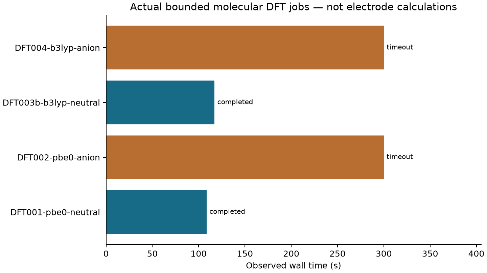
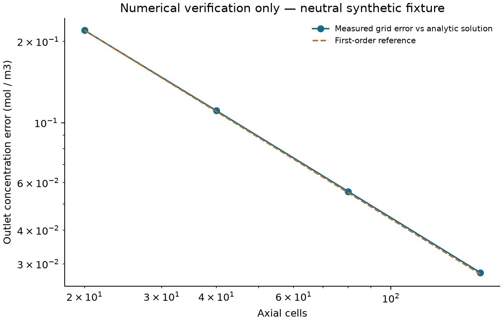

# Cu–N–P 电合成工况耦合研究：本地执行技术报告

日期：2026-09-20。范围由用户明确限定为“暂无 HPC/SI，先完成本地可执行部分并推送”。本报告与 [English version](TECHNICAL_REPORT_EN.md)对应；完整目标见[研究要求书](RESEARCH_CHARTER_ZH.md)。

## 1. 实际完成与核心结论

本次交付完成了文献与原创性边界核查、可复现的有界分子 DFT 试算、中性反应—传质数值内核、证据门控及独立代码审查。**它是可运行的本地研究基础，不是完整 Cu 电催化机制研究，也未证实排名反转、原创性或工业优势。**

| 证据类别 | 本次结果 | 允许支持的结论 |
|---|---|---|
| LITERATURE | 14 条来源记录、13 行查新矩阵、35 条实际检索式；SI 未取得 | 锁定研究方向及已有方法先例；G0 部分完成 |
| CALCULATION | 4 次实际启动的 Psi4 作业：2 个中性收敛、2 个阴离子超时；另有 2 次启动前内存拒绝 | 本机资源基准及中性分子固定核电子能 |
| SOFTWARE VERIFICATION | 可逆三态中性循环、边界层传质、守恒塞流、电耗/FE 独立核算、存档校验 | 被测试范围内的软件行为与数值一致性 |
| HYPOTHESIS | CuN4/CuN3P1 的电位—浓度—传质排序边界、产物占位效应 | 有待获得物理参数后检验的问题 |
| NOT RUN | 周期恒电位计算、目标反应 TS/路径、真实微动力学、AI 训练、实验、完整 TEA/LCA | 不可据本交付报告任何上述成果 |

没有完整中性/阴离子配对，故 DFT 电子附着能、电子亲和能对比及泛函间充电能差均为 unavailable。不能用不同泛函的中性绝对总能相减来补足该缺口。

## 2. 与唐海涛合作研究及业界问题的联系

锚定研究为 Wang 等的 [Phosphorus-Doped Single Atom Copper Catalyst as a Redox Mediator in the Cathodic Reduction of Quinazolinones](https://onlinelibrary.wiley.com/doi/abs/10.1002/anie.202505085)。官方摘要支持 CuN3P1 微配位与喹唑啉酮电还原偶联开环，并已有吸附/脱附调节论述；唐海涛、李文昊、王定胜的合作归属应一并保留。

候选研究问题是：在匹配结构、真实位点密度和已校准非水电位下，配位造成的本征优势是否会被产物占位、输运或稳定性抵消？若能建立具有不确定度的工况边界，才可能帮助选择流动反应器操作窗口、降低分离产品的电耗、避免只按单一吸附描述符筛选材料。

这些产业联系目前属于设计动机。没有真实连续流数据、电极寿命、原料/电极价格、分离负荷或过程安全数据，不能给出成本节省、放大收益或 LCA 优势。已实现的电耗算式仅为全槽电输入，明确不包括泵、分离及辅助设施。

## 3. 文献事实、冲突及原创性边界

原文官方 SI 链接本次返回 HTTP 403。原反应 1a、2a、3a 的精确结构和原子/电子映射仍未核实；CuN3P1 配位标签不能唯一恢复载体缺陷、周期超胞及原子坐标。不能按相似反应猜结构，亦不能将偶联开环改写为普通加氢。

Wiley 提供的[论文预览](https://www.researchgate.net/publication/390023854_Phosphorus-Doped_Single_Atom_Copper_Catalyst_as_a_Redox_Mediator_in_the_Cathodic_Reduction_of_Quinazolinones)图注包含 DMF、10 mA、5 h、无隔膜及添加剂字符串 **TDEA**。旧记录曾写 **TEOA**，本次保留冲突而不默认为同一物质；两者均不得用于推断添加剂结构和质子/电子收支。完整字段与证据等级见[文献审计](../literature/review_zh.md)及[冲突记录](../literature/evidence_conflicts.json)。分离收率不等于 FE。

查新直接限制了宽泛创新叙述：

- [BEAST DB](https://doi.org/10.1021/acs.jpcc.4c06826)及其[作者预印本](https://arxiv.org/abs/2405.20239)已报告偏压改变 energetic-span 排序。它不是本反应速率排序，但“电位可改变排名”不能作为普适首次发现。
- [Hao 等，JCTC 2025](https://pubs.acs.org/doi/10.1021/acs.jctc.5c00914)已联立恒电位 DFT、微动力学和 Nernst–Planck–Poisson 输运。方法组合本身不构成首创。
- [Oliver 等，ACS Central Science 2025](https://doi.org/10.1021/acscentsci.4c01733)已有有机电合成中机制与传质相互作用的研究。流量影响产率也不足以构成新的科学规律。

可能的增量必须收窄到本反应的可验证问题：在匹配 CuN4/CuN3P1 结构和实验条件下，得到可重复、误差可控的排序边界，并在预注册留出工况下验证。若没有稳健交叉，应报告“未发现反转”。本轮定向检索及公开专利检索不是系统查新或自由实施分析；原创性仍未建立。

## 4. 执行环境与旧证据复核

实际主机为 i7-13700H，14 核/20 线程、约 15.73 GiB RAM、Intel Iris Xe；未检测到 CUDA，当前可用 RAM 远小于总量。复用已安装 Psi4 1.11、xTB 6.7.1 与 Python 环境，没有重新安装。未核实可执行的周期恒电位引擎、服务器或 HPC 配额。

新数值测试使用 Conda base：Python 3.14.6、NumPy 2.5.2、SciPy 1.18.1。直接启动未激活的其他 Conda 环境曾在原生线性代数中退出；补齐 DLL 路径后恢复。失败和恢复日志保留在[审查目录](review/)，不把环境退出当作测试成功。

旧项目基线提交为 `6197929f41074cb4b21fb2792c7dcd55772a86c0`。本次复核其 31 项测试和 20 次 xTB 原生记录/源码哈希。旧的 GFN1/GFN2 固定核充电能分歧为气相 0.781648 eV、ALPB-DMF 0.831980 eV，仍超过原 0.20 eV 门槛；没有修改门槛或覆盖失败结果。旧分子预筛不是 Cu 活性位点验证。

## 5. 新增原生 DFT 计算

计算对象是独立生成的 3-methylquinazolin-4(3H)-one 模型，C9H8N2O，SMILES `CN1C=Nc2ccccc2C1=O`。继承旧 GFN2-xTB 中性极小值坐标；并非 SI 的 1a 结构确认、Cu 结构或 DFT 优化结构。输入 SHA256 为 `29351eee2bde9d27f5d9857c9d24d5ed74faa327a9e0a69ed52117ae34e688b9`。

协议：Psi4 1.11，PBE0/B3LYP，def2-SVPD，气相同核几何，DF-SCF/def2-universal-jkfit，75/302 积分网格，能量/密度收敛 1e-8；中性 84 电子单重态，阴离子 85 电子双重态。每次 2 线程、Psi4 内存设置 512 MiB、300 s 墙钟上限，逐个执行。RSS 阈值随可用 RAM 从 1024 降至 896/768 MiB，精确值记录于各作业；内存采样不是操作系统硬限额。

| 作业 | 状态 | 时间 / s | 峰值 RSS / MiB | 电子总能 / Eh |
|---|---|---:|---:|---:|
| DFT001 PBE0 中性 | SCF 收敛 | 108.659 | 612.523 | −531.5663974136239 |
| DFT002 PBE0 阴离子 | 超时，拒绝作为能量标签 | 300.061 | 622.555 | unavailable |
| DFT003 B3LYP 中性 | 内存预检拒绝，未启动 | — | — | unavailable |
| DFT003b B3LYP 中性 | SCF 收敛 | 117.232 | 612.547 | −532.1735781682701 |
| DFT004 B3LYP 阴离子 | 超时，拒绝作为能量标签 | 300.135 | 622.176 | unavailable |

另有一次较早的内存预检拒绝，单独存档；总计 4 次实际量化启动、2 次启动前拒绝。超时不是“阴离子不存在”或方法错误的证明，也不能从部分迭代能量提取科学标签。原始输出、输入、执行时源码快照、资源记录、成功作业 Molden 和失败日志见 [DFT 存档](../data/dft_pilot/README.md)。原生包清单含 58 文件约 6.01 MB，外加清单；8 个可重建 scratch 文件约 849.08 MB 留在本机，以独立哈希清单说明排除。

未执行 DFT 优化、频率、SCF 稳定性分析、基组/网格收敛；单个 SCF 解及小自旋污染不等于物理精度。没有溶剂、电极、Cu 位点、参比电位、势垒或热自由能。即便日后凑齐同核气相电荷对，也不能直接称为溶液还原电位。未混用 xTB 与 DFT 能量作差。

## 6. 数值内核与独立验证

内核严格限定为 `A + * ⇌ A* ⇌ P* ⇌ P + *` 的中性单个位点循环。正逆 Eyring 速率来自共享态能/过渡态，吸附使用无量纲活度；稳态覆盖度使用矩阵树公式，并由独立线性方程核验。手工导入速率仍需通过平衡常数和对数循环闭合检查。

薄膜通量联立 `J = km_A(cA_bulk−cA_surface) = km_P(cP_surface−cP_bulk) = Γ·TOF`，再与守恒一阶隐式塞流离散耦合。独立 Radau 积分及等速率闭式解构成验证基准。所有参数是数学测试夹具，不能作真实 Cu 势垒、训练标签或反应器预测。

| 检查 | 实测数值 | 意义 |
|---|---:|---|
| 20/40/80/160 格出口绝对误差 | 0.219978 / 0.110789 / 0.0555975 / 0.0278498 mol·m⁻³ | 一阶空间收敛 |
| 相邻加密误差比 | 1.9855 / 1.9927 / 1.9963 | 接近预期 2 |
| 160 格误差 / 入口浓度 | 2.78498×10⁻⁴ | 数学夹具误差，非化学预测误差 |
| Radau 与解析出口差 | 5.40×10⁻¹³ mol·m⁻³ | 独立求解交叉核验 |
| 稳态覆盖方程残差 | 6.66×10⁻¹⁶ s⁻¹ | 当前夹具的代数残差 |
| 薄膜通量闭合残差 | 3.39×10⁻²¹ mol·m⁻²·s⁻¹ | 当前夹具的守恒检查 |

正、逆向反应的积分源项与净出口生成分别闭合至约 2.38×10⁻²² 和 −1.11×10⁻²¹ mol/s。入口已有产物不会算成新生成产物。等温单液相、固定流量、均匀可访问位点、无轴向扩散等假设限制了该模型；它没有电势、电流、离子迁移或失活方程。

电核算独立于中性网络：`Ecell = ∫Ucell I dt`，按分离产品质量归一；FE 使用分离前形成摩尔数和外部已验证电子计量。当前中性网络无法提供电子数，测试中的电输入不与其通量拼接成虚构电催化性能。

## 7. 代码审查、验收及可复现性

三个工作代理分别承担文献/原创性、量化/资源、动力学/传质；实现完成后交叉审查。修复了元数据可错误放行物理排名、门控拒绝仍返回成功退出码、异常数据形状、导入速率绕过热力学闭合、有限输入数值溢出等问题。DFT 归档检查进一步拒绝非有限能量、设置/版本矛盾、模糊重复成功作业，并修复进程终止及失败记录逻辑。历史执行脚本保留不改，修复只作用于后续 runner。

最终集成套件为 **42 项：41 通过、1 明确跳过**；跳过项是不存在完整物理电荷对时的实测能差符号/单位检查，不以伪造配对补测。构成为动力学 20、门控 8、原生存档与进程控制 14。精确执行记录见[验证摘要](../results/validation_final/summary.json)与[完整日志](../results/validation_final/tests.txt)。这不是原文实验复现或全浮点域证明。

`physical_ranking_ready` 固定为 false，因为未实现经验证的目标反应模型。文件齐全、哈希一致或贴上 CALCULATION 标签只可能满足元数据完整性，不能放行科学结论。9 项科学输入仍未接受。CI 增加新套件和冻结文件哈希校验；本地通过不自动意味着远端 CI 已通过。

复现命令和新作业说明见 [RUNBOOK](../workflows/RUNBOOK.md)。检查不会启动 Psi4。原始存档保持冻结；独立重跑须使用新输出目录。`results/file_manifest.json`覆盖本子项目文件字节，排除缓存及清单自身，不是作者身份或科学真实性签名。

## 8. 要求书逐阶段状态与最小继续路径

| 门槛 | 当前状态 | 缺口 |
|---|---|---|
| G0 文献/身份/资源 | 部分完成 | SI、精确结构/映射、添加剂冲突、系统查新 |
| G1 基准 | 未通过 | 连完整 DFT 电荷对也未得到；真实 Cu/溶剂/电位基准未运行 |
| G2 机理 | 未运行 | 目标路径、过渡态、连通性、竞争反应 |
| G3 跨尺度 | 仅工程组件已验证 | 中性夹具不能代替真实电化学网络与输运校准 |
| G4 新预测 | 未运行 | 带方法和参数不确定性的排名边界及留出验证 |
| G5 设计收益 | 未运行 | 同约束生产率、能耗、寿命及工艺数据 |
| G6 AI 收益 | 未运行 | 可靠物理标签、强基线、固定预算与盲测 |
| G7 实验 | 未运行 | 预注册新条件的真实独立实验 |

最小继续顺序：合法取得 SI 与来源匹配坐标 → 解决试剂身份及原子/电子平衡 → 配置真实算力与恒电位引擎 → 收敛一组 Cu/吸附基准 → 建立少量关键竞争路径 → 获取位点密度及流动校准 → 锁定带误差的前瞻预测 → 独立实验检验。没有高保真标签前不训练复杂代理模型，没有实测成本和寿命前不输出 TEA 优势。

[实验接口](EXPERIMENT_INTERFACE_ZH_EN.md)列出产物添加、匹配流量扫描和位点保留三类判别实验；均未执行，也没有给出伪造的定量预测。本轮完成的是用户限定的本地交付，科学项目仍处于工程原型与负结果记录阶段。
